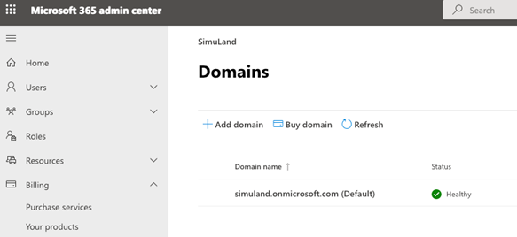
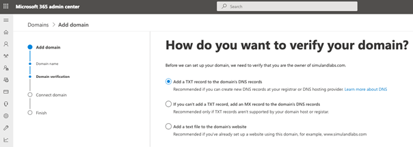
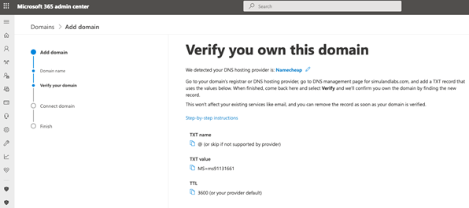
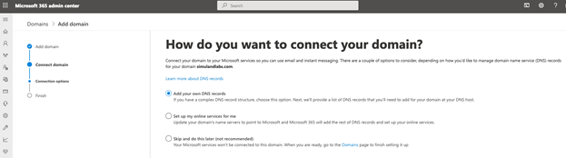
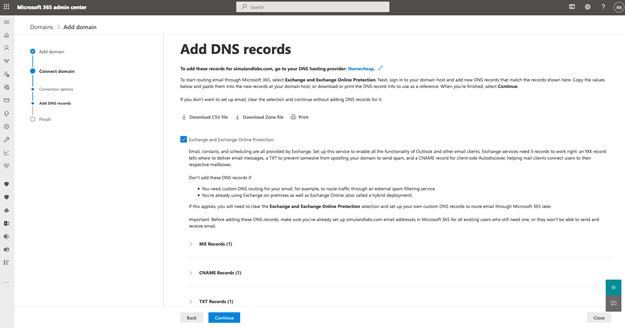
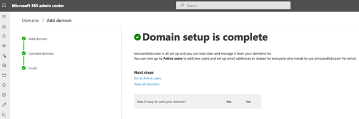
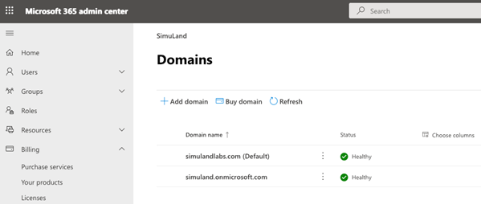
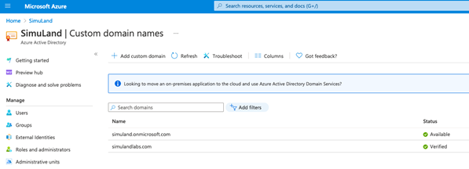

# Add Domain to Microsoft 365 Tenant

Azure AD tenants come with an initial domain name, <domain-name>.onmicrosoft.com. That domain name cannot be changed or deleted, but you can add new custom domain names.
In the lab environment, we want to authenticate to Office 365 apps in the cloud with the same on-prem password. Therefore, we need to synchronize the “on-prem” AD users with the Azure Active Directory (Azure AD) tenant of the Microsoft 365 trial subscription. This requires adding the on-prem domain to Microsoft 365. The domain needs to be one you own and that is registered.

## Pre-Requirements
* A registered valid domain name

## Main Steps
* Access Microsoft 365 admin console
* Add custom domain
* Verify domain ownership
* Connect domain to MS 365 Services (Optional)

## 1. Access Microsoft 365 Admin Console
* Go to https://admin.microsoft.com
* Go to Settings > Domains
* Click on “Add Domain”

## 2. Add Custom Domain
Enter the name of the domain you just purchased or you already own:

## 3. Verify Domain Ownership
You will need to proof that you own the domain. I usually choose the verification option to add a TXT record to the DNS records of my domain.

### Add TXT Records to Domain Settings
* Log on to your domain provider console.
* Select domain DNS settings.
* Add TXT record

## 4. Connect Domain to MS 365 Services
Next, you will have the option to attach specific Microsoft 365 services to your domain.

Add Additional DNS Records

 

That’s it! You have successfully added a custom domain to your Microsoft 365 subscription.

One thing you can do is check the Azure Active Directory (Azure AD) tenant of your Microsoft 365 subscription, and you will now see the custom domain there and verified.

* Go to https://aad.portal.azure.com
* Click on Custom domain names

