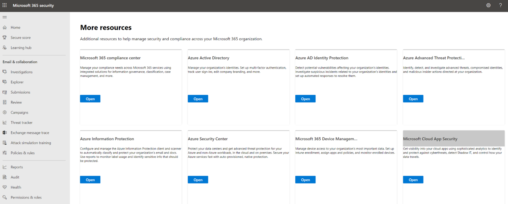
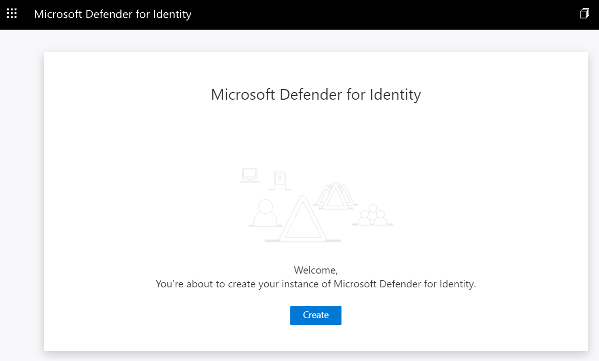

# Initialize Microsoft 365 Defenders Security Products Configurations

This guide focuses on configuring Microsoft 365 defender products before onboarding any device to Microsoft Defender for Endpoint (MDE) and Microsoft Defender for Identity (MDI) or connecting Azure AD applications to Microsoft Cloud App Security (MCAS).

## Pre-requirements
* Office 365 E5 subscription
* Microsoft 365 E5 subscription
* Office 365 Audit Log Search enabled

## Configure Microsoft Cloud App Security
1.	Navigate to [Microsoft 365 Security Center](https://security.microsoft.com/)
2.	Go to “More Resources” and click on “Microsoft Cloud App Security”.

3.	You will be taken to the MCAS portal: [https://portal.cloudappsecurity.com/](https://portal.cloudappsecurity.com/)  

4.	Click on Investigate > Connected Apps.

5.	click on the three dots to the right of the “Office 365” application to edit its settings.
6.	Make sure your settings look like the image below. They should be set by default.

7.	Finally, click on “Connect” to connect the “Office 365 app” to MCAS.

 

You can click on the Office 365 application again and run a quick test:

If office 365 auditing propagated properly, you should see office 365 app connected.

This is very important to do before connecting other solutions such as Azure Sentinel to collect data from MCAS.

## Configure Microsoft Defender for Identity
1.	Navigate to [Microsoft 365 Security Center](https://security.microsoft.com/)
2.	Go to “More Resources” and click on “Azure Advanced Threat Protection”.

3.	Create a new MDI instance

4.	You are now ready to onboard endpoints.

 

Onboard endpoints once you deploy an environment.

## Configure Microsoft Defender for Endpoint
1.	Navigate to [Microsoft 365 Security Center](https://security.microsoft.com/)
2.	Go to “More Resources” and click on “Microsoft Defender Security Center”

  

3.	You will be redirected to [https://securitycenter.windows.com/](https://securitycenter.windows.com/)  where an account will be created automatically.

4.	Once your account is created, it will automatically take care of step number 3 and then take you to step number 4 where you can start onboarding endpoints. Onboard endpoints once you deploy an environment.

5.	Click on “Start using Microsoft Defender for Endpoint” to continue. Once again, Onboard endpoints once you deploy an environment.

Same as MDI, onboard endpoints once you deploy an environment.