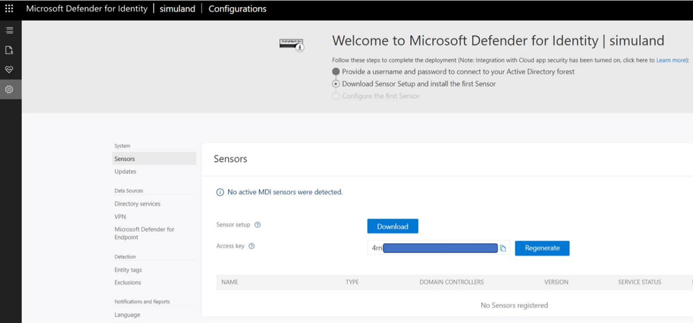
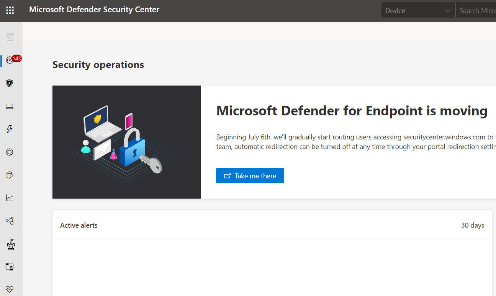

# Initialize Microsoft 365 Defenders Security Products Configurations

This guide focuses on configuring Microsoft 365 defender products before onboarding any device to Microsoft Defender for Endpoint (MDE) and Microsoft Defender for Identity (MDI) or connecting Azure AD applications to Microsoft Cloud App Security (MCAS).

## Pre-requirements
* [Office 365 E5 subscription](startM365E5Trial.md)
* [Microsoft 365 E5 subscription](startM365E5Trial.md)
* [Office 365 Audit Log Search enabled](enableOffice365AuditLogSearch.md)

## Configure Microsoft Cloud App Security
1.	Navigate to [Microsoft 365 Security Center](https://security.microsoft.com/)
2.	Go to `More Resources` > `Microsoft Cloud App Security` > [open](https://portal.cloudappsecurity.com/).

3.	You will be taken to the MCAS portal: [https://portal.cloudappsecurity.com/](https://portal.cloudappsecurity.com/)  

4.	Click on Investigate > Connected Apps.

5.	Click on the three dots to the right of the `Office 365` application > `Edit settings...`. Make sure your settings look like the image below. They should be set by default.

6.	Finally, click on `Connect` to connect the `Office 365 app` to MCAS.

 

You can click on the Office 365 application again and run a quick test:

If office 365 auditing is propagated properly, you should see office 365 app connected.

This is important to do before connecting solutions such as Azure Sentinel to collect data from MCAS.

## Configure Microsoft Defender for Identity
1.	Navigate to [Microsoft 365 Security Center](https://security.microsoft.com/)
2.	Go to `More Resources` > `Azure Advanced Threat Protection` > [open](https://portal.atp.azure.com/tenantPortal).

3.	Create a new MDI instance

4.	You should be able to add a username and password to connect to your Active Directory Forest. These credentials are used by the MDI sensor when it is installed on an endpoint. If you have not deployed your Active Directory yet, you can still set this up. SimuLand creates a few users while deploying the lab environment. If you are using the default users, here is [the information for every user](https://github.com/Azure/SimuLand/blob/main/2_deploy/aadHybridIdentityADFS/azuredeploy.json): 

5. Finally, you can download the MDI sensor onboarding package. Make sure you save the `Access Key` value. It will be used while installing the MDI sensor on an endpoint. Use the compressed file while deploying a lab environment.

## Configure Microsoft Defender for Endpoint
1.	Navigate to [Microsoft 365 Security Center](https://security.microsoft.com/)
2.	Go to `More Resources` > `Microsoft Defender Security Center` > [open](https://securitycenter.windows.com/)

  

3.	You will be redirected to [https://securitycenter.windows.com/](https://securitycenter.windows.com/) to start the onboarding process. If not, browse to [https://securitycenter.windows.com/onboarding2/start](https://securitycenter.windows.com/onboarding2/start) to force it. Then, set your `storage location`, `retention policy` and `organization size`.

4.	Next, click on `Start using Microsoft Defender for Endpoint` to continue.
* You might get a message that says `To experience Microsoft Defender for Endpoint, you need to onboard and test at least one device. You can also onboard devices later.`.
* Click `Proceed anyway`.

Beginning July 6th, 2021, we'll gradually start routing users accessing [securitycenter.windows.com](securitycenter.windows.com) to the newly unified [Microsoft 365 Defender portal](https://security.microsoft.com/) — the new home of Microsoft Defender for Endpoint.

5. Finally, download an MDE onboarding package to use it during deployment.
* Go to `Settings` > `Onboarding`.
* Select deployment method `Local Script` and click on `Download onboarding package`.
* Use the compressed file while deploying a lab environment.

