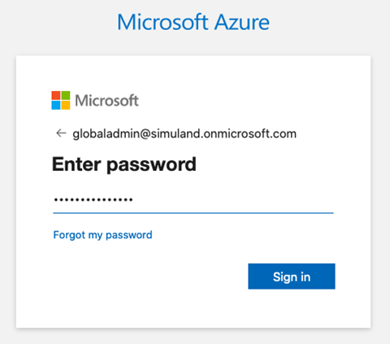
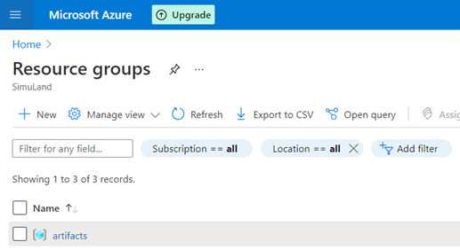
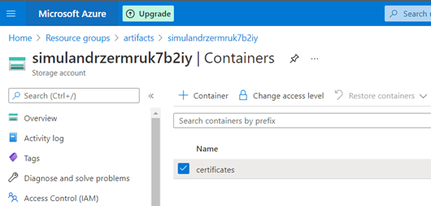
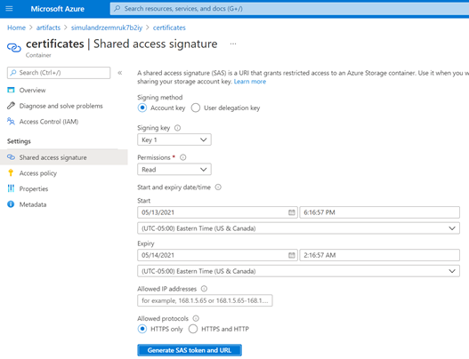
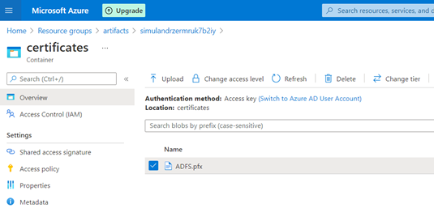
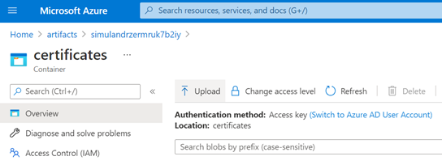
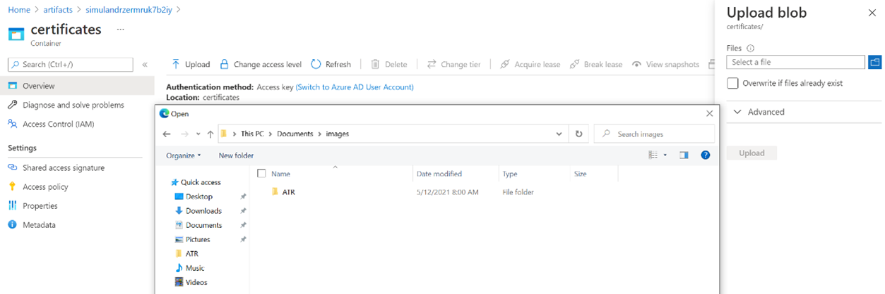

# Create an Azure Storage Account and Host a Private File in a Private Container

Sometimes while deploying a lab environment, you might need to use files that cannot be accessed through a public channel such as GitHub. One alternative is to host the private files in a private container available through an Azure storage account. If you already have a private container and want to upload a file to it, go to the [Upload File to Private Container](<#Upload File to Private Container>) section of this document.

## Pre-requirements
* Azure Subscription
* [Install Azure CLI](https://docs.microsoft.com/en-us/cli/azure/install-azure-cli?view=azure-cli-latest)

## Deploy Azure Account Storage and a Private Container

1. Download the following ARM template: [https://github.com/hunters-forge/Blacksmith/blob/azure/templates/azure/Storage-Account-Private-Container/azuredeploy.json](https://github.com/hunters-forge/Blacksmith/blob/azure/templates/azure/Storage-Account-Private-Container/azuredeploy.json)

2. Sign In Interactively

Locally, you can sign in interactively through your browser with the `az login` command. Log in as a user with permissions to deploy resource in your Azure subscription. None of your sign-in information is stored by the CLI. Instead, an authentication refresh token is generated by Azure and stored.

```
az login
```



If the cli command cannot open your browser to load the sign-in page, go to https://aka.ms/devicelogin and enter the authorization code displayed in your terminal.

You could also use the device code flow with the following command `az login --use-device-code`.

3. Create a resource group [optional] 

If this is your first time deploying resources in your Azure subscription, you will have to create a resource group. 

```
az group create -n artifacts -l eastus 
```

```
{
  "id": "/subscriptions/xxxxxxxx-xxxx-xxxx-xxxx-xxxxxxxxxxxx/resourceGroups/artifacts", 

  "location": "eastus", 
  "managedBy": null, 
  "name": "artifacts", 
  "properties": { 
    "provisioningState": "Succeeded" 
  }, 
  "tags": null, 
  "type": "Microsoft.Resources/resourceGroups" 
} 
```

You can see the new resource group if you go to the [Azure portal](https://portal.azure.com/) and look for `Resource Groups`.



4. Deploy template. Make sure you define your Resource Group, the Azure Storage Account Name and Azure Private Container Name.

```
az deployment group create --resource-group <resourcegroup> --template-file azuredeploy.json --parameters storageAccountName=<name> containerName=<name>
```

That’s it! If you go to your [Azure Portal](https://portal.azure.com/) > Resource Groups > `GroupName`, you will see the Azure Storage Account resource available. Click on it and verify your container was also created. You can now store private files in that container.



## Upload File to Private Container

### Azure CLI and a Shared Access Signature (SAS)

You can upload files to the private container by using the container’s shared access signature. A shared access signature (SAS) is a URI that grants restricted access to an Azure Storage container. Use it when you want to grant access to storage account resources for a specific time range without sharing your storage account key. 

1. Go to [Azure Portal](https://portal.azure.com/) > Resource Groups > `GroupName` > Storage Account > Containers > `ContainerName`
2. Click on Shared access signature > Generate SAS token and URL
3. Copy the ` Blob SAS URL` value



Next, use the Azure CLI command `az storage blob upload` to upload a local file to the private container using the `Blob SAS URL` value.

```
az storage blob upload --container-name <container-name> --file <ADFS.pfx> --name <ADFS.pfx> --connection-string <connection-string-SAS-token>
```



### Azure Portal UI 

Another option to upload a file to the private container is by using the [Azure portal](https://portal.azure.com/) with the `Upload` feature as shown in the image below:



Select the file you want to upload and click on `upload`



## Accessing Private Containers from ARM Templates

In ARM templates you can use the following URI syntax for every URL that we want to access. 

* **_artifactsLocation**: This is the Account Storage Container URL ([https://name-of-storage-account.blob.core.windows.net/name-of-container/](https://name-of-storage-account.blob.core.windows.net/name-of-container/))
* **_artifactsLocationSasToken**: This is the Account SAS Token that you get after deploying your Azure Account Storage and Private container via the ARM template. Go to deployments, select your deployment and look at the Deployment Output values. Do NOT forget to add the ‘?’ character before your SAS token.