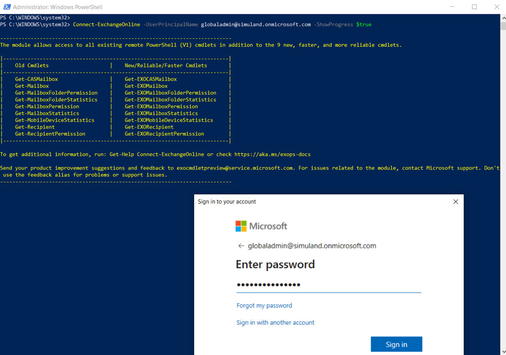
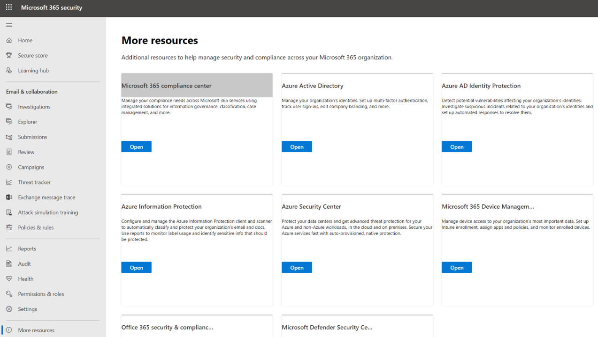
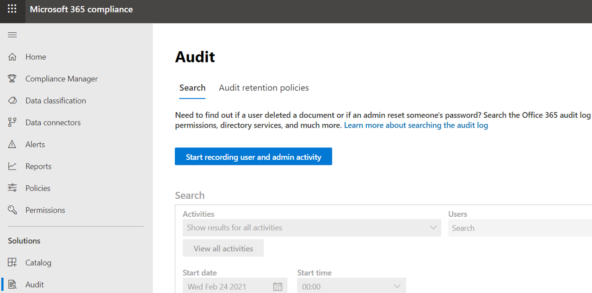
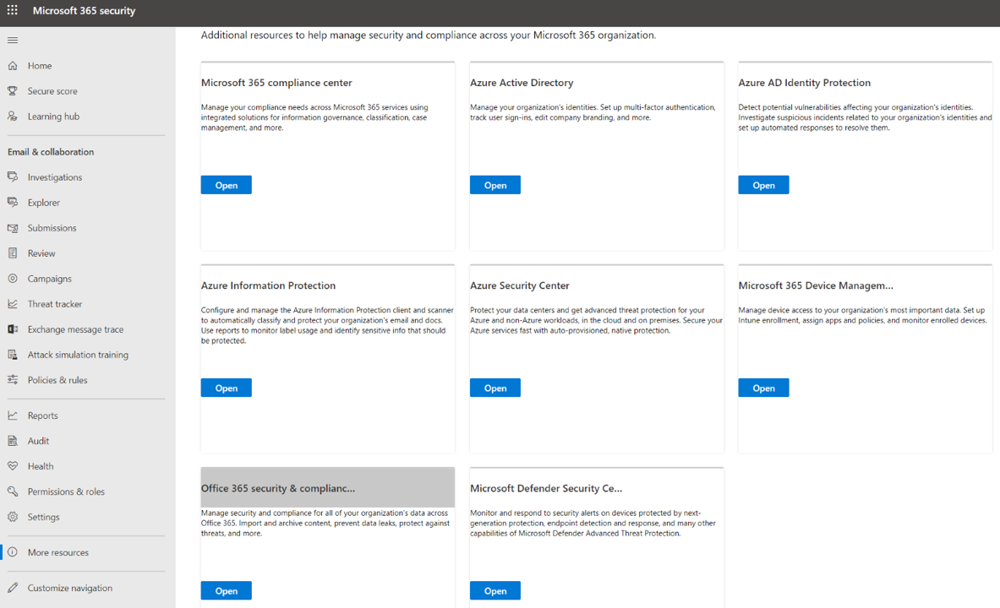
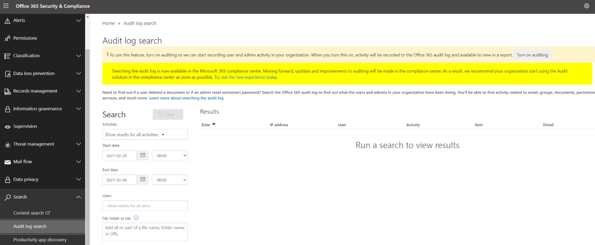

# Enable Office 365 Audit Log Search

Office 365 auditing needs to be enabled before configuring Microsoft Cloud App Security (MCAS) or connecting other solutions such as Azure Sentinel data connectors to it. Remember that the `Audit log search` is turned on by default for Microsoft 365 and Office 365 enterprise organizations. This includes organizations with E3/G3 or E5/G5 subscriptions. You can follow steps 1-3 to verify if it is enabled in your lab environment.

## Pre-requirements
* Office 365 E5 subscription
* Microsoft 365 E5 subscription
* You must be assigned the `Audit Logs role` in Exchange Online to turn audit log search on or off in your Microsoft 365 organization. By default, this role is assigned to the Compliance Management and Organization Management role groups on the Permissions page in the Exchange admin center. Global admins in Microsoft 365 are members of the Organization Management role group in Exchange Online.

## Main Steps
* Install Exchange online PowerShell v2 module
* Connect to Exchange Online
* Verify if Audit Log Search is enabled in Office 365
* Enable Audit Log search in Office 365
* Test Office 365 Audit via the Microsoft 365 compliance center 
* Test Office 365 Audit via Office 365 security and compliance

## 1. Install Exchange Online PowerShell v2 Module
* In a Windows endpoint, open PowerShell as Administrator
* Install and import the [Exchange Online PowerShell V2 module](https://docs.microsoft.com/en-us/powershell/exchange/exchange-online-powershell-v2?view=exchange-ps#install-and-maintain-the-exo-v2-module)

```PowerShell
Install-Module –Name ExchangeOnlineManagement
Import-Module ExchangeOnlineManagement
Get-Module ExchangeOnlineManagement
```


## 2. Connect to “Exchange Online”

In the same PowerShell session, run the following command with an account with the `Audit Logs` role assigned.

```PowerShell
Connect-ExchangeOnline –UserPrincipalName <account>@<domain> -ShowProgress $true
```



## 3. Verify if Audit Log Search is Enabled in Office 365
Check the current status of Office 365 auditing by running the following command:

```PowerShell
Get-AdminAuditLogConfig | FL UnifiedAuditLogIngestionEnabled
```


## 4. Enable Audit Log Search in Office 365

* Run the following command to turn on `audit log search` in Office 365

```PowerShell
Set-AdminAuditLogConfig -UnifiedAuditLogIngestionEnabled $true
```

* Verify if `audit log search` in Office 365 is enabled with the following command:

```PowerShell
Get-AdminAuditLogConfig | FL UnifiedAuditLogIngestionEnabled
```

## 5. Test Office 365 Audit via the Microsoft 365 Compliance Center
* Navigate to [Microsoft 365 Security Center](https://security.microsoft.com/)
* Go to More Resources > Office 365 Security & Compliance > Open



* Under the `Solutions` section, click on `Audit`. You should now be allowed to use this feature.


Before enabling auditing in Office 365, you would see something like the image below:

 

## 6. Test Office 365 Audit via Office 365 Security & Compliance
* Navigate to [Microsoft 365 Security Center](https://security.microsoft.com/)
* Go to More Resources > Office 365 Security & Compliance > Open



* Go to Search > Audit Log Search. You should now be allowed to use this feature.


Before enabling auditing in Office 365, you would see something like the image below:



Wait at least an hour for this setting to propagate across other services that depend on it. Services that depend on it are Microsoft Cloud App Security (MCAS) and Azure Sentinel Office 365 and MCAS data connectors.

## References
* [Connect Office 365 to Cloud App Security](https://docs.microsoft.com/en-us/cloud-app-security/connect-office-365-to-microsoft-cloud-app-security#how-to-connect-office-365-to-cloud-app-security)
* [Turn audit log search on or off - Microsoft 365 Compliance](https://docs.microsoft.com/en-us/microsoft-365/compliance/turn-audit-log-search-on-or-off?view=o365-worldwide)

