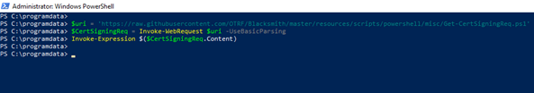
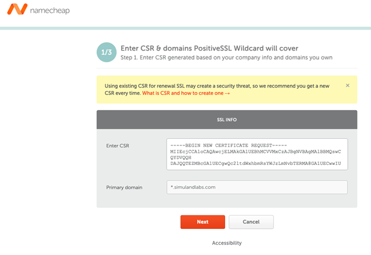
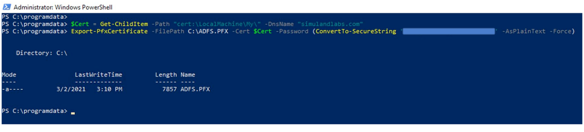

# Create a Certificate Signing Request and Get a Trusted CA Signed SSL Certificate

Simulating a federated trust between an “on-prem” environment and a Microsoft 365 Azure AD tenant requires an Active Directory Federation Services (AD FS) server with a trusted CA Signed SSL Certificate.
This guide will show you how to get a trusted CA signed SSL certificate all the way from creating the certificate signing request (CSR) to the activation, installation and export of the new certificate.

## Pre-requirements:
* A registered valid domain name

## Main Steps
* Create a certificate signing request (.csr) file.
* Buy an SSL Certificate.
* Activate SSL certificate. Here is where you would use the .csr file.
* Download and install trusted SSL certificate
* Export certificate and private keys as a .pfx file

## 1. Create a Certificate Signing Request (.CSR) File
A certificate signing request (CSR) is a block of encoded text that is given to a Certificate Authority when applying for an SSL Certificate.

For this step, we are going to use the following [PowerShell script](https://github.com/OTRF/Blacksmith/blob/master/resources/scripts/powershell/misc/Get-CertSigningReq.ps1) to generate a .csr file. You would usually execute that script on the server where you would install the new trusted certificate. However, since we have not deployed the active directory environment yet, we can do it on a separate local system. We can then install and export it from that computer to use it while deploying an AD FS server.

### Import PowerShell Module
* Log on to a Windows box and open PowerShell as Administrator
* Download and import the following module directly from GitHub

```PowerShell
$uri = 'https://raw.githubusercontent.com/OTRF/Blacksmith/master/resources/scripts/powershell/misc/Get-CertSigningReq.ps1'
$CertSigningReq = Invoke-WebRequest $uri –UseBasicParsing
Invoke-Expression $($CertSigningReq.Content)
```



### Create a .CSR File
In this guide, we create a request for a Positive SSL Wildcard (multidomain) certificate. Therefore, when creating the .csr file, we set a * wildcard as a prefix of the custom domain (i.e. *.yourdomain.com) for the Subject Common Name property of the request.

```PowerShell
Get-CertSigningReq -FriendlyName "*.yourdomain.com site certificate" 
-Description "ADFS yourdomain.com certificate" `
-SubjectCommonName "*.yourdomain.com" `
-SubjectOrganizationUnit "Research" `
-SubjectOrganization "yourdomain.com" `
-SubjectCountry "US" `
-SubjectState "PA" `
-SubjectLocality "PA" `
-CertFilePath "Request.csr"
```


Copy the contents of the .csr file and get ready to use it during the activation process of your new SSL certificate.

```PowerShell
get-content .\Request.csr
```

## 2. Buy an SSL Certificate
For this document, we bought ours from namecheap.com. In the previous step, we created a request for a PositiveSSL Wildcard certificate to secure multiple domains from one (i.e *.mydomain.com). Here are all the other options you have: [https://www.namecheap.com/security/ssl-certificates/](https://www.namecheap.com/security/ssl-certificates/)

Once you purchase your certificate, you should be ready to activate it and attach it to your domain.


If you want to validate your base64 encoded CSR blob, you can do it with this tool provided by namecheap called [Decoder](https://decoder.link/result).

## 3. Activate SSL certificate
Click on the `Activate` button shown in the previous image and enter the contents of your .csr file.



You need to confirm that you own the domain which you requested the SSL certificate for. When you get to that step you will have a few options:
* Add CNAME record: A validation CNAME record should be added to the DNS settings of your domain name. They are usually managed by your domain registrar or hosting provider.
* Receive an email: An email with a validation link will be sent to a predefined list of email addresses related to your domain name.
* Upload a validation file: The file is obtained from the CA once you submit an activation request. You will be able to download it from your account when the SSL’s status switches to `Pending`.


 
## 4. Install Certificate
* Download Certificate
* Log on to the computer where you created the .csr file and pen PowerShell as Administrator
* Install the new SSL certificate (.cer or .crt files provided by your trusted provider)

```PowerShell
$CertFile = Get-Item -Path NewSSLCert.cer

Import-Certificate -FilePath $CertFile.FullName -CertStoreLocation "cert:\LocalMachine\My"
```


 
## 5. Export Certificate and Private Key (.PFX Format)
The password that you use to export the certificate will be the same password that you will use to import the certificate file to other servers.

```PowerShell
$Cert = Get-ChildItem -Path "cert:\LocalMachine\My\" -DnsName "yourdomain.com"

Export-PfxCertificate -FilePath C:\ADFS.PFX -Cert $Cert -Password (ConvertTo-SecureString ‘YOURPASSWORD’ -AsPlainText -Force)
```



You are now ready to use that certificate while deploying an AD FS server.