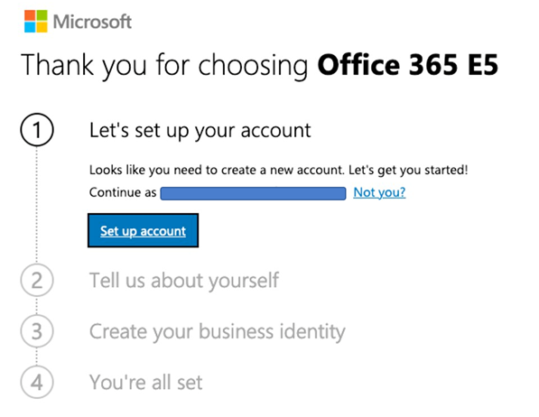
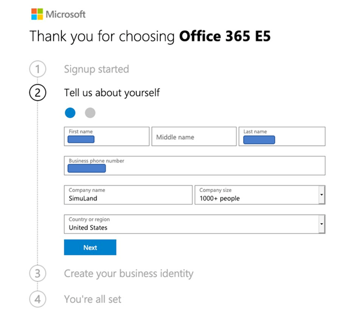
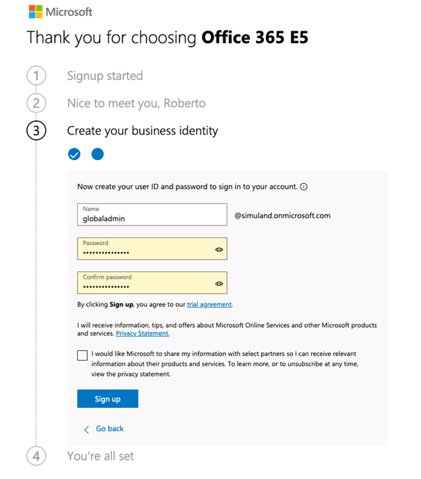
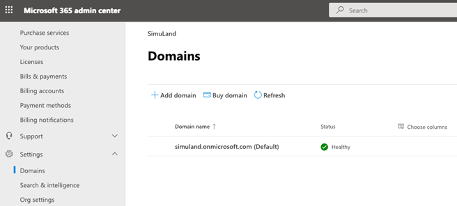
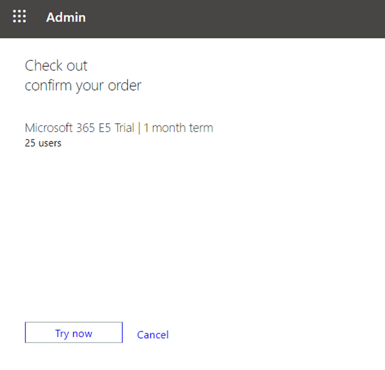

# Start Microsoft 365 E5 Trial

A Microsoft 365 E5 license can only be added to an existing Azure tenant. Therefore, it is important to first get an Office 365 E5 subscription to create an Azure tenant. For this demonstration, trial licenses will be used in both instances.

## Main Steps
1. Sign up for an Office 365 E5 Trial License.
2. Activate a Microsoft 365 E5 Trial License.
3. Update your User’s License from Office 365 E5 Trial to Microsoft 365 E5 Trial.

## Sign up for an Office 365 E5 Trial License
1. Browse to [Microsoft 365: Office 365 E5 Product Portal](https://www.microsoft.com/en-us/microsoft-365/enterprise/office-365-e5) and select `Free trial`.

 
2. Set up your account for your Office 365 E5 trial license.

 
3. You can use your personal e-mail and it will guide you to set up a new account for your E5 license. Your personal account will be attached to your new account.

4. Provide some information for your account.

5. Choose how you would like to get a verification code to continue with your account setup.

6. Create your trial business identity.

7. Create the user to sign into your account.

8. Once your account is created, you can check your e-mail address for additional information.

9. Once you are done with the initial steps, clicking on either	`Get Started` or `Manage your subscription` leads you to a login page. Login with your username and password specified in Step 7.

10. If you had clicked on `Manage your subscription`, you would enter your [Microsoft 365 Admin Center](https://admin.microsoft.com/). Under `Billing`, you can verify your current `Products` and see the new Office 365 E5 Trial license there. You can validate that your trial has started and ends in 30 days.

If you check your current `Domains` under `Settings`, you will see your new domain which was created earlier in Step 6. (Click `Show all` if you do not see `Settings`)

11. If you had clicked on `Get Started`, you would have the option to continue setting up a few things such as a custom domain or new users to your organization. However, that’s something we are going to do in other documents. Click `Exit setup` (at the bottom of the page) to leave these setup steps for later.

 

## Activate a Microsoft 365 E5 Trial License 

1. Browse to your [Microsoft 365 Admin Center](https://admin.microsoft.com/) if you were not redirected in the previous step.
2. Click on `Billing` > `Purchase services`

3. Expand products under `Microsoft 365` and select `Microsoft 365 E5` by clicking on `Details`.

4. Click on `Start free trial`.

 

5. Prove that you are not a robot by providing a phone number to get a verification code. The text message option is used here.

 

6. Enter the verification code that you received via a text message (or a call).

 

7. Confirm your order by clicking `Try now`.

 

8. Save the order number and click on `Continue`.

9. You will receive an email regarding the trial's activation to your newly created domain's inbox. You can also check `Your products` in your [Microsoft 365 Admin Center](https://admin.microsoft.com/) under `Billing`, and see that the Microsoft 365 E5 trial is now active.

## Update your User’s License from Office 365 E5 Trial to Microsoft 365 E5 Trial

1. Go to `Users` > `Active users` > Select your user account > `Licenses and apps`. You will see that the user's current license is the Office 365 E5 license.

2. Swap the user's license by unchecking the box for Office 365 E5 and checking the box for Microsoft 365 E5. Click `Save changes`.

3. A message stating `Your changes have been saved.` indicates that the updating of the user's license was successful.
