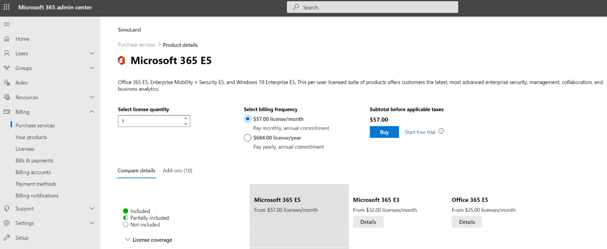

# Start Microsoft 365 E5 Trial

A Microsoft 365 E5 license can only be added to an existing Azure tenant. Therefore, it is important to first get an Office 365 E5 subscription to create an Azure tenant.

## Main Steps
* Sign up for an Office 365 E5 Trial License
* Active Microsoft 365 E5 Trial 
* Update your User’s License from Office 365 to Microsoft 365 E5 Trial

## Sign up for an Office 365 E5 Trial License
1. Browse to [Microsoft 365: Office 365 E5 Product Portal](https://www.microsoft.com/en-us/microsoft-365/enterprise/office-365-e5?rtc=1&activetab=pivot:overviewtab) and select `Free Trial`.

 
2. Set up your account for your Office 365 E5 trial license.

 
3. You can type your personal e-mail and it will guide you to set up a new account for your E5 license. Your personal account will be attached to your new account.

4. Provide some information for your account.

5. Choose how you would like to get a verification code to continue with your account setup.

6. Create your trial business identity.

7. Create the user to sign into your account.

8. Once your account is created, you can check your e-mail address for additional information.

9. Once you are done with the initial steps, one option is to click on `Manage your subscription` to go to your [Microsoft 365 Admin Center](https://admin.microsoft.com/). There you can verify you current `Products` and see the new Office 365 E5 Trial license there. You can validate that your trial has started and ends in 30 days.

10. Another option would be to click on `Get Started` and continue setting up a few things such as a custom domain or new users to your organization. However, that’s something we are going to do in other documents. Just Exit out of that setup step.

 

If you check your current domains under `Settings`, you will see your new one.

## Activate Microsoft 365 E5 Trial 

1. Browse to your [Microsoft 365 admin center](https://admin.microsoft.com/) if you were not redirected in the previous step 
2. Go Billing > Purchase Services

3. Expand products under `Microsoft 365` and select `Microsoft 365 E5`

4. Click on `Start Trial`

 

5. Prove you are not a robot by providing a phone number to get a verification code via a text message

 

6. Enter the verification code you received via a text message

 

7. Confirm your order

 

8. Save the order number and click on “Continue”

9. You can check your products one more time in your [Microsoft 365 admin center](https://admin.microsoft.com/) under `Billing`, and see that the Microsoft 365 E5 trial is there

## Update your User’s License from Office 365 to Microsoft 365 E5 Trial

1. Go to Users > Active Users > select your user account > Licenses and apps

2. Swap license from Office 365 E5 to Microsoft 365 E5

