# Configure Azure AD Connect: ADFS

## Pre-Requirements
* [Microsoft 365 E5 License](../../1_prepare/startM365E5Trial.md)
* [Custom domain added to Microsoft 365](../../1_prepare/addDomainToM365.md).
* Active Directory Domain Controller and Active Directory Federation Services (AD FS) Server
    * Azure Bastion set up.

## Configure Azure AD Connect
1.	Connect to Domain Controller [via Azure Bastion](connectAzVmAzBastion.md)
2.	Double click on the Azure AD connect icon on the desktop to start the setup process.
3.	Agree to the license terms and privacy notice and continue.

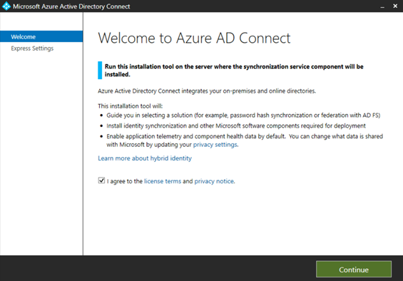

4.	Click on the `Customize` option.

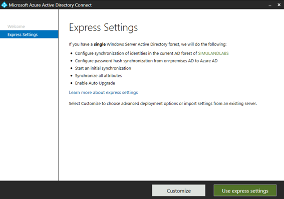

5.	Keep the defaults and click on `Install`.

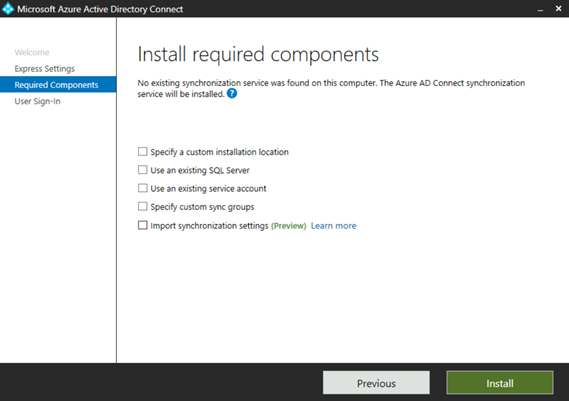

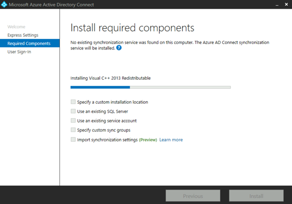

6.	Select `Federation with AD FS`. We are going to use the `on-prem` AD FS server as the identity provider to handle federation services.

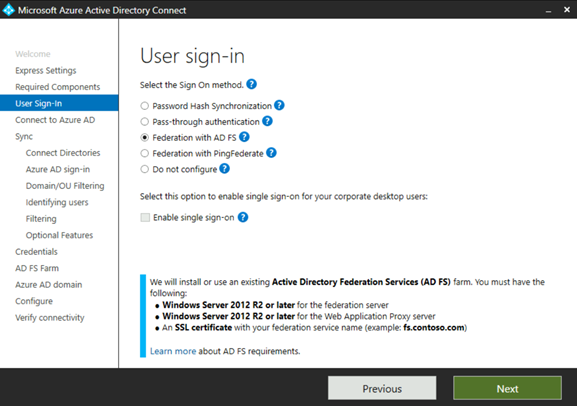

7.	Enter Azure AD Global Admin creds
 
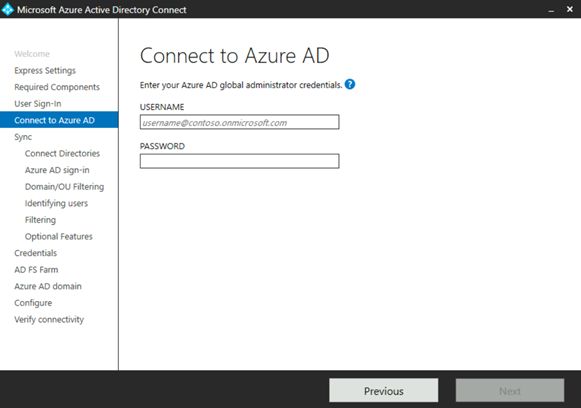
 
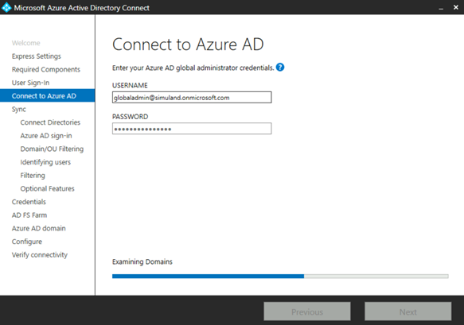

8.	Connect `on-prem` forest. Verify the Forest name and click on `Add Directory`.

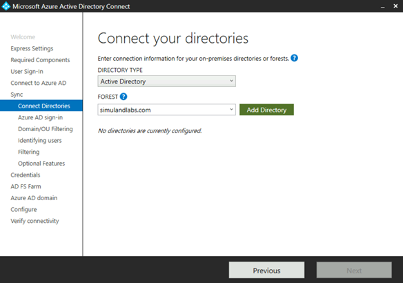

9.	Select the first option to create a new AD account. You have to enter the credentials of a domain admin in the `on-prem` environment.
 
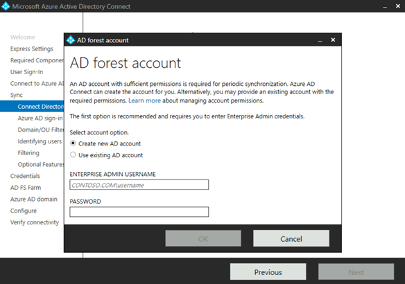

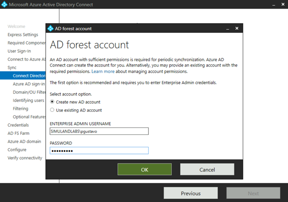

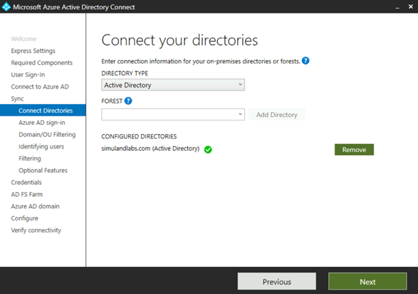

10.	Keep the defaults and click `Next`.
 
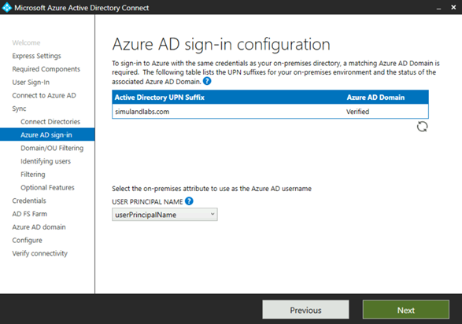

11.	Select specific domains and OUS. Select Users OU and click `Next`.

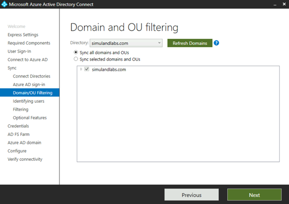

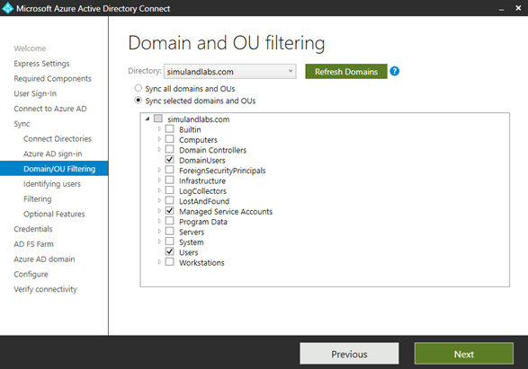

12.	Keep the defaults and click `Next`.

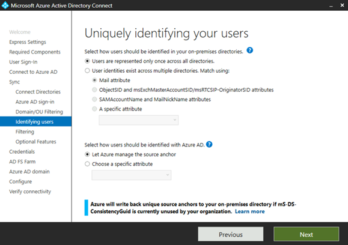

13.	Keep the defaults and click `Next`. Synchronize all users and devices.

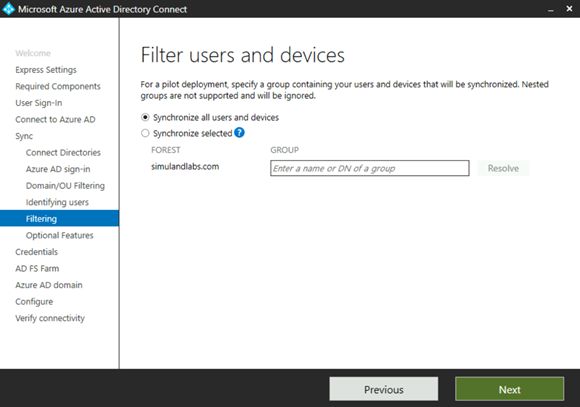

14.	Keep the defaults and click `Next`.

15.	Enter the credentials of a domain admin in the `on-prem` environment.

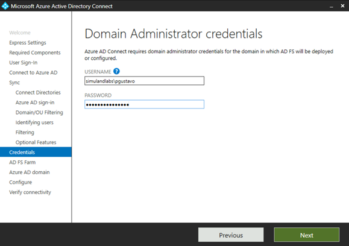

16.	Choose `Use an existing AD FS farm`

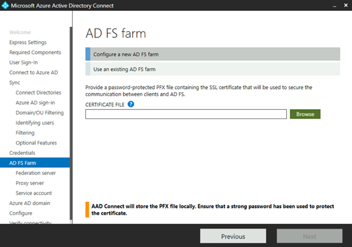

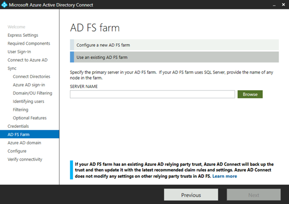

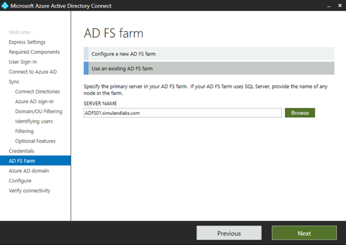

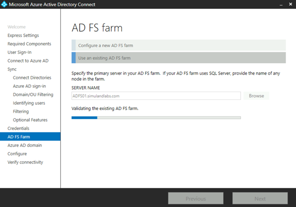

17.	Select the Azure AD domain to federate and click `Next`.

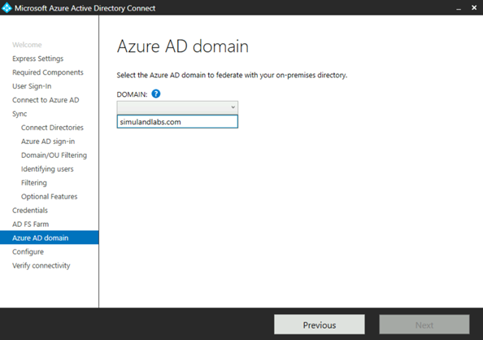

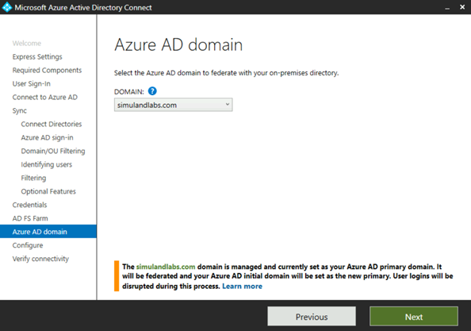

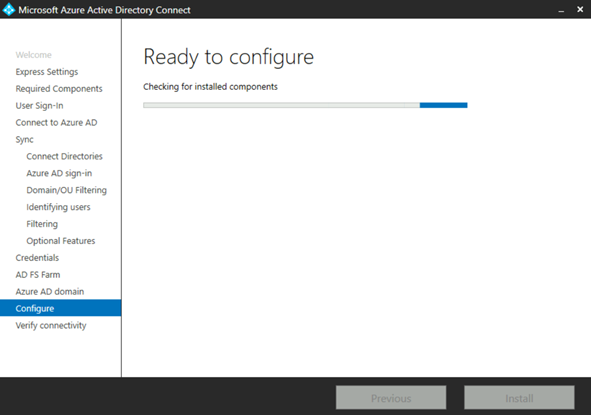

18.	Keep the defaults and click `Install`.

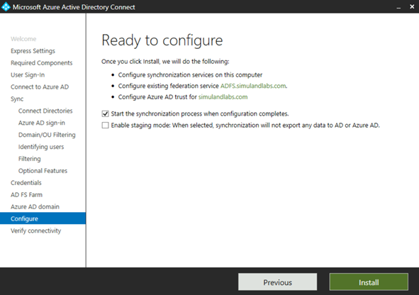

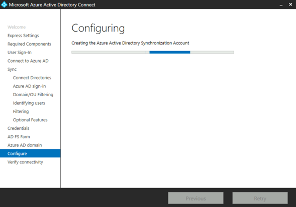

19.	After the Azure AD Connect configuration succeeds, click `Next` to verify the federation settings.
 
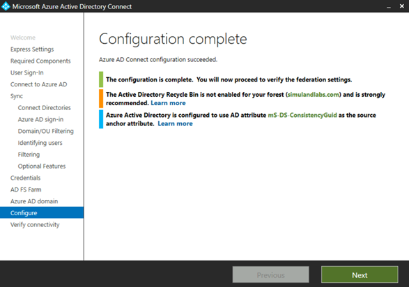

20.	keep the defaults for now and verify federation connectivity from the intranet. Click `Verify`.

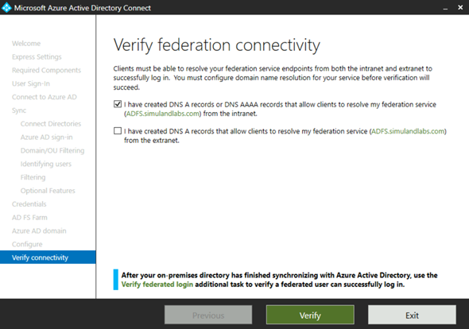

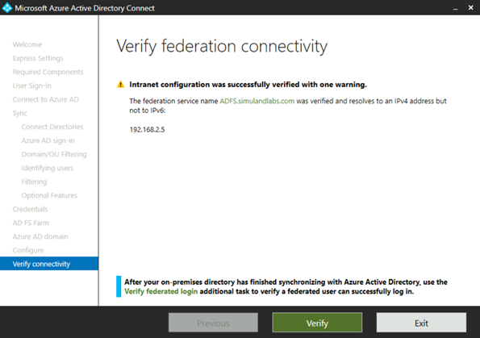

21.	That’s it! Click “Exit”

## Verify Federated Access

### Azure AD Connect
1.	Browse to [Azure portal](https://portal.azure.com/)
2.	Azure AD > Azure AD Connect

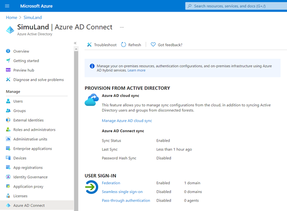

### Azure AD Custom Domains
1.	Browse to [Azure portal](https://portal.azure.com/)
2.	Azure AD > Custom Domain Names

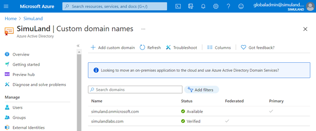

### Microsoft 365 Active Users
1.	Browse to [Microsoft 365 Admin portal](https://admin.microsoft.com/)
2.	Users > Active Users

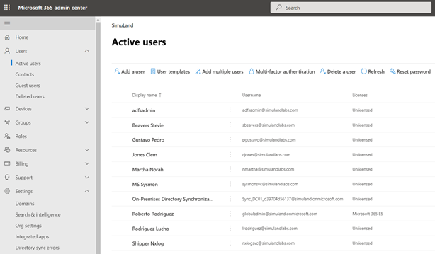
