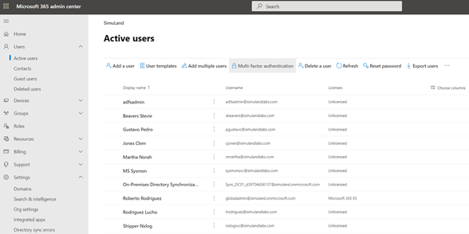
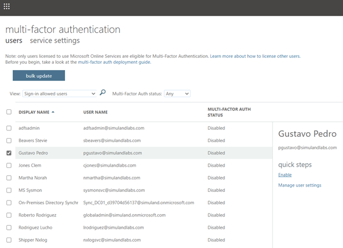
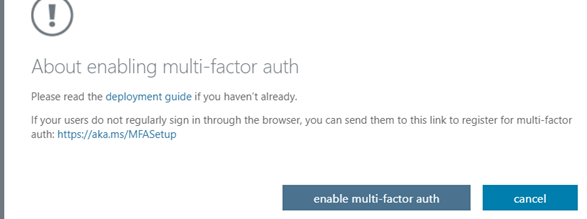
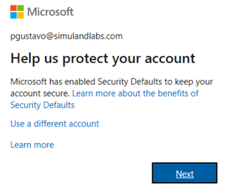
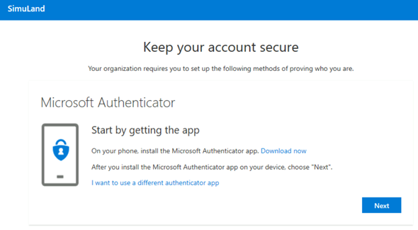
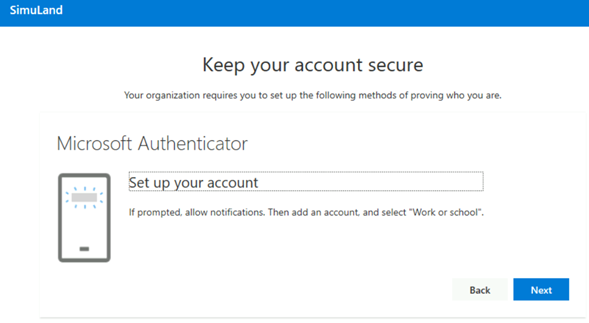
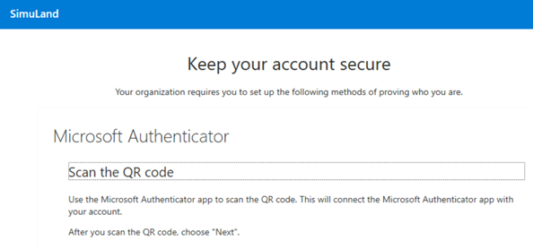
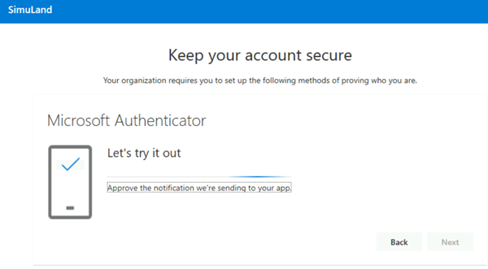
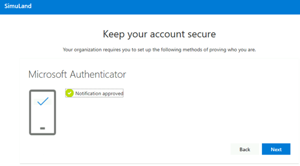
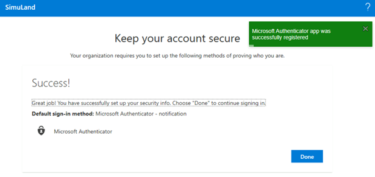

# Enable Multi-Factor Authentication

## Pre-Requirements
* [Microsoft 365 E5 License](../../1_prepare/startM365E5Trial.md)
* Azure AD active users

## Enable Multi-Factor Authentication
1.	Browse to [Microsoft 365 Admin portal](https://admin.microsoft.com/).
2.	Users > Active Users.
3.	Click on the `Multi-Factor authentication` tab.
 

4.	Select user(s) and click on `Enable`. Next, click on `enable multi-factor auth`.

## Set up Authenticator
1.	Connect to a domain joined workstation (i.e. WORKSTATION6) [via Azure Bastion](connectAzVmAzBastion.md).
2.	Open browser, go to [https://aka.ms/MFASetup](https://aka.ms/MFASetup).
3.	Log in as the user whom you enabled MFA on.
4.	Click Next to start the set-up process.

5.	Follow all the steps to set up MFA with the Microsoft Authenticator application.

