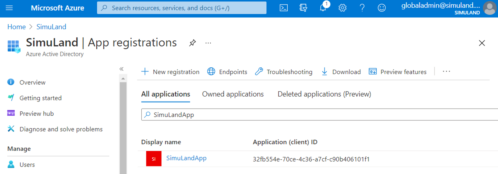
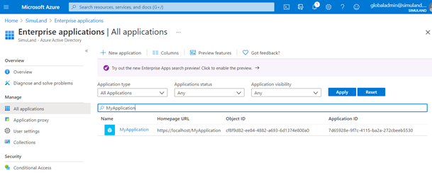
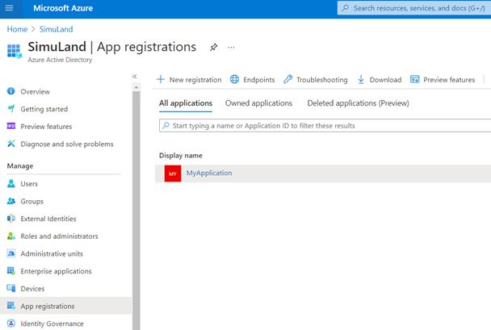
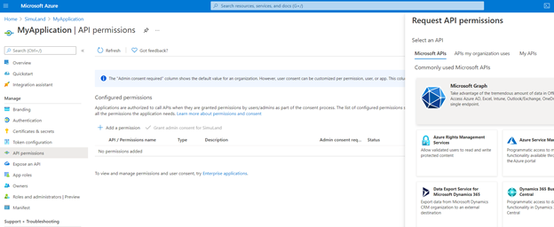
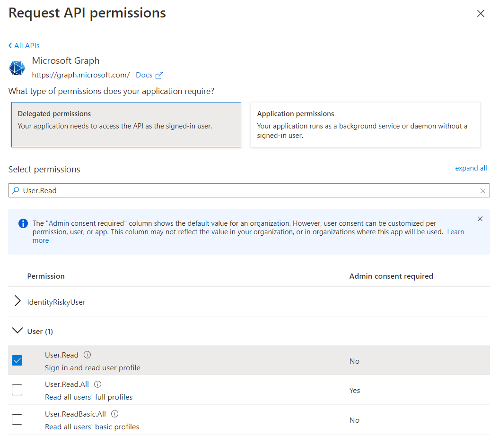
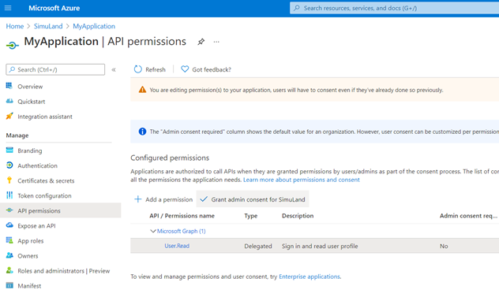
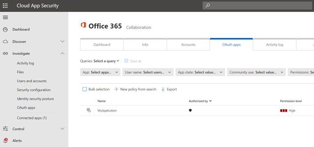

# Register Azure AD Application and Create App Service Principal

## Pre-Requirements
* Azure AD tenant
* Azure AD User with permissions to register Azure AD applications
* [Azure CLI installed](https://docs.microsoft.com/en-us/cli/azure/install-azure-cli)

## Register Azure AD Application
1.	Locally on your computer, log on as a global admin account or user that can register Azure AD applications.

```PowerShell
az login
```

2.	Open a PowerShell console and register a new Azure AD application with the following command.

```PowerShell
$app= az ad app create --display-name MyApplication --homepage 'https://localhost/MyApplication' --reply-urls 'https://localhost/MyApplication' --identifier-uris 'https://localhost/MyApplication'
$app = $app | ConvertFrom-Json
```

3.	Browse to [Azure Portal](https://portal.azure.com/)
4.	Go to Azure AD > App Registrations.
5.	Verify application was registered.
 


## Create Service Principal for Azure AD Application
1.	Run the following command to create a service principal for the Azure AD application

```PowerShell
az ad sp create --id $app.appId
```

1.	Browse to [Azure Portal](https://portal.azure.com/)
2.	Go to Azure AD > Enterprise Applications
3.	Look for your Azure AD App service principal



## Grant Delegated Permissions
1.	Browse to [Azure Portal](https://portal.azure.com/)
2.	Go to Azure AD > App Registrations > MyApplication



3.	API Permissions > Add a permission > Microsoft APIs > Microsoft Graph



4.	Select `Delegated Permissions` > `User.Read` > Add permissions



5.	Do NOT Grant admin consent to the application



That’s it.
 
Applications sometimes take a few hours to show in the Microsoft Cloud App Security (MCAS) portal.
1.	Navigate to [Microsoft 365 Security Center](https://security.microsoft.com/)
2.	Go to  `More Resources` and click on `Microsoft Cloud App Security`.
3.	Investigate > Connected Apps > Office 365 > OAuth Apps


