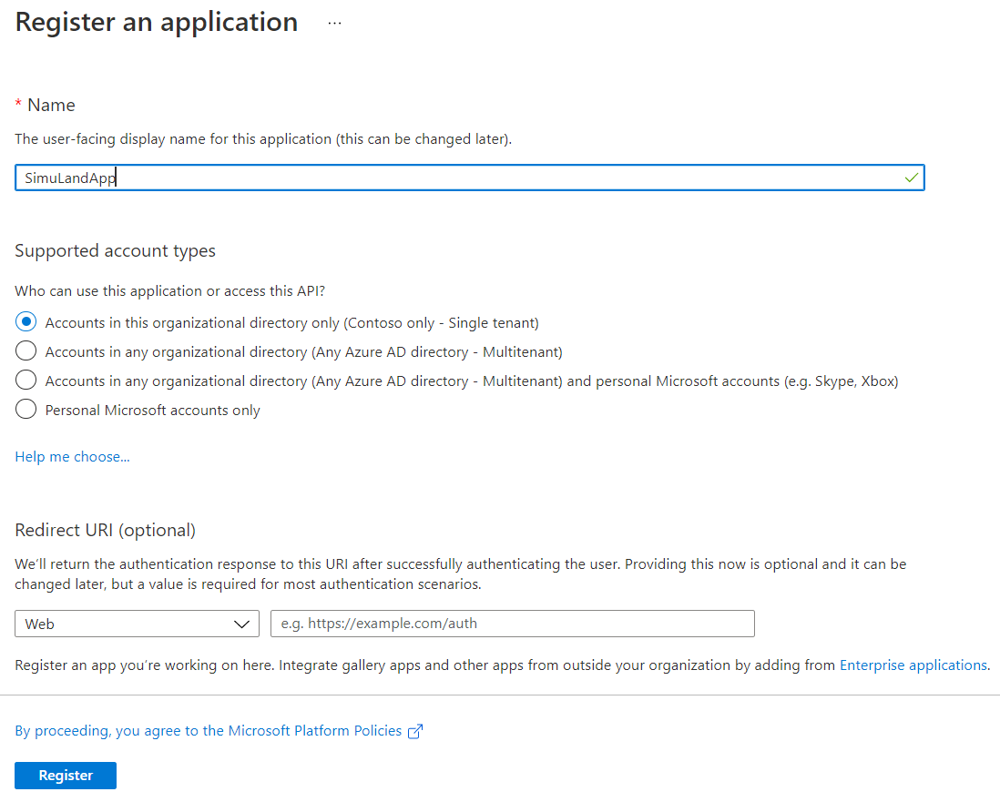
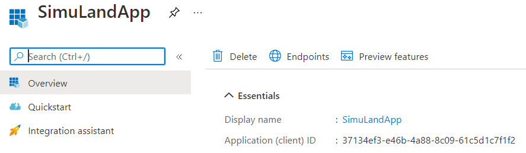
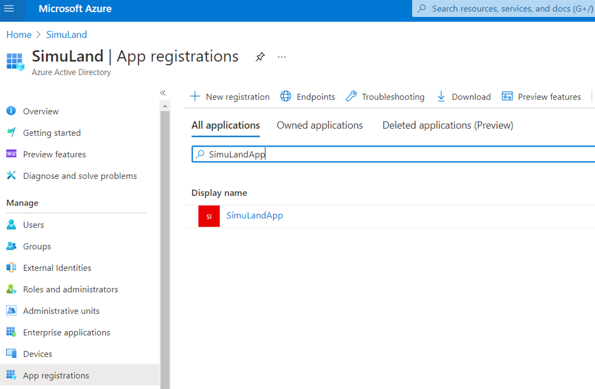
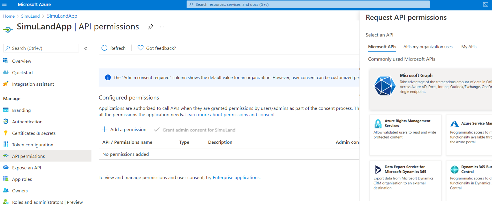
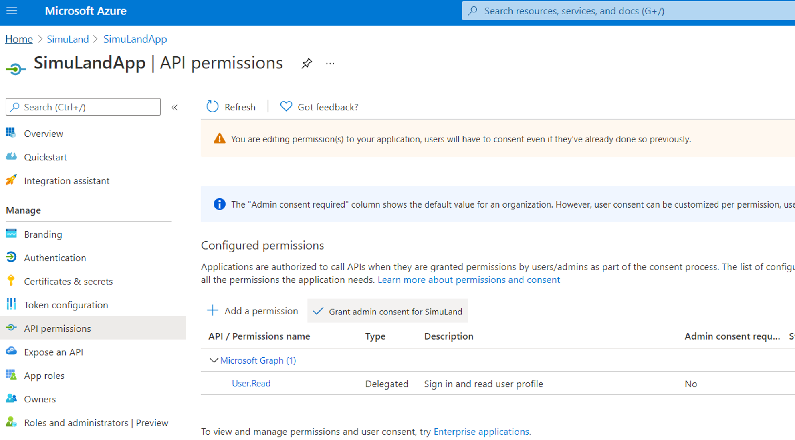

# Register Azure AD Application and Create App Service Principal

## Pre-Requirements
* Azure AD tenant
* Azure AD User with permissions to register Azure AD applications
* [Azure CLI installed](https://docs.microsoft.com/en-us/cli/azure/install-azure-cli)

## Register Azure AD Application

1.	Locally on your computer, open a PowerShell console and log on with an account that can register Azure AD applications.

```PowerShell
az login
```

2.	Register a new Azure AD application. By default, let's name it `SimuLandApp`. If you decide to give it another name, make sure you take a note of that since you will need it while going through lab instructions.

```PowerShell
$appName = "SimuLandApp"
$results= az ad app create --display-name $appname --homepage "https://localhost/$appname" --reply-urls "https://localhost/$appname" --identifier-uris "https://localhost/$appname"
$app = $results | ConvertFrom-Json
$app
```

3.	Browse to [Azure Portal](https://portal.azure.com/)
4.	Go to Azure AD > App Registrations.
5.	Verify application was registered.
 


## Create Service Principal for Azure AD Application

1.  Use the variable `$app` from the previous section and run the following command to create a service principal for the Azure AD application:

```PowerShell
az ad sp create --id $app.appId
```

2.	Browse to [Azure Portal](https://portal.azure.com/)
3.	Go to Azure AD > Enterprise Applications
4.	Look for your Azure AD App service principal



## Grant Delegated Permissions

Let's make it an OAuth application by adding a delegated permissions to it.

1.	Browse to [Azure Portal](https://portal.azure.com/)
2.	Go to Azure AD > App Registrations > `SimuLandApp`



3.	API Permissions > Add a permission > Microsoft APIs > Microsoft Graph



4.	Select `Delegated Permissions` > `User.Read` > Add permissions


5.	Do NOT Grant admin consent to the application



That’s it.
 
Applications sometimes take a few hours to show in the Microsoft Cloud App Security (MCAS) portal.
1.	Navigate to [Microsoft 365 Security Center](https://security.microsoft.com/)
2.	Go to  `More Resources` and click on `Microsoft Cloud App Security`.
3.	Investigate > OAuth Apps
