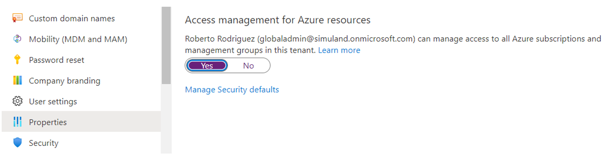
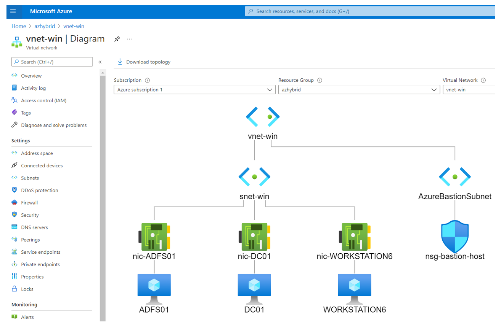

# Azure AD Hybrid Identity: Active Directory Federation Services (AD FS) Deployment 

[](https://portal.azure.com/#create/Microsoft.Template/uri/https%3A%2F%2Fraw.githubusercontent.com%2FAzure%2FSimuLand%2Fmain%2F2_deploy%2FaadHybridIdentityADFS%2Fazuredeploy.json)
[](https://portal.azure.us/#create/Microsoft.Template/uri/https%3A%2F%2Fraw.githubusercontent.com%2FAzure%2FSimuLand%2Fmain%2F2_deploy%2FaadHybridIdentityADFS%2Fazuredeploy.json)

## Prepare
1.	[Get a Microsoft 365 E5 license.](../../1_prepare/startM365E5Trial.md)
2.	[Get an Azure subscription.](../../1_prepare/m365TenantGetAzSubscription.md)
3.	[Add a custom domain to your Microsoft 365 tenant.](../../1_prepare/addDomainToM365.md)
4.	[Enable Office 365 Audit Log Search.](../../1_prepare/enableOffice365AuditLogSearch.md)
5.	[Configure Microsoft 365 Defender Security Products.](../../1_prepare/configureM365Defender.md)
6.	[Get a trusted CA signed SSL certificate.](../../1_prepare/getTrustedCASignedSSLCertificate.md)
7.	[Create Azure Storage private container.](../../1_prepare/createPrivateContainerUploadFile.md)
    * Upload SSL certificate.
    * Upload MDE onboarding package.
    * Upload MDI onboarding package.
8.	[Install Azure CLI locally](https://docs.microsoft.com/en-us/cli/azure/install-azure-cli)

## Deploy Lab Infrastructure
Once you finish all the steps from the `Prepare` section, you should be ready to deploy most of the infrastructure needed for this environment.

### Network Design


The ARM template for this environment is of [tenant scope](https://docs.microsoft.com/en-us/azure/azure-resource-manager/templates/deploy-to-tenant?tabs=azure-cli). Therefore, [you will need to elevate access to manage all Azure resources and assign “owner” or “contributor” roles to the account running the ARM template](https://docs.microsoft.com/en-us/azure/azure-resource-manager/templates/deploy-to-tenant?tabs=azure-cli#required-access).

### Elevate account access so that you can assign roles
1.	Browse to [Azure portal](https://portal.azure.com/).
2.	Log in with a `Global Administrator` account.
3.	Go to Azure Active Directory > Manage > Properties.
4.	Under Access management for Azure resources, set the toggle to `Yes`.



5.	Save your setting. `This setting is not a global property and applies only to the currently signed in user`. You can't elevate access for all members of the Global Admin role.

### Sign Into Azure
With Azure CLI installed locally on your computer, open a terminal to run the following command to log on as the `Global Administrator` account you used in the previous step.

```
az login
```

#### Assign Owner Role for Root Scope to your own Account
I recommend logging out and logging back in after running the following command in your terminal:

```
az role assignment create --assignee "<user-objectid>" --scope "/" --role "Owner"
```

### Create Resource Group

```
az group create -n azhybrid -l eastus
```

### Deploy ARM Template
```
az deployment tenant create --template-uri https://raw.githubusercontent.com/Azure/SimuLand/main/2_deploy/aadHybridIdentityADFS/azuredeploy.json --location YOURLOCATION --parameters
resourceGroup='RESOURCE GROUP NAME'
subscriptionId='SUBSCRIPTION ID'
adminUsername='NEW LOCAL ADMIN'
adminPassword='NEW LOCAL ADMIN PASSWORD'
adfsUsername='NEW AD FS USER ACCOUNT'
adfsPassword='NEW AD FS USER PASSWORD'
domainFQDN='DOMAIN.COM'
pfxCertName='CERT-NAME.pfx'
pfxCertPassword='CERT-PASSWORD'
_pfxCertBlobSasUrl='"https://STORAGE ACCOUNT.blob.core.windows.net/CONTAINER NAME/CERT.PFX?SAS-TOKEN"'
_mdePackageBlobSasUrl='"https://STORAGE ACCOUNT.blob.core.windows.net/CONTAINER NAME/MDE-FILE.zip?SASTOKEN"'
_mdiPackageBlobSasUrl='"https://STORAGE ACCOUNT.blob.core.windows.net/CONTAINER NAME/MDI-FILE.zip?SASTOKEN"'
_mdiAccessKey='xxxxxx'
```

**Parameter Definitions**:
* resourceGroup = Azure resource group to deploy resources to
* subscriptionId= Azure subscription ID to deploy resources to
* adminUsername = New local administrator account
* adminPassword = Password for new local administrator account
* adfsUsername = New AD FS service account
* adfsPassword = Password for new AD FS service account
* domainFQDN = The FQDN of the Active Directory Domain to be created
* pfxCertName = Name of the Trusted CA signed SSL Certificate file hosted in the Azure storage account – Private Container (Check `Deployment Requirements` section)
* PfxCertPassword = Password used to export trusted CA signed SSl certificate
* _pfxCertBlobSasUrl = Blob SAS Url to access a trusted CA signed SSL certificate hosted in an Azure account storage private container. A .PFX file.
* _mdePackageBlobSasUrl = Blob SAS Url to access an Microsoft Defender for Endpoint (MDE) install package hosted in an Azure account storage private container.
* _mdiPackageBlobSasUrl = Blob SAS Url to access an Microsoft Defender for Identity (MDI) install package hosted in an Azure account storage private container.
* _mdiAccessKey = Microsoft Defender for Identity (MDI) Access Key used to install an MDI sensor. This value is in your MDI portal under the sensors section.

You can track your deployment by going to resource groups > RG NAME > Deployments.


After 30-35 mins, most of the `on-prem` infrastructure and Azure Sentinel would be deployed.

**Additional Notes**: While waiting for the installation of Microsoft Defender for Endpoint sensors, an endpoint extension might return an exception. However, if after checking the logs inside of the VM, and the error id is 35, it will continue checking for onboarding status and eventually finish the installation.

## Validate Deployment
Once everything is deployed, I highly recommend you check the status of a few services and resources that were deployed by the ARM template provided with this setup.

### “On-Prem” Virtual Network Deployed
1.	Browse to [Azure portal](https://portal.azure.com/)
2.	Go to Resource Groups > `Resource Group Name`.
3.	Select the `Virtual Network` resource > Monitoring > Diagram.
 


### Validate AD FS Service is Running
1.	Browse to [Azure portal](https://portal.azure.com/)
2.	Go to Resource Groups > `Resource Group Name`
3.	Select the ADFS01 virtual machine resource and click on `Connect` > Bastion ([More details](../_helper_docs/connectAzVmAzBastion.md)).


4.	Enter Administrator credentials
5.	Open PowerShell as Administrator and run the following command to know if the AD FS service is running.

```PowerShell
Get-Service ADFSSRV
```

6.	Then, run the following command to get information about the AD FS server setup. You will need the value of HostName for the next section `step 5`.

```PowerShell
Get-AdfsProperties
Get-AdfsProperties | Select-Object HostName
```

### Validate AD FS Service via the Intranet
1.	Browse to [Azure portal](https://portal.azure.com/)
2.	Go to Resource Groups > `Resource Group Name`
3.	Select the WORKSTATION6 virtual machine and click on `Connect` > Bastion ([More details](../_helper_docs/connectAzVmAzBastion.md)).


4.	Enter domain user credentials
5.	Browse to `https://<AD FS HostName>/adfs/ls/idpinitiatedsignon.aspx`
* The AD FS HostName is what we got previously on step 5.
* If you get a login page like the one below and you can authenticate with a domain user’s credentials, then the AD FS service is running properly via the Intranet.
* You still need to link this service with Azure AD. More information about that is provided later in the `post-deployment tasks` section.


### Azure Sentinel Instance
1.	Browse to [Azure portal](https://portal.azure.com/)
2.	Search for “Azure Sentinel”
3.	Select Azure Sentinel instance created after running the ARM template.


### Azure Sentinel Data Connectors
4.	Azure Sentinel Instance > Data Connectors


### Azure Sentinel Analytics – Active Scheduled Alerts
5.	Azure Sentinel Instance > Analytics


### Azure AD Active Directory - Diagnostic Settings
1.	Browse to [Azure portal](https://portal.azure.com/)
2.	Search for `Azure Active Directory`
3.	Monitoring > Diagnostic settings > AADConnector-`Name` > Edit Setting.


### Log Analytics Workspace – Windows Event Logs
1.	Browse to [Azure portal](https://portal.azure.com/)
2.	Go to Resource Groups > `Resource Group Name`.
3.	Select the `Log Analytics Workspace` resource.
4.	Go to Settings > Agents configuration > Windows event logs.


### Microsoft Defender for Endpoint
1.	Browse to [Microsoft 365 Security portal](https://security.microsoft.com/)
2.	Click on “More Resources”
3.	Click on “Open” under the Microsoft Defender Security Center
4.	Device Inventory


### Microsoft Defender for Identity
1.	Browse to [Microsoft 365 Security portal](https://security.microsoft.com/)  
2.	Click on “More Resources”
3.	Click on “Open” under Azure Advanced Threat Protection (Microsoft Defender for Identity)
4.	Go to Configuration > Sensors.
If you have a sensor that does not start properly or it is constantly stopping and restarting itself, check if the `Domain Controllers` value is set. I have seen AD FS servers not picking up the domain controller name. Simply click on the sensor name and add the FQDN of the domain controller to the `Domain Controllers` property of the sensor.


## Post-Deployment Tasks
Not everything can be automated yet. Therefore, there are a few additional tasks to complete:

1.	[Finish Azure AD Connect setup on the "on-prem” AD domain controller](../_helper_docs/configureAADConnectADFS.md).
2.	[Enable Multi-Factor authentication to domain users](../_helper_docs/enableMultiFactorAuthentication.md).
3.	[Assign “Global Administrator” role to one domain user](../_helper_docs/assignAADRole.md).
4.	[Add Microsoft 365 E5 license to domain users](../_helper_docs/addM365LicenseToUser.md).
5.	[Register an Azure AD Application](../_helper_docs/registerAADAppAndSP.md).