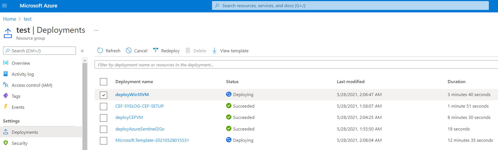
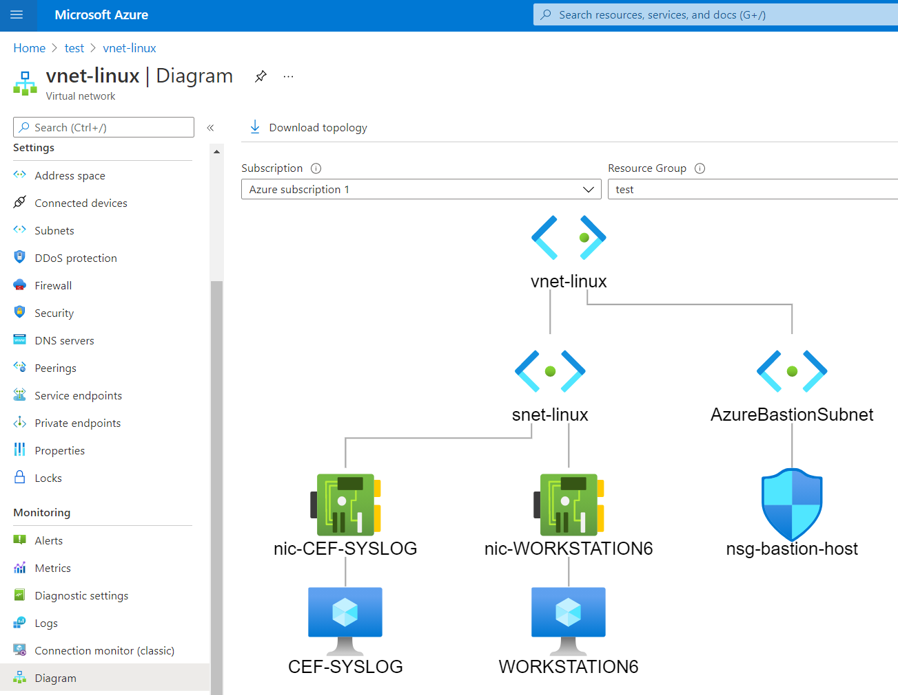
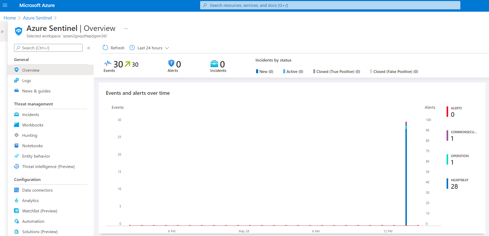
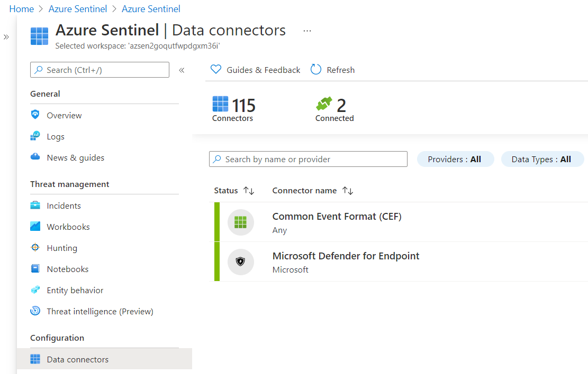

# Windows 10 + Common Event Format (CEF) Simulator Server Deployment 

[](https://portal.azure.com/#create/Microsoft.Template/uri/https%3A%2F%2Fraw.githubusercontent.com%2FAzure%2FSimuLand%2FAnomalyFusionSimulator%2F2_deploy%2Fwin10CEFServer%2Fazuredeploy.json)
[](https://portal.azure.us/#create/Microsoft.Template/uri/https%3A%2F%2Fraw.githubusercontent.com%2FAzure%2FSimuLand%2FAnomalyFusionSimulator%2F2_deploy%2Fwin10CEFServer%2Fazuredeploy.json)

## Prepare
1.	[Get a Microsoft 365 E5 license.](../../1_prepare/startM365E5Trial.md)
2.	[Get an Azure subscription.](../../1_prepare/m365TenantGetAzSubscription.md)
3.	[Configure Microsoft 365 Defender for Endpoint.](../../1_prepare/configureM365Defender.md)
7.	[Create Azure Storage private container.](../../1_prepare/createPrivateContainerUploadFile.md)
    * Upload MDE onboarding package.
8.	[Install Azure CLI locally](https://docs.microsoft.com/en-us/cli/azure/install-azure-cli)

## Deploy Lab Infrastructure
Once you finish all the steps from the `Prepare` section, you should be ready to deploy most of the infrastructure needed for this environment.

### Network Design

### Sign Into Azure
With Azure CLI installed locally on your computer, open a terminal to run the following command to log on as a user authorized to deploy resources in Azure.

```
az login
```

### Create Resource Group

```
az group create -n azhybrid -l eastus
```

### Deploy ARM Template
```
az deployment group create --template-uri https://raw.githubusercontent.com/Azure/SimuLand/AnomalyFusionSimulator/2_deploy/win10CEFServer/azuredeploy.json --parameters
adminUsername=`NEW LOCAL ADMIN`
adminPassword=`NEW LOCAL ADMIN PASSWORD`
_mdePackageBlobSasUrl=`https://STORAGE ACCOUNT.blob.core.windows.net/CONTAINER NAME/MDE-FILE.zip?SASTOKEN`
```

**Parameter Definitions**:
* adminUsername = New local administrator account
* adminPassword = Password for new local administrator account
* _mdePackageBlobSasUrl = Blob SAS Url to access a MDE install package hosted in an Azure account storage private container.

You can track your deployment by going to resource groups > RG NAME > Deployments.

After 15-20 mins, all the infrastructure will be deployed.



**Additional Notes**: While waiting for the installation of Microsoft Defender for Endpoint sensors, an endpoint extension might return an exception. However, if after checking the logs inside of the VM, and the error id is 35, it will continue checking for onboarding status and eventually finish the installation.

## Validate Deployment
Once everything is deployed, I highly recommend you check the status of a few services and resources that were deployed by the ARM template provided with this setup.

### Virtual Network Deployed
1.	Browse to [Azure portal](https://portal.azure.com/)
2.	Go to Resource Groups > `Resource Group Name`.
3.	Select the `Virtual Network` resource > Monitoring > Diagram.



### Azure Sentinel Instance
1.	Browse to [Azure portal](https://portal.azure.com/)
2.	Search for “Azure Sentinel”
3.	Select Azure Sentinel instance created after running the ARM template.



### Azure Sentinel Data Connectors
4.	Azure Sentinel Instance > Data Connectors



### Azure Sentinel Analytics – Active Fusion Alerts
5.	Azure Sentinel Instance > Analytics


### Microsoft Defender for Endpoint
1.	Browse to [Microsoft 365 Security portal](https://security.microsoft.com/)
2.	Click on “More Resources”
3.	Click on “Open” under the Microsoft Defender Security Center
4.	Device Inventory

