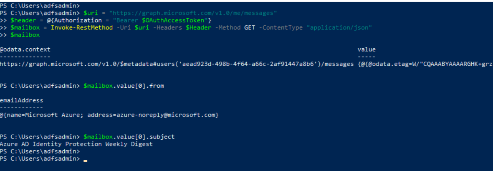

# Access A User’s Mailbox via an Application with Delegated Permissions

A threat actor with the right permissions and credentials can access and collect confidential information of interest right away. One example would be the collection of e-mails. An adversary can use Azure AD registered applications with “Mail.Read” or “Mail.ReadWrite” permissions to collect e-mails from a signed-in user mailbox or all mailboxes. This would depend on the type of permission (Delegated or Role) granted to the application. In this document, we are going to access the mailbox of a user via an application with `Mail.ReadWrite` delegated permissions.

## Preconditions
* Authorization
    * Identity solution: Azure AD
    * Access control model: Discretionary Access Control (DAC)
    * Service: Azure Microsoft Graph
    * Permission Type: Delegated
    * Permissions: Mail.ReadWrite
    * Microsoft Graph Access Token

## Verify Microsoft Graph Access Token
We need to make sure our access token has permissions to read mail.
 


## Simulate Signed-In User Mail Access via the Microsoft Graph Message API

```PowerShell
$uri = ”https://graph.microsoft.com/v1.0/me/messages”
$header = @{Authorization = “Bearer $MSGraphAccessToken”}
$mailbox = Invoke-RestMethod –Uri $uri –Headers $Header –Method GET –ContentType “application/json”
$mailbox
```



We do not necessarily have to parse the messages in this step. The simple action to access the mailbox generates telemetry that we can aggregate and create detections.

## Detect Mail Items being Accessed

From a defensive perspective, we can audit access to a mailbox with the MailItemsAccessed mailbox auditing action available as part of Exchange mailbox auditing. 

### Azure Sentinel
* [Exchange workflow MailItemsAccessed operation anomaly](https://github.com/Azure/Azure-Sentinel/blob/master/Detections/OfficeActivity/MailItemsAccessedTimeSeries.yaml)

### Microsoft 365 Hunting
* [OAuth Apps reading mail via GraphAPI anomaly [Solorigate]](https://github.com/microsoft/Microsoft-365-Defender-Hunting-Queries/blob/master/Exfiltration/OAuth Apps reading mail via GraphAPI anomaly %5BSolorigate%5D.md)
* [OAuth Apps reading mail both via GraphAPI and directly [Solorigate]](https://github.com/microsoft/Microsoft-365-Defender-Hunting-Queries/blob/master/Exfiltration/OAuth Apps reading mail both via GraphAPI and directly %5BSolorigate%5D.md)
