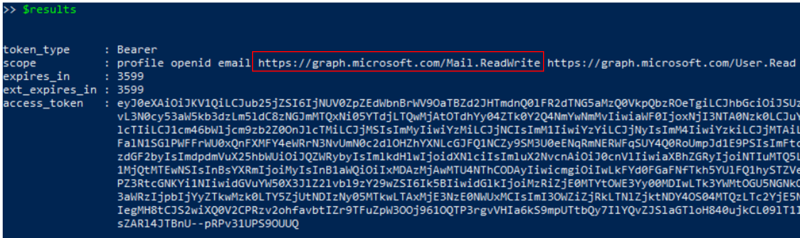

# Access A User’s Mailbox via an Application with Delegated Permissions

A threat actor with the right permissions and credentials can access and collect confidential information of interest right away. One example would be the collection of e-mails. An adversary can use Azure AD registered applications with `Mail.Read` or `Mail.ReadWrite` permissions to collect e-mails from a signed-in user mailbox or all mailboxes. This would depend on the type of permission (Delegated or Role) granted to the application. In this document, we are going to access the mailbox of a user via an application with `Mail.ReadWrite` delegated permissions.

## Preconditions
* Authorization
    * Identity solution: Azure AD
    * Access control model: Discretionary Access Control (DAC)
    * Service: Azure Microsoft Graph
    * Permission Type: Delegated
    * Permissions: Mail.ReadWrite
* Endpoint: ADFS01
    * Even when this step would happen outside of the organization, we can use the same PowerShell session where we [granted delegated permissions to an application](../persistence/grantDelegatedPermissionsToApplication.md) to go through the simulation steps.
    * Microsoft Graph Access Token
        * Use the output from the previous step where we [got an access token from an application that has the right permissions](../persistence/getAccessTokenSAMLBearerAssertionFlow.md) to read mail. Use the output of that step as the variable `$MSGraphAccessToken` for the simulation steps. 

## Simulate & Detect
* [Verify Microsoft Graph Access Token](#verify-microsoft-graph-access-token)
* [Read Signed-In User Mail](#read-signed-in-user-mail)
    * [Detect Mail Items being Accessed](#detect-mail-items-being-accessed)

## Verify Microsoft Graph Access Token
We need to make sure our access token has permissions to read mail.
 


## Read Signed-In User Mail

```PowerShell
$uri = "https://graph.microsoft.com/v1.0/me/messages"
$header = @{Authorization = "Bearer $MSGraphAccessToken"}
$mailbox = Invoke-RestMethod –Uri $uri –Headers $Header –Method GET –ContentType "application/json"
$mailbox
```


We do not necessarily have to parse the messages in this step. The simple action to access the mailbox generates telemetry that we can aggregate and create detections with.

## Detect Mail Items being Accessed

From a defensive perspective, we can audit access to a mailbox with the `MailItemsAccessed` mailbox audit action available as part of `Exchange mailbox auditing`. 

### Azure Sentinel Detection Rules

* [Exchange workflow MailItemsAccessed operation anomaly](https://github.com/Azure/Azure-Sentinel/blob/master/Detections/OfficeActivity/MailItemsAccessedTimeSeries.yaml)

### Microsoft 365 Hunting Queries

* [OAuth apps reading mail via GraphAPI anomaly [Nobelium]](https://github.com/microsoft/Microsoft-365-Defender-Hunting-Queries/blob/master/Exfiltration/OAuth%20Apps%20reading%20mail%20via%20GraphAPI%20anomaly%20%5BNobelium%5D.md)
* [OAuth Apps reading mail both via GraphAPI and directly [Nobelium]](https://github.com/microsoft/Microsoft-365-Defender-Hunting-Queries/blob/master/Exfiltration/OAuth%20Apps%20reading%20mail%20both%20via%20GraphAPI%20and%20directly%20%5BNobelium%5D.md)
