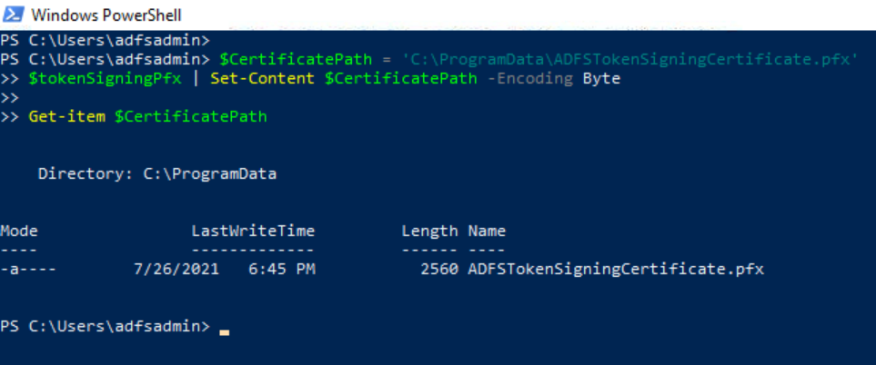

# Export Active Directory Federation Services (AD FS) Token Signing Certificate as PFX File

After [decrypting the AD FS token signing certificate](decryptADFSTokenSigningCertificate.md), you can export the cipher text to a .pfx file. Remember that this step is also performed outside of the organization. Therefore, there are not detection rules for it.

## Preconditions
* Endpoint: ADFS01 or WORKSTATION6
    * Even when this step would happen outside of the organization, we can use the same PowerShell session on one of the endpoints where we [decrypted the AD FS token signing certificate](decryptADFSTokenSigningCertificate.md) and exported the `cipher text` to a variable.
    * [AD FS token signing certificate (cipher text)](decryptADFSTokenSigningCertificate.md)
        * Use the output cipher text saved in the variable `$tokenSigningPfx` in the PowerShell commands below.

## Export AD FS Token Signing Certificate

```PowerShell
$CertificatePath = 'C:\ProgramData\ADFSTokenSigningCertificate.pfx'
$tokenSigningPfx | Set-Content $CertificatePath -Encoding Byte

Get-item $CertificatePath
```



## Output

You can use the PFX file `C:\ProgramData\ADFSTokenSigningCertificate.pfx` in the next step where we [sign our own SAML token](signSAMLToken.md) to impersonate a privileged user in a federated environment.

## References
* [Exporting ADFS certificates revisited: Tactics, Techniques and Procedures (o365blog.com)](https://o365blog.com/post/adfs/)