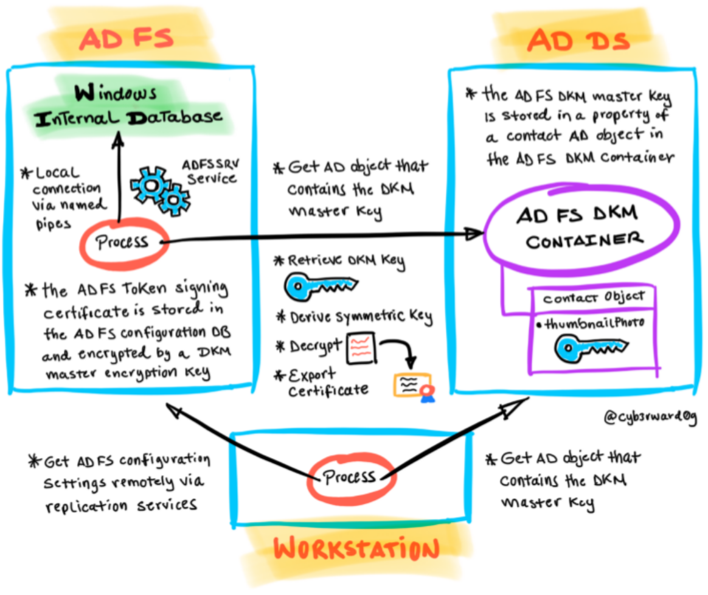

# Export Active Directory Federation Services (AD FS) Token Signing Certificate

Federation servers require token-signing certificates to prevent attackers from altering or counterfeiting security tokens to gain unauthorized access to Federated resources. The AD FS certificates (token signing and decryption) are stored in the AD FS database configuration, and they are encrypted using Distributed Key Manager (DKM) APIs. DKM is a client-side functionality that uses a set of secret keys to encrypt and decrypt information. Only members of a specific security group in Active Directory Domain Services (AD DS) can access those keys in order to decrypt the data that is encrypted by DKM.

when the primary AD FS farm is configured, an AD container (AD FS DKM container) is created in the domain controller and the DKM master key is stored as an attribute of an AD contact object located inside of the container. The AD FS DKM master key can then be used to derive a symmetric key and decrypt AD FS certificates.

A threat actor could use the `AD FS configuration settings` to extract sensitive information such as AD FS certificates (encrypted) and get the path to the AD FS DKM container in the domain controller. The `AD FS DKM master key` can then be retrieved from the AD container and used to decrypt the token signing certificate. Finally, the AD FS token signing certificate can be used to sign SAML tokens and impersonate users in a federated environment.

## Simulate and Detect
 
1.	[Export AD FS configuration settings](exportADFSConfigurationSettings.md).
    * There are two variations to this technique, locally on the AD FS server and remotely from any domain-joined workstation.
2.	[Export AD FS certificates in encrypted format](exportADFSCertificatesEncryptedFormat.md).
    * Export the AD FS token signing certificate.
3.	[Get the path of the AD FS DKM Container](getADFSDKMContainerADPath.md).
4.	[Export AD FS DKM master key from Domain Controller](exportADFSDKMMasterKeyFromDC.md).
    * There are two variations to this technique. the AD contact object holding the AD FS DKM master key can be accessed directly or retrieved/synced via directory replication services (DSR).
5.	[Decrypt AD FS certificates](decryptADFSCertificates.md).
    * Decrypt the AD FS token signing certificate.
6.	[Export AD FS certificate as PFX file](exportADFSCertificatesAsPfxFiles.md).
    * Export the AD FS token signing certificate as a PFX file.

# References
* [Token-Signing Certificates | Microsoft Docs](https://docs.microsoft.com/en-us/windows-server/identity/ad-fs/design/token-signing-certificates#:~:text=%20A%20token-signing%20certificate%20must%20meet%20the%20following,in%20the%20personal%20store%20of%20the...%20More%20)
* [Exporting ADFS certificates revisited: Tactics, Techniques and Procedures (o365blog.com)](https://o365blog.com/post/adfs/)
* [The Role of the AD FS Configuration Database | Microsoft Docs](https://docs.microsoft.com/en-us/windows-server/identity/ad-fs/technical-reference/the-role-of-the-ad-fs-configuration-database)
* [Create a server audit and database audit specification](https://docs.microsoft.com/en-us/sql/relational-databases/security/auditing/create-a-server-audit-and-database-audit-specification?view=sql-server-ver15)
* [SQL Server Audit Action Groups and Actions](https://docs.microsoft.com/en-us/sql/relational-databases/security/auditing/sql-server-audit-action-groups-and-actions?view=sql-server-ver15)
