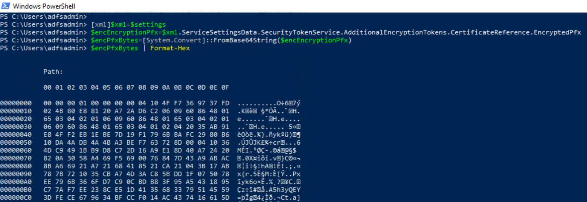

# Extract Active Directory Federation Services (AD FS) Encryption Certificate

After exporting the configuration settings of the AD FS database, a threat actor would use it to extract sensitive information such as certificates (Token signing and encryption) in an encrypted format which can later be decrypted and used for further actions.

## Preconditions
* Endpoint: ADFS01 or WORKSTATION6
    * Even when this step would happen outside of the organization, we can use the same PowerShell session on one of the endpoints where we [exported the AD FS configuration settings](exportADFSConfigurationSettings.md) from to go through the simulation steps.
    * AD FS Configuration Settings
        * The output from the previous step (`XML strings` object or `Microsoft.IdentityServer.PolicyModel.Configuration.ContractObject` object) is saved in the variable `$settings`. Use it in the PowerShell snippets below.

## Extract AD FS Encryption Certificate

Remember that the certificate is extracted as an encrypted blob.

### XML String Object

```PowerShell
[xml]$xml=$settings
$encEncryptionPfx=$xml.ServiceSettingsData.SecurityTokenService.AdditionalEncryptionTokens.CertificateReference.EncryptedPfx
$encPfxBytes=[System.Convert]::FromBase64String($encEncryptionPfx)
$encPfxBytes | Format-Hex
```



## Output

Use the variable `$encEncryptionPfx` in the next step to [decrypt the AD FS encryption certificate](decryptADFSEncryptionCertificate.md). Remember that you must [get the AD FS DKM master key value](exportADFSDKMMasterKeyFromDC.md) first from the domain controller to decrypt the certificates.

## References
* [Exporting ADFS certificates revisited: Tactics, Techniques and Procedures (o365blog.com)](https://o365blog.com/post/adfs/)