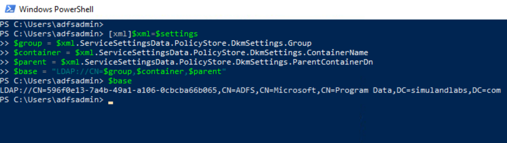

# Get the Path of the AD FS DKM Container

Even though a threat actor might have been able to extract AD FS certificates (encrypted form), they still need to be decrypted. AD FS certificates are encrypted using Distributed Key Manager (DKM) APIs and can be decryptes with a symmetric key derived from the AD FS DKM master key stored in the domain controller.

The AD FS DKM key value is stored in the `ThumbnailPhoto` attribute of a contact AD object in the AD FS DKM container. Therefore, we first need to get the path of the AD FS DKM container in the AD domain controller. That information can be retrieved from the `AD FS configuration settings`.

## Preconditions
* Endpoint: ADFS01 or WORKSTATION6
    * We can use the same PowerShell session on one of the endpoints where we [exported the AD FS configuration settings](exportADFSConfigurationSettings.md) from to go through the simulation steps.
    * AD FS Configuration Settings
        * The output from the previous step (`XML strings` object or `Microsoft.IdentityServer.PolicyModel.Configuration.ContractObject` object) is saved in the variable `$settings`. Use it in the PowerShell snippets below.

## Get path of AD FS DKM container

```PowerShell
[xml]$xml=$settings
$group = $xml.ServiceSettingsData.PolicyStore.DkmSettings.Group
$container = $xml.ServiceSettingsData.PolicyStore.DkmSettings.ContainerName
$parent = $xml.ServiceSettingsData.PolicyStore.DkmSettings.ParentContainerDn
$base = "LDAP://CN=$group,$container,$parent"
```



## Output

Use the variable `$base` for the next steps where we [export the AD FS DKM master key from the domain controller](exportADFSDKMMasterKeyFromDC.md).

## References
* [Exporting ADFS certificates revisited: Tactics, Techniques and Procedures (o365blog.com)](https://o365blog.com/post/adfs/)