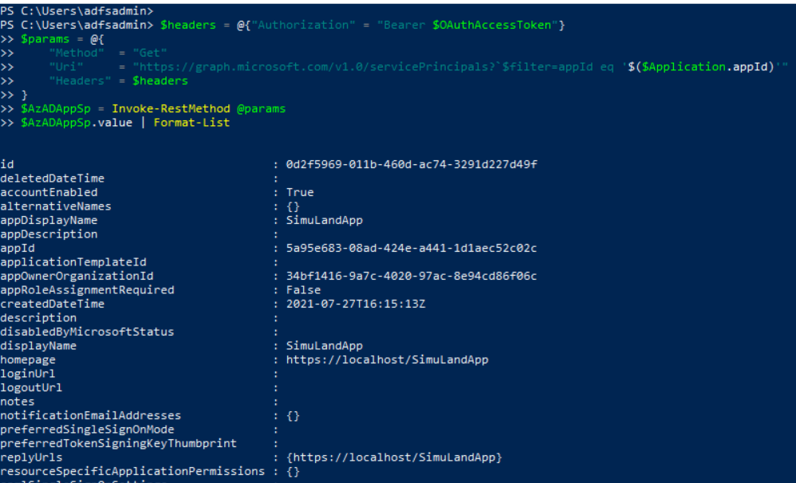

# Create Application Delegated Permission Grant

After a threat actor gets access to a cloud environment, usually the next step would be to look for additional access to other resources of interest. One way to access resources in Azure is via registered applications; especially those with privileged permissions. With the right permissions, a threat actor could grant desired permissions to existing applications.

Applications that integrate with the Microsoft identity platform follow an authorization model that gives users and administrators control over how data can be accessed. The Microsoft identity platform implements the [OAuth 2.0](https://docs.microsoft.com/en-us/azure/active-directory/develop/active-directory-v2-protocols) authorization protocol. OAuth 2.0 is a method through which a third-party app can access web-hosted resources on behalf of a user.

These resources can define a set of permissions that can be used to divide the functionality of that resource into smaller chunks. Because of these types of permission definitions, the resource has fine-grained control over its data and how API functionality is exposed.

[The Microsoft identity platform supports two types of permissions: delegated permissions and application permissions](https://docs.microsoft.com/en-us/azure/active-directory/develop/v2-permissions-and-consent):

* **Delegated permissions** are used by apps that have a signed-in user present. These permissions are of type `Scope` and delegate privileges of the signed-in user, allowing the app to act as the user. For example, if an application contains the “Mail.Read” delegated permissions and a user requests it; the app would only be able to access the signed-in user mailbox.
* **Application permissions** are used by apps that run without a signed-in user present. These permissions are of type `Role` and grant the app the full set of privileges offered by the scope. For example, if an application contains the `Mail.Read` role permissions, the application would have access to every user’s mailbox.

**OAuth Permission Grants**

 A delegated permission grant is represented by an [oAuth2PermissionGrant object](https://docs.microsoft.com/en-us/graph/api/resources/oauth2permissiongrant?view=graph-rest-1.0). Therefore, an OAuth permission grant needs to be created in order to grant delegated permissions to an application.

## Simulate & Detect

In this document, we simulate an adversary granting delegated permissions to an existing OAuth application.

1.	[List Existing Applications](#list-existing-applications)
2.	[Get the Application Service Principal](#get-the-application-service-principal)
3.	[Grant Delegated Permissions to Application](#grant-delegated-permissions-to-application)
    * [Detect Permissions Granted to Applications](#detect-permissions-granted-to-applications)

## Preconditions

* Endpoint: AD FS Server (ADFS01)
  * Even when this step would happen outside of the organization, we can use the same PowerShell session where we [got a Microsoft Graph oauth access token](../persistence/getOAuthTokenWithSAMLAssertion.md).
* Microsoft Graph OAuth access token
  * Use the output from the [previous step](../persistence/getOAuthTokenWithSAMLAssertion.md) as the variable `$OAuthAccessToken`. Make sure you request the access token with the public `Azure Active Directory PowerShell Application`. That application has the right permissions to execute all the simulation steps in this document.

## List Existing Applications

**Preconditions**
* Authorization:
    * Service: Azure Microsoft Graph
    * Permission Type: Delegated
    * Permissions (One of the following):
        * Application.Read.All
        * Application.ReadWrite.All
        * Directory.Read.All

Open PowerShell as administrator and use the Microsoft Graph oauth access token to list the current Azure AD applications in a tenant.

```PowerShell
$headers = @{"Authorization" = "Bearer $OAuthAccessToken"}
$params = @{
  "Method"  = "Get"
  "Uri"     = "https://graph.microsoft.com/v1.0/applications”
  "Headers" = $headers
}
$AzADApps = Invoke-RestMethod @params

$AzADApps.value
```


Next, filter the results and select the Azure AD application you want to grant permissions to. If you followed the instructions to [register one Azure AD application](../../2_deploy/_helper_docs/registerAADAppAndSP.md) after deploying the lab environment, your app should be named `SimuLandApp`. If you used a different name, make sure you look for it with the right name in the following PowerShell command:

```PowerShell
$Application = $AzADApps.value | Where-Object {$_.displayName -eq "SimuLandApp"}
$Application
```


## Get the Application Service Principal

**Preconditions**
* Authorization:
    * Service: Azure Microsoft Graph
    * Permission Type: Delegated
    * Permissions (One of the following):
        * Application.Read.All
        * Application.ReadWrite.All
        * Directory.Read.All
        * Directory.ReadWrite.All

Next, in order to grant permissions to the application, we need to do it at the service principal level. We can take the application Id value from our previous steps and get its service principal.

```PowerShell
$headers = @{"Authorization" = "Bearer $OAuthAccessToken"}
$params = @{
    "Method"  = "Get"
    "Uri"     = "https://graph.microsoft.com/v1.0/servicePrincipals?`$filter=appId eq '$($Application.appId)'"
    "Headers" = $headers
}
$AzADAppSp = Invoke-RestMethod @params
$AzADAppSp.value | Format-List
```
 


Now that we have the service principal of the OAuth application, we can grant permissions to it.

## Grant Delegated Permissions to Application

### Get Microsoft Graph Service Principal Id

**Preconditions**
* Authorization:
    * Service: Azure Microsoft Graph
    * Permission Type: Delegated
    * Permissions (One of the following):
        * Application.Read.All
        * Application.ReadWrite.All
        * Directory.Read.All
        * Directory.ReadWrite.All

Identify the id of the resource service principal to which access is authorized. This identifies the API which the client is authorized to attempt to call on behalf of a signed-in user.

In this exercise, we are going to grant permissions from the [Microsoft Graph API](https://docs.microsoft.com/en-us/graph/overview?view=graph-rest-1.0). Therefore, we need to get the Id of the Microsoft Graph API service principal.

```PowerShell
$resourceSpDisplayName = 'Microsoft Graph'
$headers = @{"Authorization" = "Bearer $OAuthAccessToken"}
$params = @{
  "Method" = "Get"
  "Uri" = "https://graph.microsoft.com/v1.0/servicePrincipals?`$filter=displayName eq '$resourceSpDisplayName'"
  "Headers" = $headers
}
$ResourceSvcPrincipal = Invoke-RestMethod @params

if ($ResourceSvcPrincipal.value.Count -ne 1) {
  Write-Error "Found $($ResourceSvcPrincipal.value.Count) service principals with displayName '$($resourceSpDisplayName)'"
}
$ResourceSvcPrincipal.value | Format-List
```


### Create OAuth permission grant

**Preconditions**
* Authorization:
    * Service: Azure Microsoft Graph
    * Permission Type: Delegated
    * Permissions (One of the following):
        * DelegatedPermissionGrant.ReadWrite.All
        * Directory.ReadWrite.All
        * Directory.AccessAsUser.All

Define what permissions you want grant as an array as shown below. For this example, we are granting `Mail.ReadWrite` permissions to the OAuth application. Feel free to add other delegated permissions depending on your use case.

```PowerShell
$permissions = @('Mail.ReadWrite')
```

Create an oauth permission grant via the [Microsoft Graph oauth2PermissionGrants API](https://docs.microsoft.com/en-us/graph/api/oauth2permissiongrant-post?view=graph-rest-1.0&tabs=http). 

```PowerShell
$ServicePrincipalId = $AzADAppSp.value.id
$PropertyType =  'oauth2PermissionScopes'

$body = @{
  clientId = $ServicePrincipalId
  consentType = "AllPrincipals"
  principalId = $null
  resourceId = $ResourceSvcPrincipal.value[0].id
  scope = "$permissions"
  startTime = "$((get-date).ToString("yyyy-MM-ddTHH:mm:ss:ffZ"))"
  expiryTime = "$((get-date).AddYears(1).ToString("yyyy-MM-ddTHH:mm:ss:ffZ"))"
}

$headers = @{
  "Authorization" = "Bearer $OAuthAccessToken"
  "Content-Type" = "application/json"
}
$params = @{
  "Method" = "Post"
  "Uri" = "https://graph.microsoft.com/v1.0/oauth2PermissionGrants"
  "Body" = $body | ConvertTo-Json –Compress
  "Headers" = $headers
}
Invoke-RestMethod @params
```

## Detect Permissions Granted to Applications

### Azure Sentinel Detection Rules

* [Mail.Read Permissions Granted to Application (AuditLogs)](https://github.com/Azure/Azure-Sentinel/blob/master/Detections/AuditLogs/MailPermissionsAddedToApplication.yaml)

### Microsoft 365 Hunting Queries

* [Mail.Read or Mail.ReadWrite permissions added to OAuth application CloudAppEvents](https://github.com/microsoft/Microsoft-365-Defender-Hunting-Queries/blob/master/Defense%20evasion/MailPermissionsAddedToApplication%5BNobelium%5D.md)

### Azure AD Workbook: Sensitive Operations Report
1.	Browse to [Azure portal](https://portal.azure.com/)
2.	Azure AD > Workbooks > Sensitive Operations Report


### Microsoft Cloud App Security
1.	Navigate to [Microsoft 365 Security Center](https://security.microsoft.com/)
2.	Go to `More Resources` and click on `Microsoft Cloud App Security`
3.	Connected Apps > Office 365 > Activity Logs


