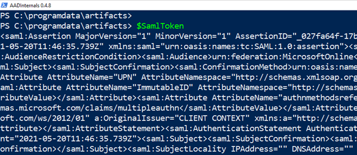
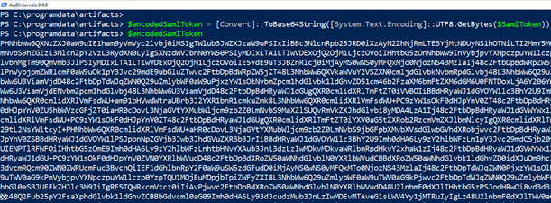
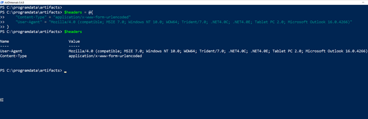
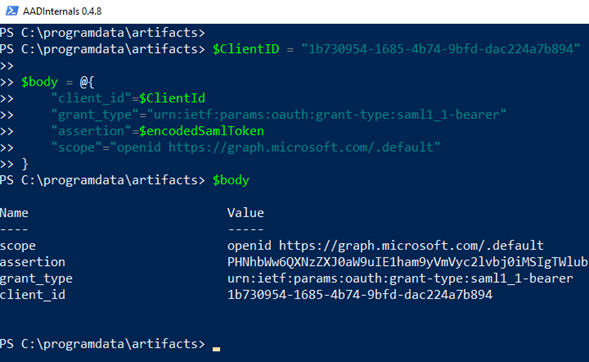
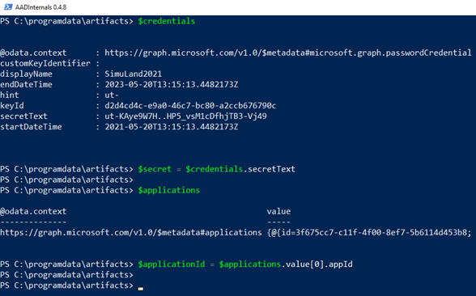
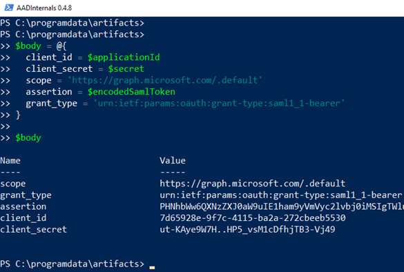
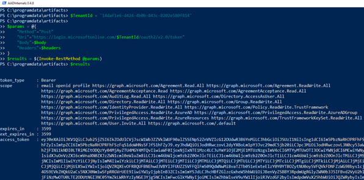
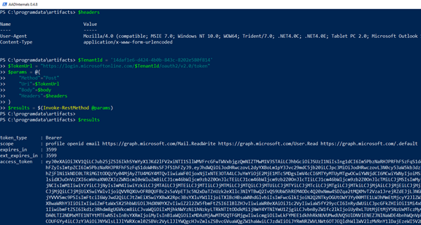
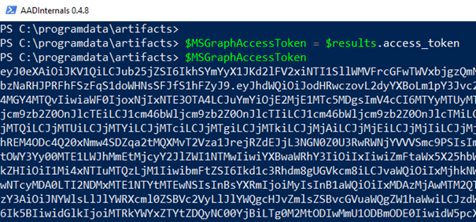

# Get an Access Token via SAML bearer Assertion Flow

An access token is a security token that's issued by an [authorization server](https://docs.microsoft.com/en-gb/azure/active-directory/develop/developer-glossary#authorization-server) as part of an OAuth 2.0 flow. It contains information about the user and the resource for which the token is intended. The information can be used to access web APIs and other protected resources.

The Microsoft identity platform supports the [OAuth 2.0 SAML bearer assertion flow](https://docs.microsoft.com/en-us/azure/active-directory/develop/v2-saml-bearer-assertion) which allows you to request an OAuth access token using a SAML assertion when a client needs to use an existing trust relationship. This type of flow supports users authenticating with identity providers such as Active Directory Federation Services (ADFS) federated to Azure Active Directory. The SAML assertion obtained from ADFS can be used in an OAuth flow to authenticate the user.

In this document, we are going to use an existing SAML token to exchange it for an access token from Azure AD.

## Simulate & Detect
1.	[Encode SAML token](#encode-saml-token)
2.	[Create HTTP request headers](#create-http-request-headers)
3.	[Create HTTP request body](#create-http-request-body)
4.	[Send HTTP POST to Microsoft identity platform token endpoint](#send-http-post-to-microsoft-identity-platform-token-endpoint)

## Preconditions
* A trust relationship between the authorization server/environment (Microsoft 365) and the identity provider, or issuer of the SAML 2.0 bearer assertion (AD FS server)
* Endpoint: AD FS Server (ADFS01)
    * Even when this step would happen outside of the organization, we can use the same PowerShell session where we [signed a new SAML token](../credential-access/signSAMLToken.md) to go through the simulation steps.
    * A valid SAML bearer token
        * Use the output from that previous step as the variable `$SamlToken`.

## Encode SAML token

1.  Take a SAML token and base64 encode it to use it in an HTTP request.


 
2.  Open a PowerShell console and run the following command to base64 encode it:

```PowerShell
$encodedSamlToken = [Convert]::ToBase64String([System.Text.Encoding]::UTF8.GetBytes($SamlToken))
```



## Create HTTP Request Headers

3.  Create an HTTP header. You can, for example, set the user Agent to look like `Microsoft Outlook` or other known applications.

```PowerShell
$headers = @{
    “Content-Type” = “application/x-www-form-urlencoded”
    "User-Agent" = "Mozilla/4.0 (compatible; MSIE 7.0; Windows NT 10.0; WOW64; Trident/7.0; .NET4.0C; .NET4.0E; Tablet PC 2.0; Microsoft Outlook 16.0.4266)"
}
```



## Create HTTP Request Body

4.  Create an HTTP request body and set the specific resource you want to get an access token for.

### Azure Active Directory PowerShell Application (Client)

We can request an access token for the Microsoft Graph leveraging the public Azure Active Directory PowerShell application (`1b730954-1685-4b74-9bfd-dac224a7b894`).

* client_id: Application (Client) ID for the app we would use to access other resources
* grant_type: The type of token request.
* assertion: The base64 encoded SAML token.
* scope: List of scopes for the token request

```PowerShell
$ClientID = "1b730954-1685-4b74-9bfd-dac224a7b894"

$body = @{
    "client_id"=$ClientId
    "grant_type"="urn:ietf:params:oauth:grant-type:saml1_1-bearer"
    "assertion"=$encodedSamlToken
    "scope"="openid https://graph.microsoft.com/.default"
}
```



### Custom Application (Client ID & Credentials Needed)

We can also request an access token for the Microsoft Graph leveraging an application we registered ourselves. For this example, we need to use the application credentials along with the `client_id`.

* client_id: Application (Client) ID for the app we would use to access other resources
* grant_type: The type of token request.
* assertion: The base64 encoded SAML token.
* scope: List of scopes for the token request

We can verify that we have information about the application (client) and its credentials. 
 


```PowerShell
$body = @{
    client_id = $applicationId
    client_secret = $secret
    scope = 'https://graph.microsoft.com/.default'
    assertion = $encodedSamlToken
    grant_type = 'urn:ietf:params:oauth:grant-type:saml1_1-bearer'
}
$body
```



## Send HTTP POST to Microsoft identity platform token endpoint

5.  For this exercise, we send the access token request to the OAuth 2.0 (v2) endpoint: `https://login.microsoftonline.com/$TenantId/oauth2/v2.0/token`

```PowerShell
$TenantId = '14daf1e6-d424-4b0b-843c-8202e580f814'
$TokenUrl = "https://login.microsoftonline.com/$TenantId/oauth2/v2.0/token"
$params = @{
    "Method"="Post"
    "Uri"=$TokenUrl
    "Body"=$body
    "Headers"=$headers
}
$results = $(Invoke-RestMethod @params)
```

### Azure Active Directory PowerShell Application (Client)



### Custom Application
 


6. Finally, you can get the access token from the results.

```PowerShell
$MSGraphAccessToken = $results.access_token
```



You can inspect your access token here: [jwt.ms: Welcome!](https://jwt.ms/)

## Output

Use the variable `$MSGraphAccessToken` that contains the access token for the `Azure Directory PowerShell application` for the following steps:

* [Add credentials to Azure AD application](addCredentialsToApplication.md).
* [Grant delegated permissions to Azure AD application](grantDelegatedPermissionsToApplication.md).

Use the variable `$MSGraphAccessToken` that contains the access token for an application where we used the application's credentials to get a token for the following steps:

* [Mail access via an application with delegated permissions](../collection/mailAccessDelegatedPermissions.md)

## References
* [Exporting ADFS certificates revisited: Tactics, Techniques and Procedures (o365blog.com)](https://o365blog.com/post/adfs/)