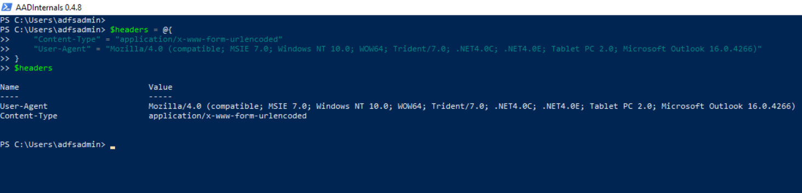
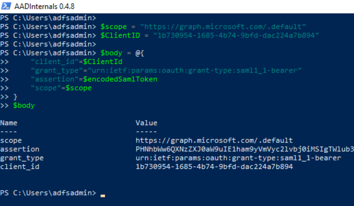
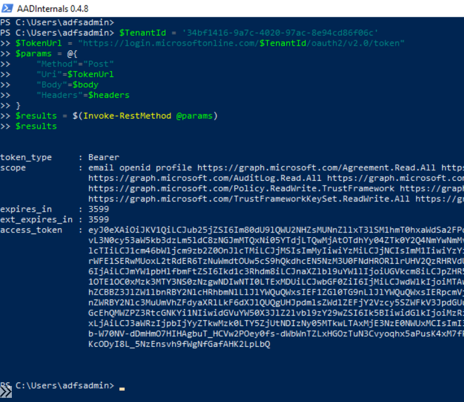
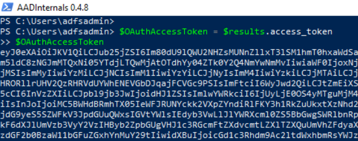

# Get an OAuth Access Token with a SAML Assertion

An access token is a security token that is issued by an [authorization server](https://docs.microsoft.com/en-gb/azure/active-directory/develop/developer-glossary#authorization-server) as part of an OAuth 2.0 flow. Access tokens contain information about the client, who requests the token, and the OAuth protected resource (the API) the token is intended for (its audience).

The Microsoft identity platform (Azure AD) supports the [OAuth 2.0 SAML bearer assertion flow](https://docs.microsoft.com/en-us/azure/active-directory/develop/v2-saml-bearer-assertion) which allows a user to use an existing trust relationship and request an OAuth access token using a SAML assertion. The SAML assertion is posted to the OAuth token endpoint. The endpoint processes the assertion and issues an access token based on prior approval of the OAuth protected application. The client isn’t required to have or store a refresh token, nor is the client secret required to be passed to the token endpoint.

This type of flow supports users authenticating with identity providers such as `Active Directory Federation Services (ADFS)` to Azure Active Directory. The SAML assertion obtained from ADFS can be used in an OAuth flow to authenticate the user.

In this document, we are going to use an existing SAML token to exchange it for an OAuth access token from Azure active directory (Azure AD).

## Table of Contents

* [Preconditions](#preconditions)
* [Simulation Steps](#simulation-steps)
* [Output](#output)

## Preconditions
* Input:
    * SAML Token
    * Azure AD Application ID: The ID of the application (`appId`) to request the OAuth token (e.g Public Azure AD Application = `1b730954-1685-4b74-9bfd-dac224a7b894`).
    * Scope: A space-separated list of scopes, or permissions, that the app requires (e.g. Microsoft Graph = `"https://graph.microsoft.com/.default`).
    * Client secret (optional):
        * If your app is a public client, then `the client_secret` cannot be included. If the app is a confidential client (Your own app), then it must be included in the OAuth HTTP request.

## Simulation Steps

### Encode SAML token

1. Open a PowerShell console and run the following command to base64 encode a SAML token to later use it in an OAuth HTTP request:

```PowerShell
$encodedSamlToken = [Convert]::ToBase64String([System.Text.Encoding]::UTF8.GetBytes($SamlToken))
```


### Create OAuth HTTP POST request

#### HTTP header

You can, for example, set the user Agent to look like `Microsoft Outlook` or other known applications.

```PowerShell
$headers = @{
    "Content-Type" = "application/x-www-form-urlencoded"
    "User-Agent" = "Mozilla/4.0 (compatible; MSIE 7.0; Windows NT 10.0; WOW64; Trident/7.0; .NET4.0C; .NET4.0E; Tablet PC 2.0; Microsoft Outlook 16.0.4266)"
}
$headers
```



#### HTTP body

Use the following parameters:

| Parameter | Required/Optional | Description |
| --- | --- | --- |
| client_id  | required | ID of application to request OAuth access token |
| grant_type | required | Must be `urn:ietf:params:oauth:grant-type:saml1_1-bearer` |
| assertion  | required | The base64 encoded SAML token |
| scope | required | A space-separated list of scopes, or permissions, that the app requires |
| client_secret | optional | If your app is a public client (Azure AD PowerShell Application), then `the client_secret` cannot be included. If the app is a confidential client (Your own Azure AD application), then it must be included. |

**Scope**

For this example, we can use the Microsoft Graph API in the scope. Feel free to change this value depending on the use case.

```PowerShell
$scope = "https://graph.microsoft.com/.default"
```

**Client ID**

We can request an OAuth access token leveraging the `public` Azure Active Directory PowerShell application (Cliend ID = `1b730954-1685-4b74-9bfd-dac224a7b894`).

```PowerShell
$ClientID = "1b730954-1685-4b74-9bfd-dac224a7b894"
```

If you want to use an application that you registered yourself, set the variable `$ClientID` to the ID of your application. Remember that you `must` use the application secret parameter in the `HTTP body` too when you use a confidential application.

**Body**

```PowerShell
$body = @{
    "client_id"=$ClientId
    "grant_type"="urn:ietf:params:oauth:grant-type:saml1_1-bearer"
    "assertion"=$encodedSamlToken
    "scope"=$scope
}
$body
```



if you are using a client secret, then add it to the `$body` variable with the following commands:

```PowerShell
$secret = 'xxxxxx'
$body['client_secret'] = $secret
```

### Send HTTP POST request to the Microsoft identity platform token endpoint

Send the OAuth token request to the OAuth 2.0 (v2) token endpoint: `https://login.microsoftonline.com/$TenantId/oauth2/v2.0/token`

```PowerShell
$TenantId = 'YOUR-TENANT-ID'
$TokenUrl = "https://login.microsoftonline.com/$TenantId/oauth2/v2.0/token"
$params = @{
    "Method"="Post"
    "Uri"=$TokenUrl
    "Body"=$body
    "Headers"=$headers
}
$results = $(Invoke-RestMethod @params)
$results
```




### Get OAuth Access Token from Results

```PowerShell
$OAuthAccessToken = $results.access_token
$OAuthAccessToken
```



You can inspect your token here: [jwt.ms: Welcome!](https://jwt.ms/)

## Output

* OAuth Access Token
    * Use the variable `$OAuthAccessToken` to call the API defined in the `scope` parameter of the HTTP body.

## References
* [Exporting ADFS certificates revisited: Tactics, Techniques and Procedures (o365blog.com)](https://o365blog.com/post/adfs/)