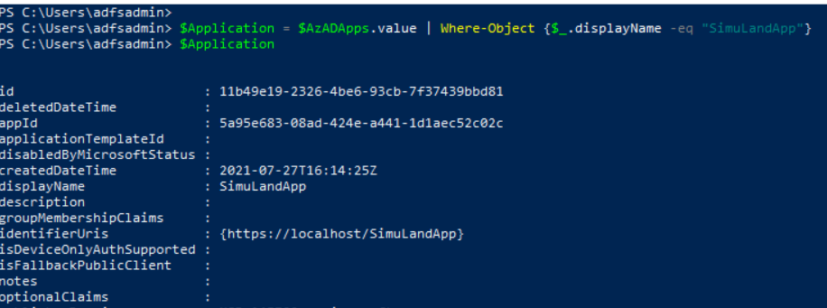

# Update Application Delegated Permission Grant

After a threat actor gets access to a cloud environment, usually the next step would be to look for additional access to other resources of interest. One way to access resources in Azure is via registered applications; especially those with privileged permissions. With the right permissions, a threat actor could grant desired permissions to existing applications.

Applications that integrate with the Microsoft identity platform follow an authorization model that gives users and administrators control over how data can be accessed. The Microsoft identity platform implements the [OAuth 2.0](https://docs.microsoft.com/en-us/azure/active-directory/develop/active-directory-v2-protocols) authorization protocol. OAuth 2.0 is a method through which a third-party app can access web-hosted resources on behalf of a user.

These resources can define a set of permissions that can be used to divide the functionality of that resource into smaller chunks. Because of these types of permission definitions, the resource has fine-grained control over its data and how API functionality is exposed.

[The Microsoft identity platform supports two types of permissions: delegated permissions and application permissions](https://docs.microsoft.com/en-us/azure/active-directory/develop/v2-permissions-and-consent):

* **Delegated permissions** are used by apps that have a signed-in user present. These permissions are of type `Scope` and delegate privileges of the signed-in user, allowing the app to act as the user. For example, if an application contains the “Mail.Read” delegated permissions and a user requests it; the app would only be able to access the signed-in user mailbox.
* **Application permissions** are used by apps that run without a signed-in user present. These permissions are of type `Role` and grant the app the full set of privileges offered by the scope. For example, if an application contains the `Mail.Read` role permissions, the application would have access to every user’s mailbox.

**OAuth Permission Grants**

A delegated permission grant is represented by an [oAuth2PermissionGrant object](https://docs.microsoft.com/en-us/graph/api/resources/oauth2permissiongrant?view=graph-rest-1.0). If delegated permissions need to be granted to an application that already has been granted permissions of the same resource type, one needs to update the OAuth permission grant of the same resource and not create a new one.

## Table of Contents

* [Preconditions](#preconditions)
* [Simulation Steps](#simulation-steps)
* [Detection](#detection)
* [Output](#output)

## Preconditions
* Authorization:
    * Resource: Azure Microsoft Graph
      * Permission Type: Delegated
      * Permissions:
        * Application.ReadWrite.All
        * Directory.ReadWrite.All
        * DelegatedPermissionGrant.ReadWrite.All
* Input:
  * Microsoft Graph OAuth access token

## Simulation Steps

### List Existing Applications

1. Open PowerShell and use the Microsoft Graph oauth access token to list the current Azure AD applications in a tenant.

```PowerShell
$headers = @{"Authorization" = "Bearer $OAuthAccessToken"}
$params = @{
  "Method"  = "Get"
  "Uri"     = "https://graph.microsoft.com/v1.0/applications”
  "Headers" = $headers
}
$AzADApps = Invoke-RestMethod @params

$AzADApps.value
```


2. Next, filter the results and select the Azure AD application you want to grant permissions to. If you followed the instructions to [register one Azure AD application](../../2_deploy/_helper_docs/registerAADAppAndSP.md) after deploying the lab environment, your app should be named `SimuLandApp`. If you used a different name, make sure you look for it with the right name in the following PowerShell command:

```PowerShell
$Application = $AzADApps.value | Where-Object {$_.displayName -eq "SimuLandApp"}
```



### Get the Application Service Principal

3. In order to grant permissions to the application, we need to do it at the service principal level. We can take the application Id value from our previous steps and get its service principal.

```PowerShell
$headers = @{"Authorization" = "Bearer $OAuthAccessToken"}
$params = @{
    "Method"  = "Get"
    "Uri"     = "https://graph.microsoft.com/v1.0/servicePrincipals?`$filter=appId eq '$($Application.appId)'"
    "Headers" = $headers
}
$AzADAppSp = Invoke-RestMethod @params
$AzADAppSp.value | Format-List
```
 


Now that we have the service principal of the application, we can look for the permission grant of the application with the service principal Id.

### Get the Application Permission Grant Metadata

4. Get all available permission grants and filter on the one where the `clientId` is the same as the application's service principal Id.

```PowerShell
$headers = @{
  "Authorization" = "Bearer $OAuthAccessToken"
  "Content-Type" = "application/json"
}
$params = @{
  "Method" = "Get"
  "Uri" = "https://graph.microsoft.com/v1.0/oauth2PermissionGrants"
  "Headers" = $headers
}

$permissionGrants = (Invoke-RestMethod @params).Value
$appPermissionsGrant = $permissionGrants | where {$_.ClientId -eq $AzADAppSp.value.id }
$appPermissionsGrant

$permissionGrantId = $appPermissionsGrant.id
$permissionGrantId

$permissionGrantScope = $appPermissionsGrant.scope
$permissionGrantScope
```


### Create HTTP Request Body

5. In the request body, supply the values for relevant fields that should be updated. Existing properties that are not included in the request body will maintain their previous values or be recalculated based on changes to other property values. For best performance you shouldn't include existing values that haven't changed.

6. Set the `scope` in the HTTP request body to update the delegated permissions. The `scope` is a space-separated list of the claim values for delegated permissions which should be included in access tokens for the resource application (the API).

7. Set the new delegated permissions with the variable `$newpermission`. If you have multiple permissions you want to update, make sure they are space-separated. For this example, we are adding the Microsoft Graph `Mail.ReadWrite` delegated permission.

```powerShell
$newPermissions = "Mail.ReadWrite"
$newScope = @($permissionGrantScope, $newPermissions) -join ' '

$body = @{
  scope = $newScope
}
$body
```


### Update Permission Grant

8. Update the permissions grant with the [Microsoft Graph oauth2PermissionGrants API](https://docs.microsoft.com/en-us/graph/api/oauth2permissiongrant-update?view=graph-rest-1.0&tabs=http). Make sure you use the permission grant Id obtained in the previous step as the variable `$permissionGrantId`.

```PowerShell
$headers = @{
  "Authorization" = "Bearer $OAuthAccessToken"
  "Content-Type" = "application/json"
}
$params = @{
  "Method" = "Patch"
  "Uri" = "https://graph.microsoft.com/v1.0/oauth2PermissionGrants/$permissionGrantId"
  "Body" = $body | ConvertTo-Json –Compress
  "Headers" = $headers
}

$results = Invoke-WebRequest @params -usebasicparsing
if ($results.StatusCode -eq 204) {
    return "Required permissions were assigned successfully"
}

$results
```

If successful, this method returns `204 No Content` response code. It does not return anything in the response body.


### Verify Permission Grant Update

9. Browse to [Azure portal](https://portal.azure.com/) > Azure Active Directory > App Registrations > `SimuLandApp` > API permissions


## Detection

### Detect Permission Grants to Applications

#### Azure Sentinel Detection Rules

* [Mail.Read Permissions Granted to Application (AuditLogs)](https://github.com/Azure/Azure-Sentinel/blob/master/Detections/AuditLogs/MailPermissionsAddedToApplication.yaml)

#### Microsoft 365 Hunting Queries

* [Mail.Read or Mail.ReadWrite permissions added to OAuth application CloudAppEvents](https://github.com/microsoft/Microsoft-365-Defender-Hunting-Queries/blob/master/Defense%20evasion/MailPermissionsAddedToApplication%5BNobelium%5D.md)

#### Azure AD Workbook: Sensitive Operations Report
1.	Browse to [Azure portal](https://portal.azure.com/)
2.	Azure AD > Workbooks > Sensitive Operations Report


#### Microsoft Cloud App Security
1.	Navigate to [Microsoft 365 Security Center](https://security.microsoft.com/)
2.	Go to `More Resources` and click on `Microsoft Cloud App Security`
3.	Connected Apps > Office 365 > Activity Logs


## Output