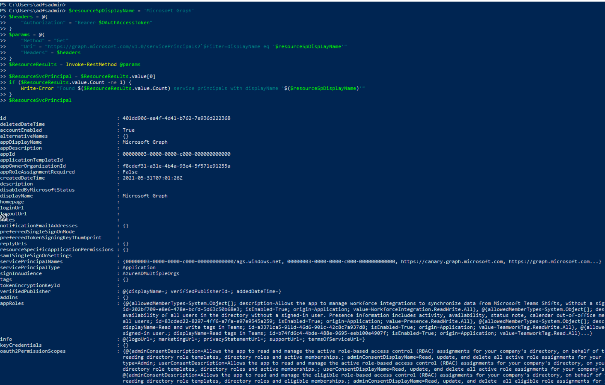
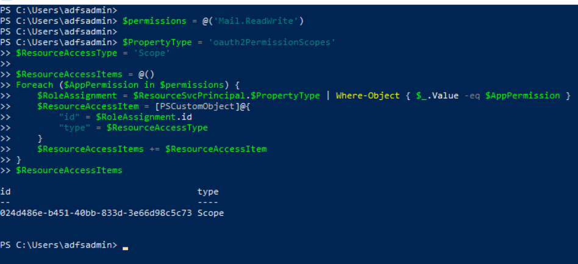

# Update Application OAuth Permissions Scopes

After a threat actor gets access to a cloud environment, usually the next step would be to look for additional access to other resources of interest. One way to access resources in Azure is via registered applications; especially those with privileged permissions. With the right permissions, a threat actor could grant desired permissions to existing applications.

Applications that integrate with the Microsoft identity platform follow an authorization model that gives users and administrators control over how data can be accessed. The Microsoft identity platform implements the [OAuth 2.0](https://docs.microsoft.com/en-us/azure/active-directory/develop/active-directory-v2-protocols) authorization protocol. OAuth 2.0 is a method through which a third-party app can access web-hosted resources on behalf of a user.

These resources can define a set of permissions that can be used to divide the functionality of that resource into smaller chunks. Because of these types of permission definitions, the resource has fine-grained control over its data and how API functionality is exposed.

[The Microsoft identity platform supports two types of permissions: delegated permissions and application permissions](https://docs.microsoft.com/en-us/azure/active-directory/develop/v2-permissions-and-consent):

* **Delegated permissions** are used by apps that have a signed-in user present. These permissions are of type `Scope` and delegate privileges of the signed-in user, allowing the app to act as the user. For example, if an application contains the “Mail.Read” delegated permissions and a user requests it; the app would only be able to access the signed-in user mailbox.
* **Application permissions** are used by apps that run without a signed-in user present. These permissions are of type `Role` and grant the app the full set of privileges offered by the scope. For example, if an application contains the `Mail.Read` role permissions, the application would have access to every user’s mailbox.


**Required Resource Access Collection**

Before granting permissions to an application, one needs to specify the resources the application requires access to and the set of OAuth permission scopes and application roles that it needs under each of those resources. This pre-configuration of required resource access drives the consent experience.

The specified OAuth 2.0 permission `scopes` and `app roles` may be requested by client applications (through the `requiredResourceAccess` collection) when calling a resource application. The requiredResourceAccess property of the application entity is a collection of `RequiredResourceAccess`.

## Simulate & Detect

In this document, we simulate an adversary updating the `OAuth permission scopes` of an existing OAuth application via its `requiredResourceAccess` property.

1.	[List Existing Applications](#list-existing-applications)
2.	[Update Application Delegated Permissions](#update-application-delegated-permissions)
    * [Detect OAuth Permission Scopes Update](#detect-oauth-permission-scopes-update)

## Preconditions

* Endpoint: AD FS Server (ADFS01)
  * Even when this step would happen outside of the organization, we can use the same PowerShell session where we [got a Microsoft Graph oauth access token](../persistence/getOAuthTokenWithSAMLAssertion.md).
* Microsoft Graph OAuth access token
  * Use the output from the [previous step](../persistence/getOAuthTokenWithSAMLAssertion.md) as the variable `$OAuthAccessToken`. Make sure you request the access token with the public `Azure Active Directory PowerShell Application`. That application has the right permissions to execute all the simulation steps in this document.

## List Existing Applications

**Preconditions**
* Authorization:
    * Service: Azure Microsoft Graph
    * Permission Type: Delegated
    * Permissions (One of the following):
        * Application.Read.All
        * Application.ReadWrite.All
        * Directory.Read.All

Open PowerShell as administrator and use the Microsoft Graph oauth access token to list the current Azure AD applications in a tenant.

```PowerShell
$headers = @{"Authorization" = "Bearer $OAuthAccessToken"}
$params = @{
  "Method"  = "Get"
  "Uri"     = "https://graph.microsoft.com/v1.0/applications”
  "Headers" = $headers
}
$AzADApps = Invoke-RestMethod @params

$AzADApps.value
```


Next, filter the results and select the Azure AD application you want to update the permission scopes. If you followed the instructions to [register one Azure AD application](../../2_deploy/_helper_docs/registerAADAppAndSP.md) after deploying the lab environment, your app should be named `SimuLandApp`. If you used a different name, make sure you look for it with the right name in the following PowerShell command:

```PowerShell
$Application = $AzADApps.value | Where-Object {$_.displayName -eq "SimuLandApp"}
```


## Update Application Delegated Permissions

### Get Microsoft Graph Service Principal

**Preconditions**
* Authorization:
    * Service: Azure Microsoft Graph
    * Permission Type: Delegated
    * Permissions (One of the following):
        * Application.Read.All
        * Application.ReadWrite.All
        * Directory.Read.All
        * Directory.ReadWrite.All

Identify the id of the resource service principal to which access is authorized. This identifies the API which the client is authorized to attempt to call on behalf of a signed-in user.

In this exercise, we are going to add permission scopes from the [Microsoft Graph API](https://docs.microsoft.com/en-us/graph/overview?view=graph-rest-1.0). Therefore, we need to get the Id of the Microsoft Graph API service principal.

```PowerShell
$resourceSpDisplayName = 'Microsoft Graph'
$headers = @{
    "Authorization" = "Bearer $OAuthAccessToken"
}
$params = @{
    "Method" = "Get"
    "Uri" = "https://graph.microsoft.com/v1.0/servicePrincipals?`$filter=displayName eq '$resourceSpDisplayName'"
    "Headers" = $headers
}
$ResourceResults = Invoke-RestMethod @params

$ResourceSvcPrincipal = $ResourceResults.value[0]
if ($ResourceResults.value.Count -ne 1) {
    Write-Error "Found $($ResourceResults.value.Count) service principals with displayName '$($resourceSpDisplayName)'"
}
$ResourceSvcPrincipal
```



### Create Resource Access Items

Define the delegated permissions as an array. For this example, we are going to use the Microsoft Graph `Mail.ReadWrite` permission scope. Feel free to change it for other use cases.

```PowerShell
$permissions = @('Mail.ReadWrite')
```

Next, we need to get the ID of the permission scopes. We can get that information from the Microsoft Graph API servcie principal object we got in the previous step. Since we are adding `delegated` permissions to an application, we use the **PropertyType** `oauth2PermissionScopes` and **ResourceAccessType** `Scope` to filter permissions from the Microsoft Graph service principal object.

```PowerShell
$PropertyType = 'oauth2PermissionScopes'
$ResourceAccessType = 'Scope'

$ResourceAccessItems = @()
Foreach ($AppPermission in $permissions) {
    $RoleAssignment = $ResourceSvcPrincipal.$PropertyType | Where-Object { $_.Value -eq $AppPermission }
    $ResourceAccessItem = [PSCustomObject]@{
        "id" = $RoleAssignment.id
        "type" = $ResourceAccessType
    }
    $ResourceAccessItems += $ResourceAccessItem
}
$ResourceAccessItems
```

As you can see in the image below, the type of resource access item is `Scope`. That is an indicator that we are working with delegated permissions only.



### Create Required Resource Access Collection

As mentioned before, the `required resource access` collection specifies resources that this application requires access to and the set of OAuth permission scopes and application roles that it needs under each of those resources.

This required resource access object is represented by the following properties:

| Property | Type | Description |
| --- | --- | --- |
| resourceAccess | [resourceAcces collection](https://docs.microsoft.com/en-us/graph/api/resources/resourceaccess?view=graph-rest-1.0) | The list of OAuth2.0 permission scopes and app roles that the application requires from the specified resource. |
| resourceAppId | String | The unique identifier for the resource that the application requires access to. This should be equal to the appId declared on the target resource application. |

For this example, we use the `resource access items` from the previous step and the Id of the Microsoft Graph API service principal. Also, ff there are permission scopes from the same resource already present in the application, you need to make sure they are added to the `required resource access` collection. The PowerShell commands below take care of all that for you.

Reference: [https://github.com/TheCloudScout/devops-auto-key-rotation/blob/main/scripts/Set-addApplicationOwner.ps1](https://github.com/TheCloudScout/devops-auto-key-rotation/blob/main/scripts/Set-addApplicationOwner.ps1)

```PowerShell
if ($resourceAccess = ($Application.requiredResourceAccess | Where-Object -FilterScript { $_.resourceAppId -eq $ResourceSvcPrincipal.appId })) {
    Foreach ($item in $ResourceAccessItems) {
      if ($null -eq ($resourceAccess.resourceAccess | Where-Object -FilterScript { $_.type -eq "$ResourceAccessType" -and $_.id -eq $item.id })) {
        $Application.requiredResourceAccess[$Application.requiredResourceAccess.resourceAppId.IndexOf($ResourceSvcPrincipal.appId)].resourceAccess += $item
      }
    }
}
else {
    $RequiredResourceAccess = [PSCustomObject]@{
        "resourceAppId" = $ResourceSvcPrincipal.appId
        "resourceAccess" = $ResourceAccessItems
    }
    # Update/Assign application permissions
    $Application.requiredResourceAccess += $RequiredResourceAccess
}
$Application.requiredResourceAccess
```

As you can see in the image below, we used the `requiredResourceAccess` property in the application object represented as the `$Application` variable and added the new permission scopes to it.


### Update Application Required Resource Access collection

Use the [Microsoft Graph update application API](https://docs.microsoft.com/en-us/graph/api/application-update?view=graph-rest-1.0&tabs=http) and the `$Application.requiredResourceAccess` new value to patch the OAuth application's `requiredResourceAccess` property in Azure AD.

```powerShell
$AppBody = $Application | Select-Object -Property "id", "appId", "displayName", "identifierUris", "requiredResourceAccess"
$headers = @{
  "Authorization" = "Bearer $OAuthAccessToken"
  "Content-Type" = "application/json"
}
$params = @{
    "Method" = "Patch"
    "Uri" = "https://graph.microsoft.com/v1.0/applications/$($AppBody.id)"
    "Body" = $AppBody | ConvertTo-Json -Compress -Depth 99
    "Headers" = $headers
}
$updatedApplication = Invoke-WebRequest @params -usebasicparsing
if ($updatedApplication.StatusCode -eq 204) {
    return "Required permissions were assigned successfully"
}
```


### Verify permission scopes were updated

Once the permission scopes are updated via the OAuth application's `requiredResourceAccess` property, we can run the following commands to get the new resource access values directly from Azure AD.

```PowerShell
$headers = @{"Authorization" = "Bearer $OAuthAccessToken"}
$params = @{
  "Method"  = "Get"
  "Uri"     = "https://graph.microsoft.com/v1.0/applications”
  "Headers" = $headers
}
$AzADApps = Invoke-RestMethod @params

$Application = $AzADApps.value | Where-Object {$_.displayName -eq "SimuLandApp"}

$Application.requiredResourceAccess.resourceAccess
```


## Detect OAuth Permission Scopes Update

### Azure Sentinel Hunting Queries

* [OAuth Application Required Resource Access Update)](https://github.com/Azure/Azure-Sentinel/blob/master/Hunting%20Queries/AuditLogs/AppRequiredResourceAccessUpdate.yaml)

## Output

You can now grant the delegated permissions added to the OAuth application with the following steps:
* [Create Application Delegated Permission Grant](createAppDelegatedPermissionGrant.md)
* [Update Application Delegated Permission Grant](updateAppDelegatedPermissionGrant.md)