# Configure Azure AD Connect: Pass-through Authentication

## Pre-Requirements
* [Microsoft 365 E5 License](startM365E5Trial.md)
* [Custom domain added to Microsoft 365](addDomainToM365.md).
* Active Directory Domain Controller and Active Directory Federation Services (AD FS) Server
    * Azure Bastion set up.

## Configure Azure AD Connect
1.	Connect to Domain Controller [via Azure Bastion](connectAzVmAzBastion.md)
2.	Double click on the Azure AD connect icon on the desktop to start the setup process.
3.	Agree to the license terms and privacy notice and continue.

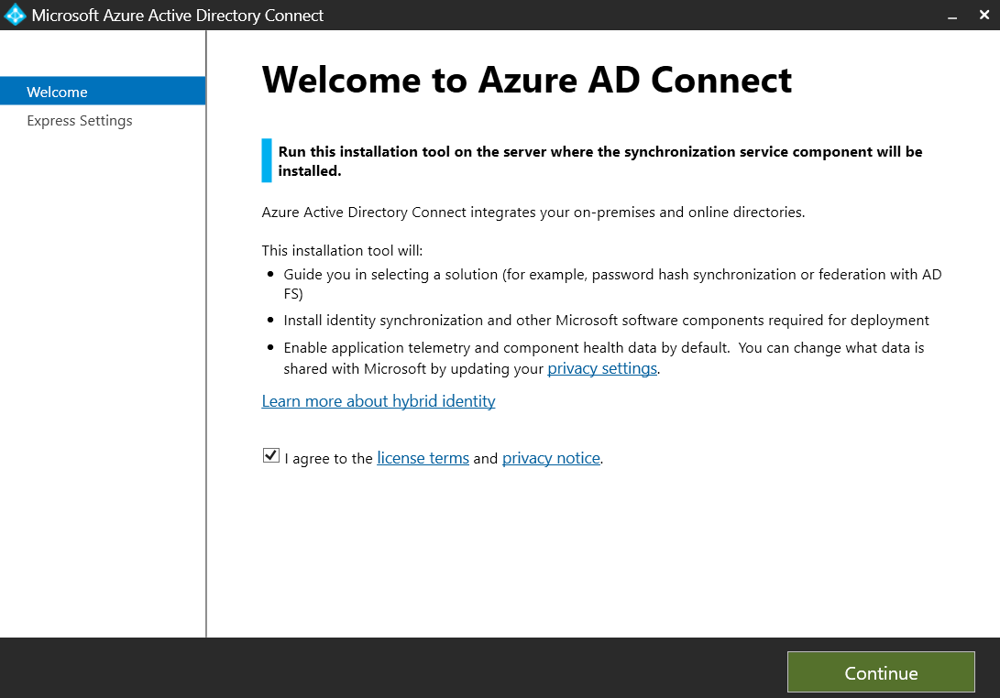

4.	Click on the `Customize` option.

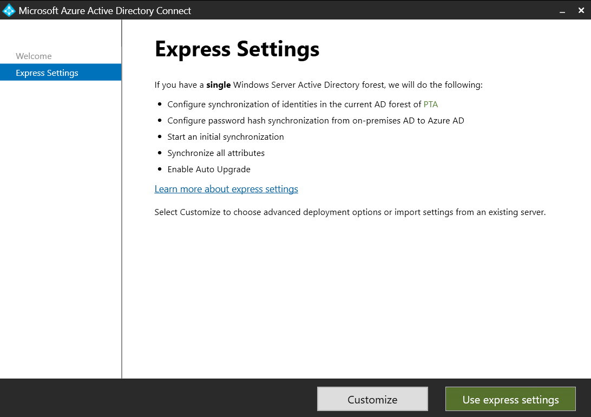

5.	Keep the defaults and click on `Install`.

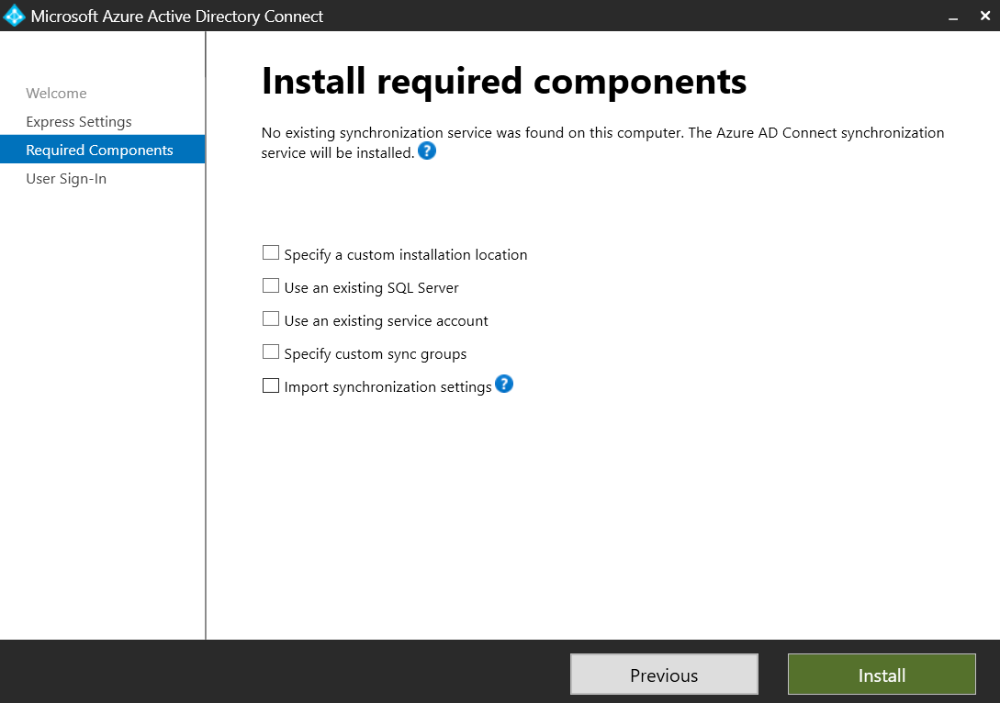

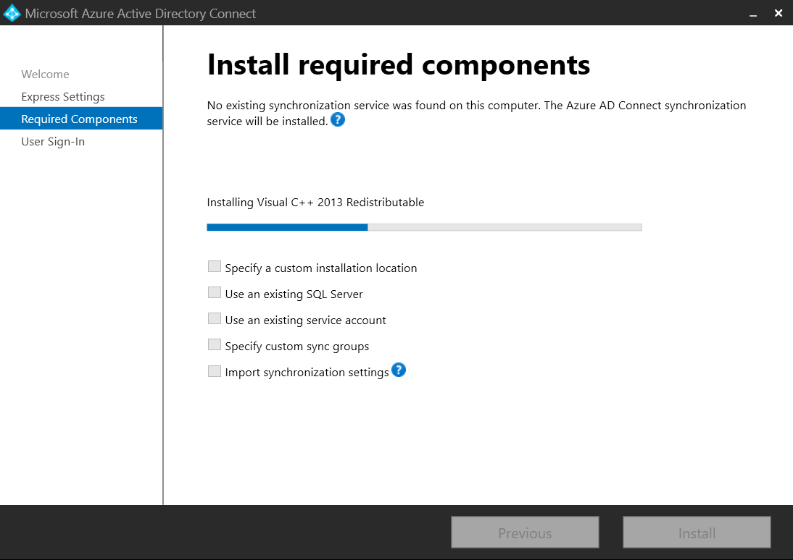

6.	Select `Pass-through authentication`.

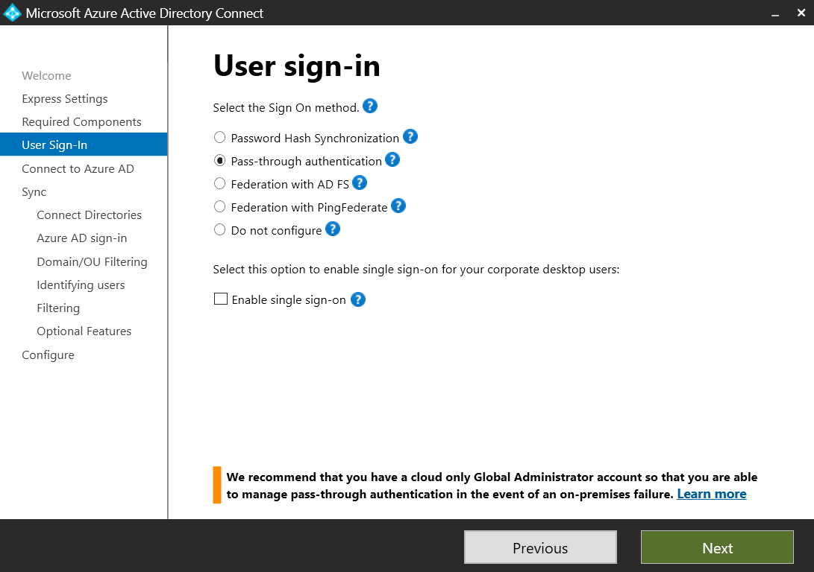

7.	Enter Azure AD Global Admin creds
 
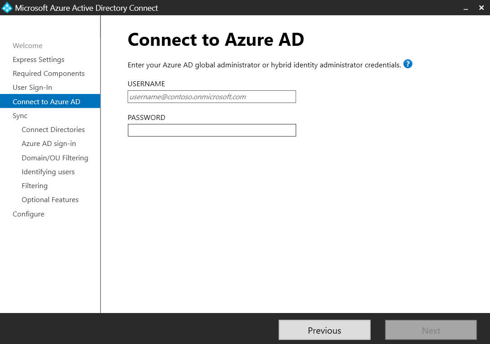

8.	Connect `on-prem` forest. Verify the Forest name and click on `Add Directory`.

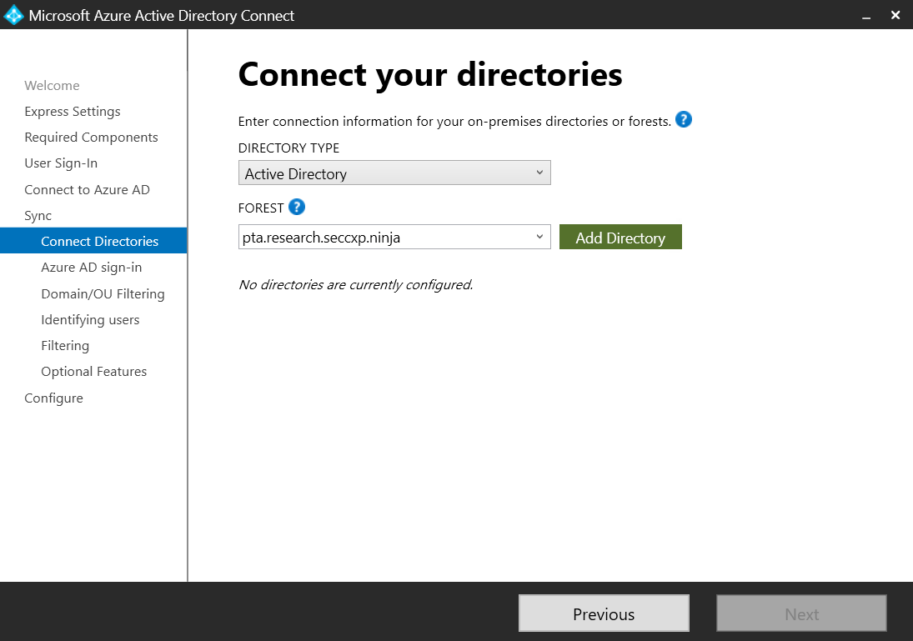

9.	Select the first option to create a new AD account. You have to enter the credentials of a domain admin in the `on-prem` environment.
 
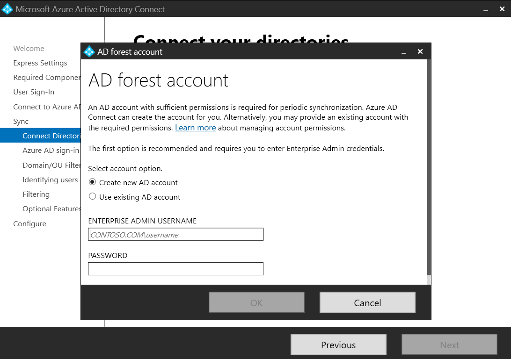

10.	Keep the defaults and click `Next`.

11.	Select specific domains and OUS. Select Users OU and click `Next`.

12.	Keep the defaults and click `Next`.

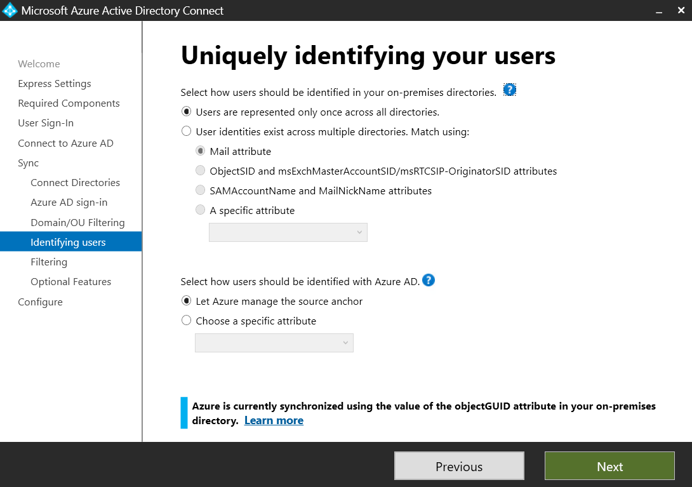

13.	Keep the defaults (`Synchronize all users and devices`) and click `Next`.

14.	Keep the default `optional Features` and click `Next`.

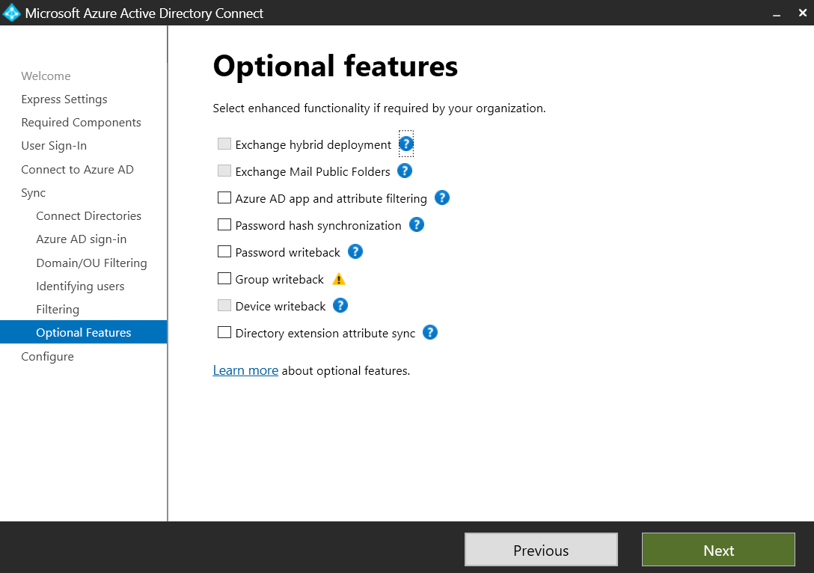

15.	Keep the default settings and click on `Install`.

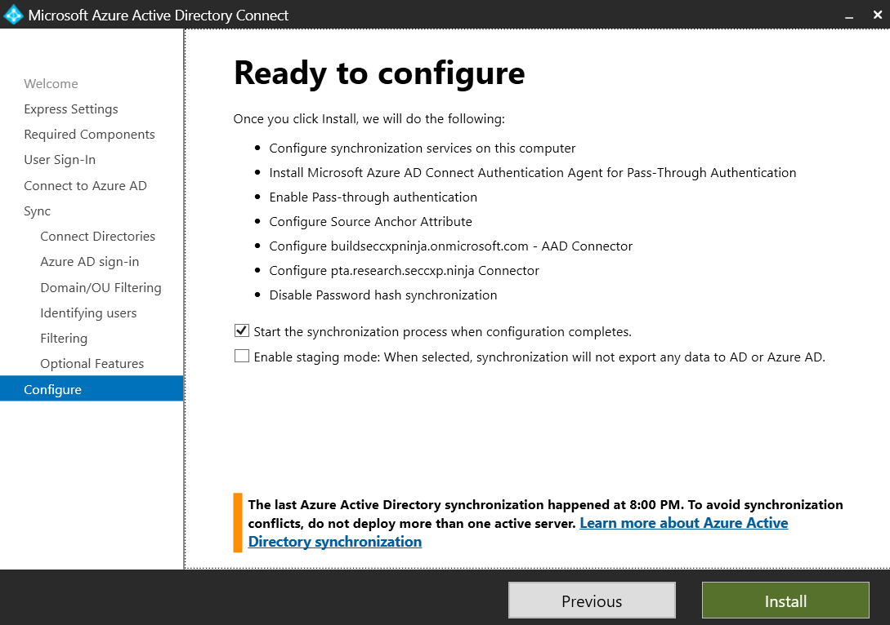

16.	Done.

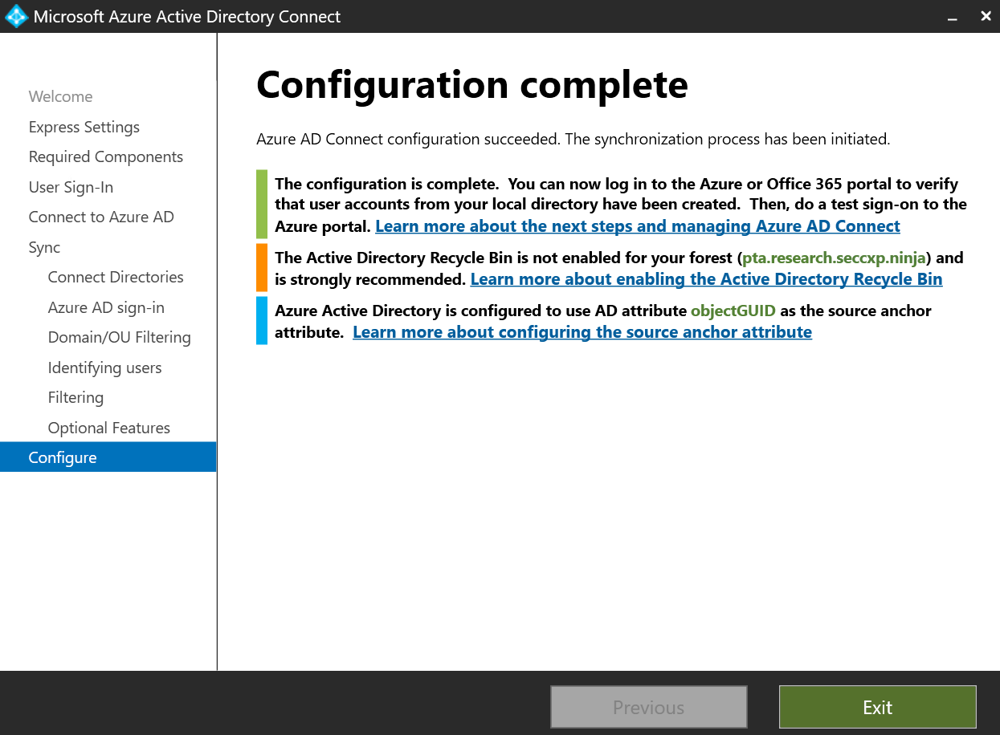

17.	That’s it! Click “Exit”

## Verify PTA Connection

### Azure AD Connect
1.	Browse to [Azure portal](https://portal.azure.com/)
2.	Azure AD > Azure AD Connect

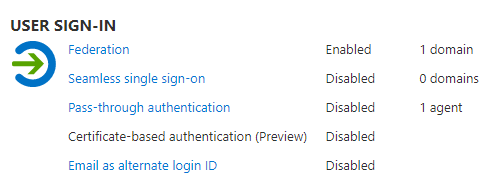