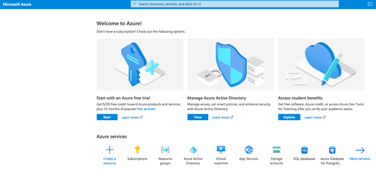
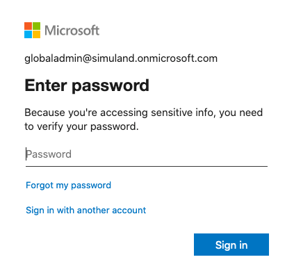
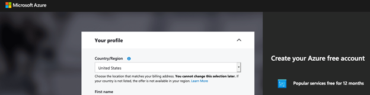
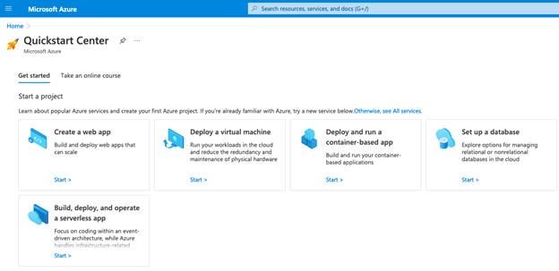
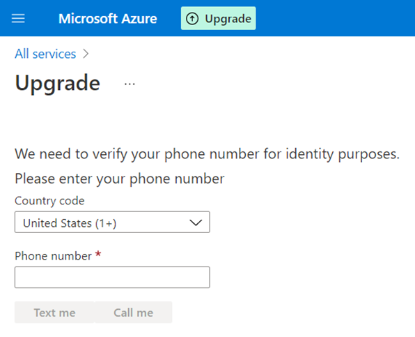
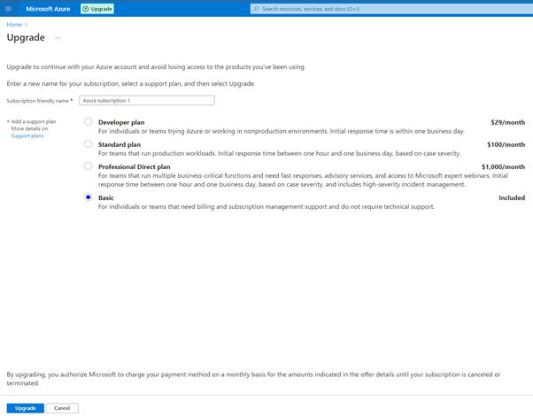

# Microsoft 365 Tenant: Get an Azure Subscription

Even though you already have a Microsoft 365 subscription with an Azure AD tenant, you will not be able to create resources in Azure. You need to sign up for an Azure subscription. You can sign up for an Azure subscription free trial through the [Azure portal](https://portal.azure.com) and then upgrade to a `Pay-As-You-Go` plan.

## Main Steps
* Start Azure free trial
* Upgrade subscription to a Pay-As-You-Go plan

## 1. Start Azure Free Trial
* Browse to [Azure Portal](https://portal.azure.com).
* Log in with the same account you set up your Microsoft 365 subscription.
* Click on `Start` under the option to start an Azure free trial.

* Enter the credentials for the account you used to set up your Microsoft 365 subscription.

* Fill out your Azure profile. You will be asked to provide your credit card information. This is just to make a temporary authorization on the card. Nothing will be charged unless you upgrade your subscription and start deploying resources.

You will then be redirected to the `Azure QuickStart Center`

## 2. Upgrade Subscription to a Pay-as-You-Go Plan
* You can simply click on the `Upgrade` button on the top of the Azure portal

 
* Verify your phone number

* Select the basic support plan

That’s it. You will have to wait for at least 15 mins for the change to apply. Log out and log back in until the “Upgrade” button on the top of your Azure portal disappears.
